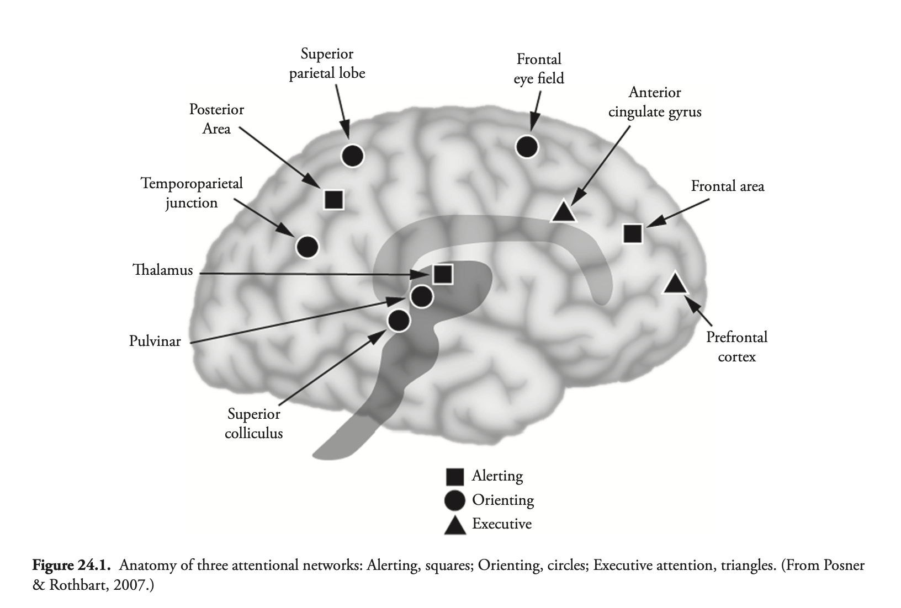
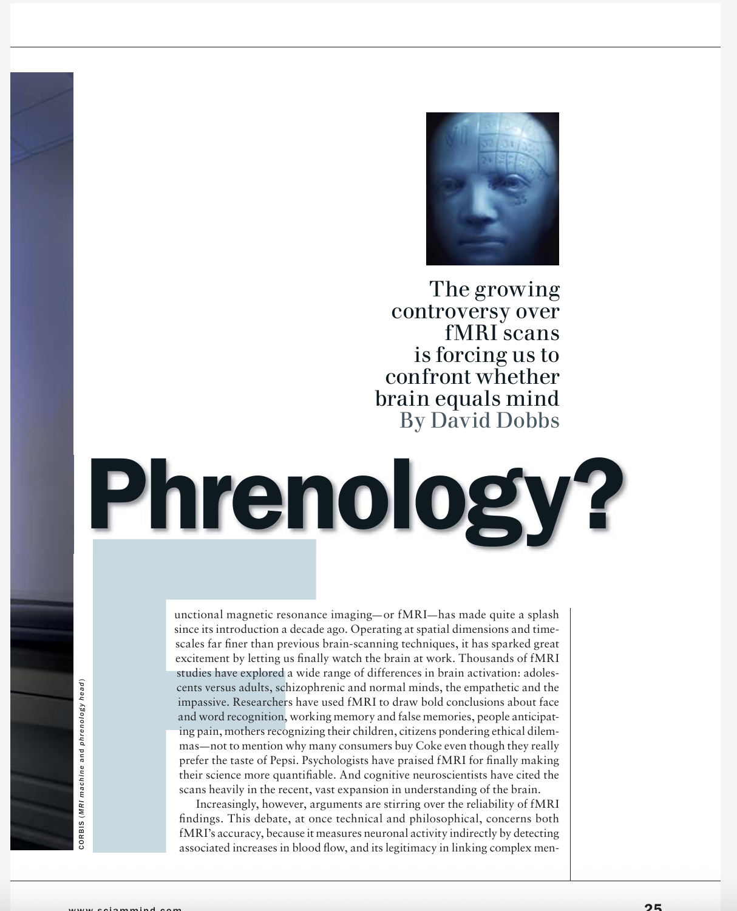
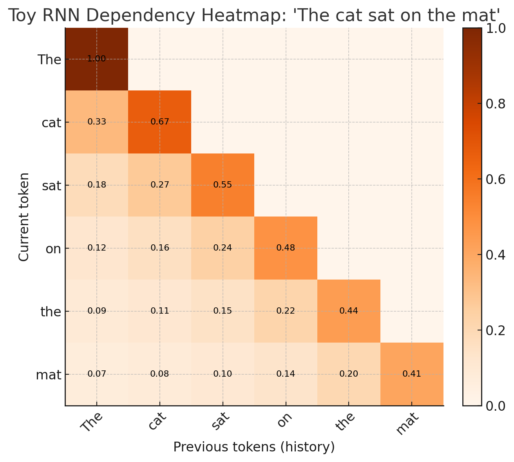
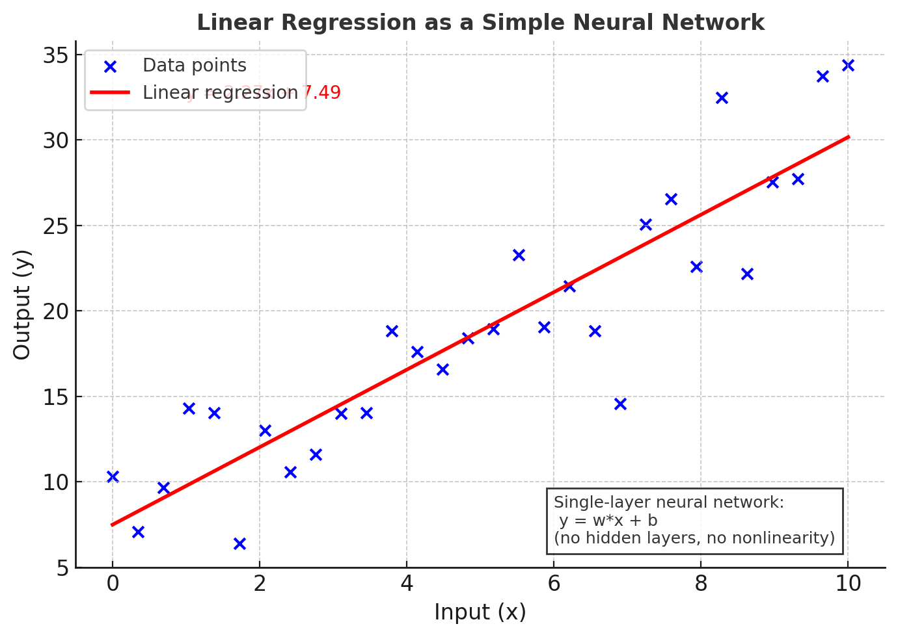
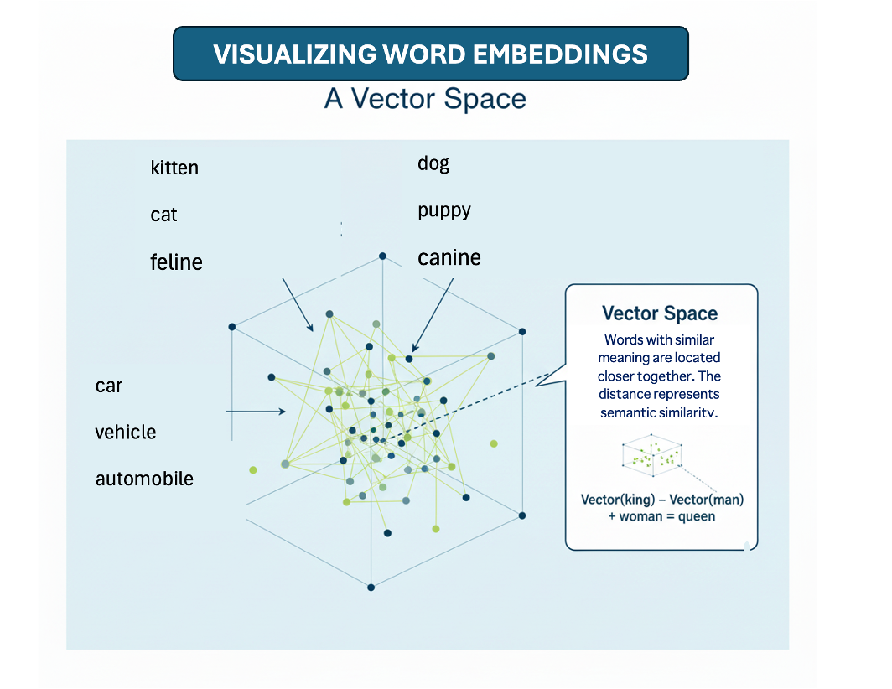
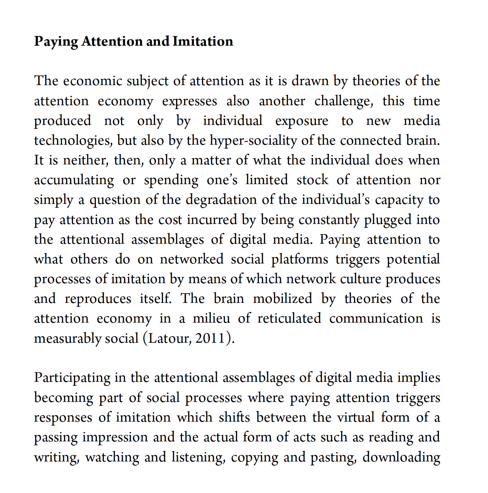
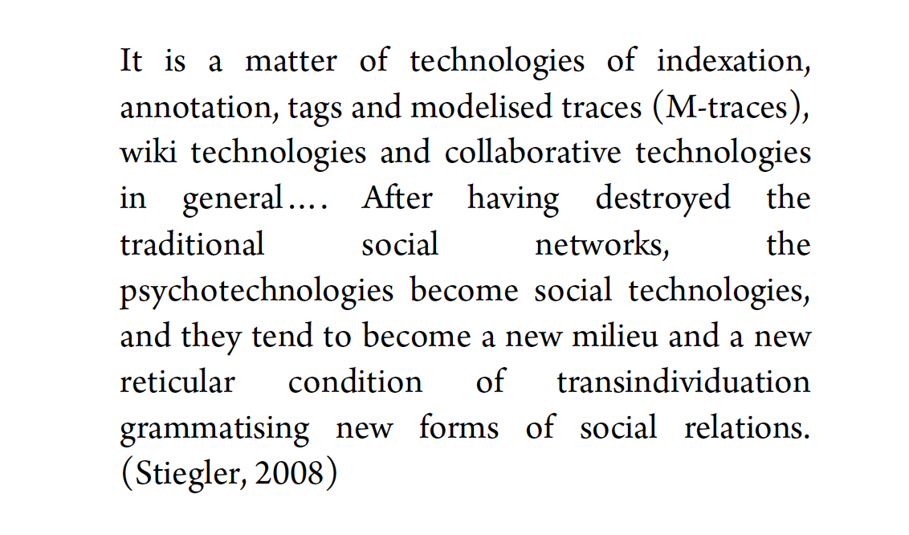
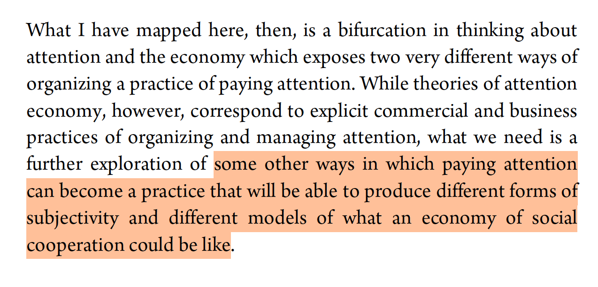

## Attention


- Vaswani, A., Shazeer, N., Parmar, N., Uszkoreit, J., Jones, L., Gomez, A. N., Kaiser, L. & Polosukhin, I. (2017). [Attention is all you need](https://i-share-uiu.primo.exlibrisgroup.com/discovery/fulldisplay?docid=cdi_proquest_journals_2076493815&context=PC&vid=01CARLI_UIU:CARLI_UIU&search_scope=CentralIndex&tab=CentralIndex&lang=en). *Advances in Neural Information Processing Systems*, 30.
- Petersen, S. E., & Posner, M. I. (2012). [The attention system of the human brain: 20 years after]([url](https://i-share-uiu.primo.exlibrisgroup.com/discovery/fulldisplay?docid=cdi_pubmedcentral_primary_oai_pubmedcentral_nih_gov_3413263&context=PC&vid=01CARLI_UIU:CARLI_UIU&search_scope=CentralIndex&tab=CentralIndex&lang=en)). *Annual Review of Neuroscience*, 35(1), 73-89.
- Terranova, T. (2012). [Attention, economy and the brain]([url](https://culturemachine.net/wp-content/uploads/2019/01/465-973-1-PB.pdf)). *Culture Machine*, 13.


```notes
As we've noted in the week's online guide, this week we are moving both back and forward - back to the earlier moments of consciousness, perception in particular, but also forward to the much more recent developments in both neuro and computer science.

What I propose this week is that we examine three key papers that all treat the concept of attention in a specific way. I won't be doing too much here to relate this concept to Hegel's unfolding architecture in *Phenomenology of Spirit* - we'll instead turn to that in the weeks ahead. But you may want to think how different meanings of attention might be situated with respect to both concepts of experience and recognition we've covered to date.

I'll start by looking at the Petersen & Posner [-@stevene.petersen2012theattention] paper, *The Attention System of the Human Brain: 20 Years After*, then the Vaswani et al's [-@ashishvaswani2017attentionis] *Attention is All You Need* paper, and then finally Terranova's [-@tizianaterranova2012attentioneconomy] critique of the Attention Economy. In each case we'll provide a short summary, and connect the argument to the wider lecture and course content - then provide time for discussion.
```


--- 


---

### Human Attention


| Attention Subsystem | Part of Brain | Reading Analogy |
| --- | --- | --- |
| Alerting | Thalamus; Frontal area | Be *ready* to read  |
| Orienting | Temporoparietal Junction  | *Direct* attention to text |
| Executive: Sustain focus  | Cingulo-opercular | *Continue* to concentrate |
| Executive: Switch focus  | Frontoparietal (eye field / superior parietal lob | Realize that you are tired and *need a break* |




```notes

The first paper is an updated version of an earlier text from 1990, also by Posner and Petersen, at the beginning of the era of "neuroimaging": using tomography, fMRI and EEG machines to monitor brain activity. Posner and Petersen suggest human attention involves three distinct but related subsystems and associated cognitive processes: alterting, orienting and executive (or executive control). We might think of these as involving become aware of something; turning our attention towards that thing; and then making some decision about that thing: is it dangerous, attractive, and so on.

I'll briefly talk through these three functions.

Alerting involves the initial registration of an external stimulus. They further distinguish two modes of alerting:  phasic, or short-term reactions, and tonic, or sustained vigilance. Both their initial and this updated paper located alerting function to the right hemisphere of the brain.

Orienting involves some kind of fast directing of attention in response to the stimulus or goal. This might be the instant turning of the head toward a large sound; or the fixation of the head and eyes on the road ahead while driving in difficult conditions. This happens in the frontal and posterior parts of the brain.

Finally, the executive function involves making decisions: to stay fixed upon an object that has gained attention, or to move on. In their revised article Petersen and Posner identify two distinct executive processes: one involving *sustained* focus or attention, another enabling a *switching* of tasks within the same overall attention frame or goal. The prefrontal cortex is responsible for the first of these - task focus – while the frontal eye field and superior parietal lobes together are responsible task switching. 


```


---

### Hierarchy and Networks

- (a) Connected, Ordered Hierarchy: different parts of the brain are responsible for **different** aspects of attention: alerting, orienting, executive functions (sustaining and switching attention)
- (b) Semi-redundant Networks: different parts of the brain coordinate on the **same** aspects of attention


```notes

But what perhaps matters to us here is not so much which areas of the brain are involved in different aspects of attention. Instead we can note that attention involves (a) a connected *hierarchy* of functions or subsystems and (b) a *network* of parts performing the same or similar roles (with some redundancy).

As we will see, it is not so much that use of attention in computer networks follows precisely what happens in our brains. The word "attention" is in some sense metaphorical, just as is the term "neural networks". However at the level of architecture we will see some analogies. 

```

---

### Attention and Learning


```notes

Within the context of learning, we can also see how this new attention-oriented work helps to make sense of, in particular, learning *difficulties*. Impairments on different brain regions can result in complex but still localizable – and potentially addressable – limitations in how attention is alerted, directed, sustained and purposefully redirected, as conditions require. 

Now while this is not a course diving into neuroscientific research, we can note in passing that this kind of neurological or neuroscientific research has impacted upon the theory and practice of pedagogy. A quick Google Scholar search shows for example how many results have integrated "executive function" into pedagogy research: 17,200 results since 2021.

```

---

### Attention and Childhood Development

- infants first develop alerting functions (with some orienting and executive ability)
- children develop mature orienting and basic executive (concentrating) functions
- adolescents and young adults develop higher order executive (both attention-sustaining and -switching) functions


**References:**

<span style="font-size:0.8em;">

- Rueda, M. R., & Posner, M. I. (2013). Development of attention networks. 
- Posner, M. I., & Rothbart, M. K. (2007). Research on attention networks as a model for the integration of psychological science. Annual Review of Psychology, 58, 1–23.
 - Boen, R., Ferschmann, L., Vijayakumar, N., Overbye, K., Fjell, A. M., Espeseth, T., & Tamnes, C. K. (2021). Development of attention networks from childhood to young adulthood: A study of performance, intraindividual variability and cortical thickness. Cortex, 138, 138-151.
 
</span>

<!--- Rueda, M. R., Posner, M. I., & Rothbart, M. K. (2004). Attentional control and self-regulation in early development. Trends in Cognitive Sciences, 8, 140–147.-->

```notes

Several of these studies show that the hierarchy of attention mechanisms - alerting to orienting to executing – also correspond to stages of learning and childhood development. Work by Posner and colleagues in particular has sought to demonstrate that:

- **infants** first develop alerting functions (with some orienting and executive ability)
- **children** develop mature orienting and basic executive (concentrating) functions
- **adolescents and young adults** develop higher order executive (both attention-sustaining and -switching) functions

```

---

### Neuroscience and Hegel?

> Without hesitation, the raw instinct of self-conscious reason will reject such a science of phrenology – as well as reject this other observing instinct of self-conscious reason, which, once it has blossomed into a foreshadowing *of cognition*, has spiritlessly grasped cognition as, “The outer is supposed to be an expression of the inner.” However, the worse the thought is, the less easy it sometimes is to say exactly where its badness lies, and it becomes even more difficult to explicate it. (para 340)

```notes
And to keep concordance with Hegel, we might also note his own strong distrust of the "neuroscience" of his day – a now outdated field called "phrenology", which involved measuring skulls to determinine cognitive aptitude. Much later in the *Phenomenology*, he savagely criticises the pseudoscience of phrenology for attempting to account for traits like intelligence based on bumps on the skull. Of course for Hegel, as we have seen, the development of Consciousness and Self-consciousness - and eventually Reason, Spirit and Absolute Knowledge – depends upon an infinitely supple and complex negotiation, both within ourselves and with others. This complex process of development cannot be "read" off the shape or dimensions of the skull. In a phrase that pre-empts where we go next week, Hegel states: 
 
> Without hesitation, the raw instinct of self-conscious reason will reject such a science of phrenology – as well as reject this other observing instinct of self-conscious reason, which, once it has blossomed into a foreshadowing *of cognition*, has spiritlessly grasped cognition as, “The outer is supposed to be an expression of the inner.” However, the worse the thought is, the less easy it sometimes is to say exactly where its badness lies, and it becomes even more difficult to explicate it. (para 340)

```


---


### Neuroscience: A Modern Phrenology?

|   |   | 
|---|---| 
|  |   |


---

### The Gap Between Brain and Mind

> The idea of mapping psychological functions to brain structures has a venerable history, dating back to Galen’s ventricular doctrine (Green [2003]) and continuing to Gall’s phrenology (Gall and Spurzheim [1810]). Although those theories are now in disrepute, the advent of neuroimaging techniques, such as positron emission tomography (PET), functional magnetic resonance imaging (fMRI), electro-encephalography (EEG), and magnetoencephalography (MEG), gives the prospect of finding one-to-one correlations between psychological functions and brain structures new vigour, and the project is the main goal of the young field of cognitive neuroscience (Posner and DiGirolamo [2000]).1 Yet many doubt that cognitive neuroscience can give us such a psychological atlas, whereby the building blocks of mind get assigned to specific neural structures (Uttal [2001], [2011]).

#### References:

<span style="font-size:0.8em;">

- Dobbs, D. (2005). Fact or phrenology?. Scientific American Mind, 16(1), 24-31.

- Stea, J. N., Black, T. R., & Di Domenico, S. I. (2022). Phrenology and neuroscience. In *Investigating Pop Psychology* (pp. 9-19). Routledge.

</span>


```notes


While neuroscience involves far more rigorous and detailed methods of investigation into the operations of the brain than phrenology, we can note in passing that it has attracted criticisms quite similar to those levelled by Hegel towards the "neuroscience" of his day. See for example the following quote from a recent book chapter by Stea, Black and Domenico, titled appropriately for our purposes "Phrenology and Neuroscience.

Despite the advances in science, for many today there remains a distinct gap between brain and mind, or the biological processing of signals and the rich descriptions of consciousness we get from philosophy, literature, art and religion. 

How we understand this gap also affects our interpretation of the potential for machines to develop consciousness - our topic for next week. But for now, we need to look at how the concept of attention also applies to machine learning.
```

---

### Machine Attention


 - Pre-2017: Recurrent, convolutional networks (RNNs, CNNs)
 - Problems: Recurrent networks degrade as the length of text grows
 - Attention already used in combination with architectures
 - But is Attention All You Need? The Vaswani et al. (2017) Transformers paper
 - Implementation by OpenAI: *Improving Language Understanding by Generative Pre-Training* (Radford et al. 2018): **GPT-1**.

```notes
Vaswani et al.'s 2017 paper is a landmark in machine learning. Perhaps the most cited paper this century, this work by Google scholars was first actually implemented, not by Google, but by a young start-up company, OpenAI. There is a entire story of intrigue about how OpenAI was founded – with seed funding from Elon Musk – and eventually caught sight of this 2017 paper, understood its potential, and developed something called a "Generative Pre-Training" model 
(*Improving Language Understanding by Generative Pre-Training*)[-@alecradford2018improvinglanguage].

Now we don't have time or opportunity to fully talk through this paper and its technical details. We would need to venture too far into the history of neural networks and their application to language modelling. But we can say that *prior* to this paper, the state-of-the-art models were using recurrent or convlutional networks, sometimes with attention mechanisms built in. 
```

---

### From linear to grid representations


<!-- | RNN | Transformer |
| --- | --- |
|  |  | -->


```notes

In short the problem with these systems was the need to maintain an ever-growing set of connections between the next token we would like to predict and the tokens or words that preceded it. 

I've used two heatmaps generated by GPT-5 to convey the general idea: RNNs process tokens in a linear way, from left to right, just as we read. But we quickly develop a long set of connections between tokens. 

Instead transformers require every token in a sentence or sequence to be related to every other - no matter how far apart they are in the sequence. This reduces the *time* involved in processing data, at the cost of increased training time and model space - but these are (comparatively) cheap.

Shortly we'll do a thought experiment that will hopefully make this more clear.

```


---

### Some general terminology...

#### Tokens vs Words

**Tokens** are word-like pieces of data that are the foundational primitatives of language models. Why not words?  There are many words in natural language, but often they involve commonly recurring terms (e.g. morphemes, prefixes, suffixes: 'un-', '-ing'). Roughly **4** tokens per **3** words.

#### Training vs Inference: 

**Training** involves building a large language model by processing large amounts of textual (or other) data, to develop up relationships between tokens. 

**Inference** applies the trained model to a particular sequence, e.g. when you ask a question of ChatGPT.


---

### Terminology continued...

#### Neural Network, Layers, Weights and Biases

Describes the structure of a language model: has **interconnected** nodes organized in **layers**. Each layer contains (typically) a **weight** matrix and **bias** vector. 


Much of the difference between models involves details about the architecture of a network and its layers; how much the weights and biases are trained; and what data is used in training.

#### Feed forward / Backpropagation

1. First we estimate **weights** and **biases**, and generate a **loss**, measuring their accuracy.
2. Second we use **calculus** to update all the weights
3. Rinse and repeat, until loss is minimized. 


---

### Is AI just fancy statistics?

 - Core Intuition: A **language model** approximates a **function** (with many parameters). 



Typical multiple regression - a simplified 1-layer neural network:

$$
\begin{align}
y_i &= \beta_0 + \beta_1 x_{i1} + \beta_2 x_{i2} + \cdots + \beta_p x_{ip} + \varepsilon_i,
\quad i = 1, \dots, n
\end{align}
$$

So **training** is the attempt to produce an (ever more) accurate 

---

### Attention is Three Matrices: Queries, Keys, Values

- Queries: what each token is **asking for** from other tokens (in training or inference)
- Keys: the **relative match** of each token to this token
- Value: what the token **represents** (e.g. in syntax or semantic terms)

This process is what is meant by **attention**. 


---

### Thought Experiment


> The cat sat on <span style="color: red;">the</span>...

```notes
Let's work through the following thought experiment. We will imagine we have the following unfinished sentence, and we'll focus on the last word, `the`:
```


---

### Sympathy for the Machine...


| Query | Key | Weight |
|-------|-----|--------|
| the   | The | 0.05**  |
| the   | cat | 0.15   |
| the   | sat | 0.25   |
| the   | on  | 0.55   |


 ** Because `the` rarely follows `the`!

What does this set of probabilities refer to? The relevance or how much the word `the` *attends* to the other tokens in the sentence. 


```notes
Now let's think about this from the machine's point of view, during inference rather than training. We saw from preceding discussion that this word `the` maintains a place in three lists of words or tokens:

- Query
- Key
- Value

We are considering the second `the` as our *query* word, and we want to know what word should follow. We first compare it with every other word in the sentence, checking against their *key* values. This generates an initial set of probabilities, for which I'll just use some example values:


| Query | Key | Weight |
|-------|-----|--------|
| the   | The | 0.05**  |
| the   | cat | 0.15   |
| the   | sat | 0.25   |
| the   | on  | 0.55   |


 ** Because `the` rarely follows `the`!

What does this set of probabilities refer to? The relevance or how much the word `the` *attends* to the other tokens in the sentence. We are primed, in other words, more strongly in favour of 'on the' than anything else.

```


---

### From Attention to Context



```notes

Now each of these tokens – *the*, *cat* etc – also contains a set of numbers relating to their *values*. The values are – if you like – the semantic space of the word: the **cattiness** of the 'cat' (noun, animal, furry, etc); the **sittingness** of the 'sat' (verb, temporal, positional, etc); the **on-ness** of the 'on') (preposition, relational term); the **the-ness** of the 'the' (definite article, applies to nouns, connected to preposition). But also tied to the context of the current sentence.

So once we have a sense of relative attention – how the 'the' relates to other words in the sentence – we combine the values, which we can think of as a hybrid syntactico-semantic representation, with these attention weights. 

This produces a **context** that governs prediction. 


```


---

### Iterated Context: From tokens to quasi-phrases / sententces


 - 'the' is no longer just a word or token
 - its 'the'-ness becomes a kind of 0.55 * 'on' + 0.25 + 'sat etc. 
 - All of these influences, derived from repeated attention, make 'mat' a more likely continuation.

```notes

This process is repeated over several or many layers of a network. At each layer we develop a richer representation of this context for each token. The mathematical representation of the 'the' we are looking at accumulates the influence of the other tokens it attends to - and so do these other tokens themselves. These ultimately help to narrow the scope – or increase the bias - toward particular tokens such as 'mat'.

The 'the'-ness becomes a highly specific and contextualized 'the'-ness that is paired strongly with a prepositional phrase; is associated with a spatio-temporal situation - one of sitting; and is (less strongly) influenced by an agent. None of these roles are hard-coded; they are learned by the network. But at the same time they ressemble the rules of grammar and meaning we are used to.

All of these influences, derived from repeated attention, make 'mat' a likely continuation (from within the wider set of the model's vocabulary).

```

---

### From Context to Prediction


| Token | Probability |
|-------|-------------|
| the   | 0.01        |
| cat   | 0.01        |
| sat   | 0.01        |
| on    | 0.01        |
| mat   | **0.80**        |
| dog   | 0.08        |
| house | 0.08        |


```notes
This learned context is applied to every item in our initial vocabulary. That would include all the words we have used, plus (in a toy example), other nouns like 'mat', 'dog', 'house'. This produces a final set of probabilities:


And finally: we roll a virtual die, and produce a set of predictions. In this toy example, 80 per cent of the time the predicted completion of the sentence will be 'mat'. 

Note that this 80% of the time - not 100% - is what makes LLMs often 'probabilistic', 'stochastic' and 'non-deterministic'.

As a further note: You might also imagine all of this computation gets expensive for (a) large vocabularies (like multiple human languages) and (b) long contexts (like novels). That is true! And why companies like Nvidia and TSMC have such extreme valuations today - to train and do inference on attention-based mechanisms involves hardware investments in the order of tens or hundreds of billions of dollars today.

```

---

### What about human attention?

Let's continue now with a further rough experiment.

Start by *attending to* the following words I say:

```
The cat sat on the...
```

---


Now when I said:

> Start by *attending to* the following words I say:

You are *alerted*. You have to shift from an everyday state to an alerted one, maybe by the fact that I've issued an imperative: 'Start'.

What follows is your orientation to what actually does *follow* from the words 'the following words I say'. You are oriented towards the completion:

```
The cat sat on the...
```


---

### Executive Functions and Metacognition 

Do you:

1. Complete the sentence?
2. Keep listening to what I say?

```notes
But then you are also possibly primed to the visual and audible *incompleteness*. The sentence doesn't end, instead your lecturer continues on with his exposition. The executive functions need to *decide*. What do you do? Do you:

1. Complete the sentence?
2. Keep listening to what I say?

Or both? Because this is a trivial case, you can complete the sentence very fast, and I'm not speaking too fast. Or do you *resist* the completion – ignoring my command altogether, or completing the sentence with another word? 
```

---

### Questions on human attention

Think for a moment about this final activity. Is **your** completion different to the **LLM**? How much of this - pointing ahead to next week's topic – is **conscious** or **unconscious**? Do you – like the Transformer model – draft a list of candidates, and pick the most **likely**? Is there a kind of metacognitive aspect that enables you to determine to **sustain** or **switch** your attention? Can you **refuse** to complete what you ought to - what your training suggests? 


---

### Make Content, Get Attention... Profit?


```notes
Turning now to Terranova's article, we come to the idea that attention is a kind of *commodity* and even *capital*, marked - like all commodities – by scarcity. It is an object that in itself warrants the *attention* of capital, of investors and advertisers, in the context of digital media. This is of course not new - the nephew of Sigmund Freud, Edward Bernays, pioneered many uses of what was then, in the early/mid twentieth century, new media, such as radio, magazines, film and television. But with the maturation of computers, the Internet, smartphones, social media and, today, AI, we come to a point at which we see attention as corroded or "degraded" by information. There is so much information, in other worrds, that human attentive processes become saturated, barely able to keep up.

Terranova argues, citing Nicholas Carr, Catherine Malabou, Jonathan Crary and othres, that precisely the kind of neuroscientific research we discussed earlier makes possible a new corresponding *industrialization* of attention. By developing sophisticated techniques for securing attention (at alerting and orienting levels), it also seems as though the higher order "executive functions" are disrupted. In particular, the ability to "switch" is impaired - we find ourselves staring at the screen long past the point at which we intended to, when we initially and intentionally sought distraction. 
```

---

### Attention and Imitation 



```notes
In a turn that also reminds us of our discussion of Hegel and the *social* process of learning, Terranova then discusses how attention to digital media in turn leads to another kind of by-passing of the deeper attention marked by executive function, due to social imitation. 

But this need not be entirely negative. Here Terranova turns to another Italian theorist, Lazzarato, and his treatment of attention as the condition of social labour – and therefore a positive and productive force.

But Terranova's discussion takes a negative turn again, through the work of Bernard Stiegler. Stiegler – a French philosopher writing on technology since the 1990s – famously argued that contemporary technologies short-circuit important cognitive processes of memory and social processes of communication, resulting in, as Stiegler put it, a grave risk of "proletariatanization". Primal psychic and libidinal energy gets put to service, in this analysis, in the creation of value for companies that can direct our collective attention via "social technologies" and "new forms of social relations".
```

---

### Cooperation or Proletariatanization?




```notes
Collecting up both Lazzaratto and Stiegler's arguments, Terranova claims that – despite the very different valences or attitudes each brings to their analysis – both authors see attention as not simply a store of human attention that is only degraded by technologies. Rather, those technologies redirect attention, which in turn makes possible new kinds of subjects and social relations. For Lazzaratto, technology actually makes humans cooperate in ways that can resemble the internal structure of an individual brain. For Stiegler, technology is similarly integral to all human cognitive and social activity – but in its current form (the Internet, social media, and the general capitalization of attention and associated "libidinal" energies), it is tending toward the production of a simplified, proletarianized and even stupified society. 
```


---


### Is Attention a Design Problem?



```notes
The reason for including Terranova's analysis – aside from its wide-ranging survey of recent debates – is that in a certain sense it elaborates upon Hegel's insistence that self-consciousness and learning is essentially *social* in nature. Indeed both Lazzaratto and Stiegler's positions, which Terranova surveys, can be seen as extensions to Hegel's insight, though adjusted for the dramatic effects wrought by informatic technologies. 

The individual human subject is affected by what others say and do, and digital technologies act like a concentrating device of those social habits. Let's exaggerate: every tweet, post or Tiktok we read or watch acts like a small encounter between two self-consciousnesses, which must resolve itself into a micro-master / servant dialectic enounter. Do we like the content, do we stay engaged to it - are we in other words, a servant to it? Or do we criticize, disengage and ultimately walk away? Is our self-regulation of our own attention a method also of self-mastery that resists servitude to others? Or are these attention-grabbing technologies too powerful for self-regulation, and do we need to treat attention management as a collective design problem?

And where does this then bring us with respect to a technology that arguably exceeds what Terranova, Lazzaratto and Stiegler could ever have anticipated in terms of its potential capture of human attention - precisely via application of its own "attention" mechanisms?
Hansen argues that as we enter the era of machine learning, platforms will increasingly predict,  and thereby control, even more fundamental processes than our attention: our conscious thinking itself. 
```


---


### Synthesizing Human and Machine Attention?


Posner on the role of att
 - https://www.youtube.com/watch?v=PKzz1OAiTRQ
 - https://www.youtube.com/watch?v=uYUdwS7-WvA

```notes
According to many neuroscience, attention is seen as critical to the operations of consciousness. Surprisingly, in recent discussions,  neuroscientists like Posner have also emphasized the experimental and social nature of attention formation, even in infants as they shape their alerting, orienting and executive facilities. Surprisingly, neuroscience may not be so far removed from Hegel's speculations on the nature of consciousness.

 Next week we focus on this concept, bringing closer together Hegel's ideas on consciousness and self-consciousness with other theories. We'll see how some scholars, like N. Katherine Hayles, have sought to combine research into both human cognition and machine learning with more traditional philosophical concerns about the nature of consciousness. We will revisit attention, but also consider ideas of the "unconscious" – developed originally by Freud, but surprisingly relevant in the world of machine learning too – as well as Katherine Hayles' work on what she terms "nonconscious cognition", operating in the world of machines.
```

