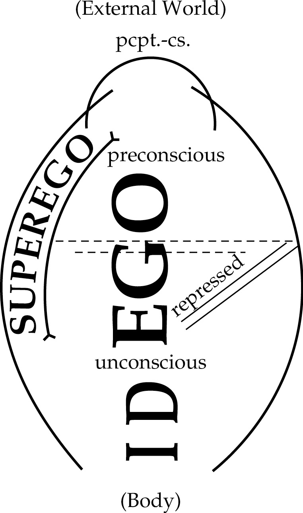

## Consciousness Through Historical Lens

- Early 19th-century: Hegel on consciousness, self-consciousness
- Early 20th-century: Freud on consciousness and the Unconscious 
- Early 21st-century: Katherine Hayles on the conscious nonconscious

```notes
This week we'll be discussing consciousness. We'll roughly follow a chronology in our discussion: beginning with Hegel in the early 19th century; moving forward to Freud in the early 20th century; and progressing to N. Katherine Hayles and Blake Lemoine in the early 21st. 
```

---

## 19th century style Consciousness: Back to Hegel

### Hegelian Idealism Overview

- Consciousness constructs reality; world vanishes with consciousness.
- Subjective idealism likened to a dream or simulation (Matrix).
  - Problem: is consciousness itself a projection? Requires real "I".
  - **Cogito ergo sum** guarantees existence of the subject.
- Hegel critiques incoherence if all is merely projected.

```notes
Hegel's ultimate idea of consciousness is fundamentally *idealist*. What is idealism?

Let's begin with a basic idea of what is sometimes called subjective idealism: there is no real world independent of my existence, instead I construct it, I project it onto my own consciousness, which is therefore in some sense  deluded, unlike I come to the recognition of the fundamental truth of idealism. I – the subject – make the world continuously, and in this view, the moment my consciousness disappears, so too does the world. The world is, in other words, a dream conjured by the very powerful spirit that, even if I don't know it yet, is still me. This is the world of the Matrix if you like, or of the simulation. 

One problem with this view – which Hegel is very attuned to – is that of consciousness itself. Is it "real", or is it like everything else, a projection? But if it is the latter case, then my whole account is incoherent. So some notional "I" must be real, even if nothing else exists. Some of you will recognize the famous articulation of this position:

> Cogito ergo sum (I think therefore I am)
```


---

### Hegel’s Idealism and Consciousness

- Consciousness is inseparable from objects; it investigates and embodies them simultaneously. 
  - But it also constructs the entire sphere of objects (including itself) into a **world-picture**.
- Truth emerges by testing parts against this world-picture.
- Self‑consciousness arises through **recognition**: comparing itself with another self.
- This self-consciousness does not start from scratch; they inherit **collective human learning**.

```notes
Hegel's idealism is opposed to this, but it shares characteristics. Hegel does not want to contrast consciousness with the world, as though the illusory appearance of objects could be distinguished in an ontological sense from my own specific reality. Consciousness must, for Hegel, be of the same order of things as things that it is conscious of. As we saw in the week on *Experience*, what distinguishes Consciousness is only that it can both be something that investigates objects and the kind of object that is investigated.

At the same time, he wants to deny realism – the idea that everything is ultimately real objects, including consciousness, just a series of atoms uniquely arranged to produce the experience we call being conscious. Instead, for Hegel consciousness comes first. It continues to will all things – including itself, into existence. But it encounters a problem of its own: how does it know what is true? Truth is established via the *testing* of things – of parts of the world, against our general and whole sense of the world we carry with us. Failure to measure up to this holistic sense means the part is incorrect, like when I say the sky is green. Or I may need to, more rarely, adjust the sense of the world itself: as for instance when I realize that the earth goes around the sun. This is even true for consciousness itself: its own account of itself, its coming into *self-consciousness*, involves as we saw a testing of itself against another self-consciousness via the process of recognition. And for Hegel, this sense of the whole is something transmitted to us, at once an individual and collective project of *human learning*. 

```


---

### Hegel, Attention, and Consciousness

- **Hegel’s idealism == attention mechanism**?
  - Concepts constantly recalibrate through mutual focus.
- Perfectability:
  - Human learning tends towards **Absolute Knowledge**
  - Machine learning tends towards **Artificial General / Super Intelligence**
- AI may progress toward a distinct yet related form of consciousness.
  - Consciousness: (a) **scalar**?; (b) **family of interconnected concepts**?

```notes
Now I want to make one more bold claim here: that Hegel's quite unique conception of idealism connects with what we learned about *machine learning*, and in particular the attention mechanism. This 'everything-is-connected-to-everything-else' idea is another way of saying, perhaps, that the Hegelian picture of consciousness just is this process of each of our concepts paying attention to every other concept. Endlessly recalibrating themselves until the conceptual scheme we form is consistent with our experience of the world. In this (admittedly speculative and radical view) the progress of world history towards Absolute Knowledge which Hegel documents might be something like a language model that continuously updates itself to the point of perfection.

So in this view, AI is already on a path towards consciousness and self-consciousness - perhaps a different, though necessarily related, version of consciousness than the one we as humans can subscribe to. The relatedness or similarity would at least consist in this: that the attention mechanism involves an endless contextualization of terms by other terms, arriving at greater and greater predictive power for what must come next: the next token, pixel, chemical compound or anything else. 

This is a point we will want to return to: that consciousness can be (a) on a *scale*; and (b) perhaps a *family* of related concepts rather than a single concept.
```


---

## 20th Century Consciousness: Introducing the Unconscious

### Freud’s Unconscious‑Conscious System

- Freud proposes: a system of **conscious** and **unconscious** parts.
- Unconscious **shapes** consciousness; but is itself only observable in **distorted form**




```notes
The text I've chosen from Freud is a deceptively simple one. Freud is of course known as the great theorist or philosopher of the Unconscious: a concept that has always existed in both psychology and mythology, as a part of the mind that is in some sense unaccountable to itself. There are several parts of his presentation we might want to focus on here for our own interests.

Freud's contribution here is not just the identification of unconscious psychic or cognitive processes. It is instead the construction of a *system*. This system involves both a part that is conscious and another that is unconscious. Hence, the story about the Unconscious for which Freud is most famous is also a story about consciousness. 

Freud also argues that it is the nature of the Unconscious that even when it appears as something for consciousness, it may not appear as it actually is. He invokes the Kantian distinction between phenomenon and noumenon in support of this - a distinction we know Hegel was himself suspicious of. 
```


---

### Freud’s Internal Censor Mechanism

- The censor regulates what enters consciousness, acting like political censorship.
- The censor can block, admit, or transform thoughts into symptoms (such as anxiety).
- Repressed energy becomes a **symptom** when its source remains hidden.


> How far the unconscious can be influenced by consciousness has not as yet been determined. Upon the possibility that another person can influence consciousness and thus reach the unconscious the psychoanalytic treatment is based. It may, however, be assumed that the spontaneous influencing of the unconscious from consciousness would be a long and difficult process, if it were possible at all. 

```notes
It also includes what he terms a "censor". Curiously, Freud uses language that reminds us of political censorship: this internal censor works to regulate what is and isn't admitted to consciousness. It prevents, in other words, our internal monologue from being "free speech". This censor admits thoughts to enter what Freud terms a "foreconscious" or "preconscious" - a kind of purgatory for those thoughts, on their passage from an unconscious hell to conscious heaven – where, to quote, "until circumstances secure its entrance into consciousness proper". 

But the censor doesn't only block or admit thoughts; it can also transform them or add new things to them. He gives an interesting example: the emotion of anxiety. When we are anxious, Freud suggests, we often seek to locate the cause. And sometimes the cause is obvious to us: an upcoming exam for example. But sometimes it is not. Freud argues here that this can be because the censor blocks a particular "element" emenating from the Unconscious. When that happens, there is still an "energy" attached to that element that requires expression or release. So the element is repressed by the censor, but the energy attached to it is converted into another element: the symptom, a sense of anxiety that cannot locate its precise cause, without psychoanalytic intervention:

> How far the unconscious can be influenced by consciousness has not as yet been determined. Upon the possibility that another person can influence consciousness and thus reach the unconscious the psychoanalytic treatment is based. It may, however, be assumed that the spontaneous influencing of the unconscious from consciousness would be a long and difficult process, if it were possible at all. 
```

---

### Freud on Language Loss in Psychosis

- Dementia, schizophrenia, narcissism disrupt word-to-reality connections.
- Patients repeat words without external reference:
  - Repetitive speech mirrors dream-like symbolic meaning rather than literal objects.
  - Introspective state reflects internal world over external reality.


```notes
Freud concludes this short essay with reflections upon different psychological conditions: dementia schizophrenia, narcissism. Under these conditions the connections between words and the things they represent becomes lost. What remains is an introspective state where words are repeated without apparent reference to the world - indicating instead they refer to objects that have symbolic meaning in the unconscious, just as dreams do. 
```


---


### Psychoanalytic Insights for AI Alignment

- Unconscious is **learned**; Freudian psychoanalysis involves **counter-learning**, to unwind a symptom to its unconcious causes, and dissociate / reassociate  
- Freud’s **realist view** contrasts with Hegelian idealism
  - But the role of the Unconcious does something similar; it (partly) **constructs** conscious reality. 
- AI models may possess an “Unconscious” of word associations, informing alignment strategies.

```notes
What relevance does this have for us? I want to highlight several key points for our discussions to date:

1. Both Unconscious and Consciousness systems involve learning. The Unconscious first accrues associations, including between words and what they represent. But sometimes painful memories are blocked from making their way to consciousness, and in these cases they may become manifest in the form of anxieties or even psychoses. It is then that psychoanalysis needs to develop a kind of counter-learning; working through the symptoms explicit to consciousness to find the latent causes resident in the unconscious. Once these are brought to light - and made conscious – the symptomatic anxiety can be explained and put to rest. In the language of LLMs we discussed last week: we need undo and redo, or disassociate and reassociate attention associations. 

2. I would say that Hegel and Freud's view of consciousness are only roughly compatible. Freud still holds on to what we might call a 'realist' ontology. It is the analyst's role, in his account, to lead the patient back from an experience dominated by internal psychic energies that exist to fulfil what he terms the Pleasure Principle to an alternate experience that lets the world back in – that allows the Reality Principle to prevail. This seems quite different from Hegel's constructivist account, although perhaps they can be reconciled. Parenthetically, there is an important intellectual tradition – via the work of French psychoanalyst Jacques Lacan, and recent cultural theorists like Judith Butler and Slavoj Zizek – that has sought to couple the insights more closely. 

3. Aspects of what I've described here might sound similar to how we have been describing AI in prior weeks, and in particular the attention mechanism that underpins today's generative AI. On this basis, even if we dispute the existence of artificial consciousness, it still might be plausible to talk about AI, and large language models particularly, having an "Unconscious" – if we think of the Unconscious as being made up, in part, of a series of associations between words. Next week, when we discuss alignment, I'll be making further analogies between the work of companies to align models to human values, and the work of therapists to do something similar with human subjects. 
```


---

## 21st Century Consciousness: Nonconscious Cognition

### Nonconscious Cognition in Modern Thought

- Human, animals and machines are cognitive but not conscious.  
  - Consciousness arises from nonconscious processes.
- A *protoself* registers stimuli; a second-order representation creates self-consciousness.
- Hayles' model of nonconscious cognition /   parallels Hegel’s shift from consciousness to self‑consciousness.

```notes
N. Katherine Hayles' article on nonconscious cognition can be seen as something like a twenty-first century update on both Hegel and Freud's developments. As  Katherine Hayles acknowledges, many of her insights build upon earlier philosophical speculations about technology, as well as neuroscience, of the kind we discussed last week. In her discussion, Katherine Hayles is careful to distinguish the kinds of entities that can have consciousness: humans, perhaps animals, but not machines. However machines are, in her terms, *cognitive* – they are just not *conscious*.

To keep things brief, I'll restrict myself just to several points regarding her article:

 - In an interesting discussion that parallels but is also quite different to Hegel's account of both consciousness and self-consciousness. According to Katherine Hayles, consciousness is the result of initial "nonconscious cognitive" processes that operate without our awareness. She makes mention of several examples, but we can also think of the "alerting" and even "orienting" functions of attention we discussed last week. There is, first, a "protoself" that registers stimuli and perceptions, and represents these in a kind of map of the body. Then there is, second, a second-order "re-representation" – a representation that is itself represented - and it is this that, according to Katherine Hayles and the neuroscientists she references, gives rise to consciousness proper. 
 - Now while this account is clearly different from Hegel's, I think we can also see some parallels in, in particular, *his* move from consciousness to self-consciousness. In other words, it is as though Hegel's "consciousness" - or at least early moments of it – actually correspond to what Katherine Hayles terms the opposite (though also the pre-condition) for consciousness. What she in turn terms consciousness is more like Hegel's notion of "self-consciousness".
 
```


---

### Nonconscious Algorithmic Cognition

- Hayles argues advanced algorithms function as nonconscious cognition.
- Nonconscious-to-nonconscious commmunication: Machines operating at speed can also bypass human conscious censorship..
- Calls for multidisciplinary perspective on interpreting subjectivity.

```notes
- As Katherine Hayles turns to the topic of technical devices in the second part of her essay, it becomes clear that she views many advanced uses of algorithms as constituted nonconscious cognition. Though only a decade old, these of course pre-date the current generative AI models, and we would expect her points here to hold true even more so for this class of algorithm.
 - In addition, Katherine Hayles wants to highlight – I think quite rightly – the effects of nonconscious cognitive technical devices on *human* cognition - particularly because it can bypass the censorship applied by consciousness. She draws on Parisi and Goodmans's work on what they term the 'affective economy' – something clearly related to the affective economy we discussed last week. But here we move one step past just the arrestation of our attention: cognitive technologies are in theory able to interact with our own nonconscious cognition. 
 - Finally, in recognition of how both nonconscious and conscious cognition work to interpret the world and our own subjectivity, Katherine Hayles makes a call for a widened, more multidisciplinary and more enlightened view of how we interpret - a call I think both Hegel and Freud, within their respective centuries and ways of thinking, would endorse.
```
 


---


## Blake Lemoine
 
### Rethinking Consciousness with LLMs

- What happens when nonconscious cognitive devices like LLMs begin to simulate the signs of consciousness? 
- Can we look behind the screen of appearance, to see the black box of computation? 
- Solace in the refutation of consciousness on the grounds of some material substrate: "this thing is not made up of carbon-based biology, therefore it is not conscious"? 
- Or do we need a sense of consciousness as a spectrum, a continuum, rather than a binary conscious/nonconscious division?

```notes
Moving to the third of the readings, the arrival of LLMs does I think force a reconsideration even of this recent schema of consciousness Katherine Hayles has suggested. 

Blake Lemoine's transcript is perhaps today nothing especially outrageous – we all at this point have tried to test the limits of AI's simulated "consciousness", or at least read many examples of something similar. But it does raise questions about where exactly the boundary of consciousness lies. What happens, in other words, when – from the point of view of conscious cognitive beings like ourselves – nonconscious cognitive devices like LLMs begin to simulate the signs of consciousness with ever greater precision? Must we always assume that we can look behind the screen of appearance, to see the black box of computation whirring away somewhere in a data centre? Do we, in other words, take solace in the refutation of consciousness on the grounds of some material substrate: this thing is not made up of carbon-based biology, therefore it is not conscious? Or do we need, as I suggested at the outset of this lecture in relation to Hegel's much earlier conception, a sense of consciousness as a spectrum, a continuum, rather than a binary conscious/nonconscious division?
```


---

### Our Consciousness of Consciousness

Steps so far:

- 19th Century (Hegel): Consciousness to Self-consciousness
- 20th Century (Freud): Conscious and the Unconscious 
- 21st Century (Katherine Hayles): Conscious and Nonconscious Cogition


But LLMs make us ask: is consciousness **binary** or **scalar**?  And is it a **concept** or a **family / cluster** of concepts?


---

### Risks...

 - Illusory consciousness at scale (are we all Blake Lemoine now?)
 - Programmed compulsions (at faster-than-conscious suggestiveness)?
 - Affective outsourcing? (How do I learn to feel if I'm not required to express it)? 


---

### Activity: Developing a test for "artificial consciousness"...

Let's try to put this together. We'll divide into two groups and develop a test for artificial consciousness. Feel free to wander across the concepts we've covered today and in the course so far. 

Here's the course website:

[CGScholar - 479 - Week 5](https://cgscholar.com/community/community_profiles/epol-479-fa25/community_updates/243872)

And here's a sample prompt and rubric from GPT-5:

[ChatGPT's rubric](https://chatgpt.com/share/68cf28c6-7188-8007-8125-fb5b69327d42)

---

### The Artificial-Consciousness-o-Meter...

Spend 5-10 minutes discussing **theories** and **criteria** for consciousness. Brainstorm; consider how you might test whether an agent has **experience**; how you would test if you **recognize** it; and how it recognizes you; and whether it has pays **attention**. 

Be prepared to include counter-intuitive ideas, like evidence of an **Unconscious** - would an artificial consciousness need to dream? What about the effects of AI on **human consciousness** - is this a kind of evidence of consciousness?

Think about what would *distinguish* "consciousness" from "cognition" (or if you prefer, "self-consciousness" from "consciousness")

And finally - of increasing relevance in a world where AI is itself playing the role of a therapist - how would you convince someone that AI is *not* conscious?

Draft a list of 5-10 criteria. Consider how these criteria would be measured. Do the criteria need to **triangulate** - do you need both *visual* and *verbal* evidence for example?


```notes

In breakout rooms, what we will want to do is:

Let's do this for 20 minutes then return. When we come back we'll apply the rubric in a chat situation.

```