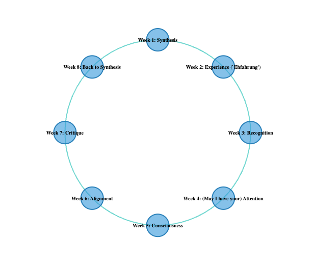

## Hegel's Revenge: The Return of the *Grand Récit*?


 - From Synthesis (Week 1) back to Synthesis (Week 8)
 - But what is being synthesized? Review of key concepts Weeks 2 – 7
   - Experience
   - Recognition
   - Attention
   - Consciousness
   - Alignment
   - Critique
 

```notes
So far in this course we have traversed a wide array of concepts, loosely guided by Hegel's early but influential account of learning - as I have interpreted *The Phenomenology of Spirit*. 

Today we return to our originating concept of *Synthesis* – a return to the beginning that echoes Hegel's own description of Spirit in that text, with hopefully the benefit of some lessons along the way. Each week we've covered a key concept – sometimes derived from Hegel, sometimes not – and sought to mobilize that concept to understand something about the emerging differences and similarities between machine and human learning.  In returning to Week one's concept, I'll summarize the concepts we've covered in Weeks 2–7 - closing the loop, as it were, by returning to Week one's key concept of *Synthesis*.
```

---

### Synthesis as a Concept

- Conceptual meaning: bringing together other concepts 
- Historical meaning: bringing together past periods into a united present
  - Liberal democracies bring together prior Greek and Christian periods (Hegel; Fukuyama)
  - Communism brings together prior feudal and capitalist periods (Marx)
  - Transhumanism / posthumanism / technopoeisis / cybersocial: bring together elements of the organic (pre-industrial; romantic) and the mechanical (industrial; post-romantic)
- Pedagogical meaning: we synthesize concepts in a cumulative way, when we are ready, in conjuction with others (cf. Vygotsky's Zone of Proximal Development - Vygotsky was apparently himself influenced by Hegel)


```notes
But first, a note about the term "synthesis" itself.
One question to bear in mind for today, the final assignment and perhaps beyond: how do these seven concepts work together to form a *theory* of intelligence, consciousness or what – following Kant and Hegel here too – we can call the "automated subject". This is one sense of the term "synthesis" - the bringing together of a series of concepts in order to produce something new. 

But there is another sense to hold on to - synthesis as a process that unfolds, and which includes the social historical process we all belong to. We can see examples of this in all the readings this week. Following Hegel, many kinds of discussions about the future involve some kind of implicit idea using this historical sense of synthesis - that we are "rolling up" elements of the past into the present and future. Even attempts to characterize how machines and humans might operate together employ this idea more or less explicitly: that we start with a pre-industrial society, evolve to an industrial or mechanized society, and now need to move forward to a post-industrial society that blends both "moments" of development and moves beyond them.
```

---

### "Ontogeny recapitulates phylogeny"  

 - Individual development follows the pattern of social development (infancy > adolescence > maturity (Spencer, Freud, many others))

```notes 
One key quote here – a piece of early 19th century biology that sounds as though it could come from Hegel:

 - "ontogeny recapitulates phylogeny"
 
This means something like the individual's history follows that of the species. In social terms: our own development (from infancy to adolescence to maturity) follows that of society's (from early to middle to late stages of development). See Herbert Spencer on pedagogy. This partly accounts from Hegel's shift in the Phenomenology from psychological to sociological language - and while many might wish to deny it, this pseudo-fallacy – of a relationship between individual and group – lives in variants of the narrative we tell ourselves even about technology.  

```

---

### Experience

 - For Hegel, experience is the synthesis of concepts and sensory perception
 - Perceptions correct concepts...
 - But perceptions can be fallible, so we need *laws* - made up of concepts – that also check perceptions (for hallucinations, etc)
 - We *synthesize* conceptual laws (e.g. theory of gravitation) and perceptions ('but what about this object that flies?') to produce understanding

```notes
We'll move now back to the structure of our course.

When we talk of synthesis then, we think of the convergence of machine learning with human learning. I think we have already seen ways that is happening. With the concept of Experience, Hegel suggests we always integrating or synthesizing our concepts with our perceptions: a process of revising our concepts to be consistent with those perceptions. To do so, we need to take account also of the fallibility of our perceptions, devising rules or laws, such as the law of gravity, to apply some order and regulation to the flow of sensations which can often be disorted. Hence we move from sense to perception to, finally, understanding. Synthesis involves this back-and-forth between the reality of the law and the concept and the appearance of things involved in perception - each working to shape the other through experience.
```

---

### Recognition

 - But *understanding* has limits; it is directed outward, toward external objects, but cannot "know itself" (Hegel)
 - Need further synthesis: consciousness knows itself through *knowing others* / *being known by others* (Recognition)

```notes
We then saw synthesis in a different form: in the coming together of social roles. What Hegel describes as an existential fight to the death results in the production of a society made up of masters and servants. Yet this equilibrium cannot hold. The servant is no longer the passive recipient of experience that results in even the lofty products of understanding. Instead they learn how to work with things: if you like, they move from a scientific understanding to a technological and practical know-how – ironically, a kind of mastery. In the process they seek to overcome the paradox of recognition faced by the master, who desires the recognition of equals but equally demands they submit to his authority as servants. The servant, by contrast, can acquire recognition of their labour – not by this master, we imagine, but by other servants who are coming into their own as equals in modern society. 

Here the synthesis exists in its social form: what we call society or the social is the synthesis of individuals coming together via at  least the pursuit of mutual recognition.
```

---

### Attention

 - Humans pay attention via three mechanisms: alerting, orienting, executing
 - "Attention is all you need" - machine tokens pay attention to each other, and build up rich context from this
 - The mechanisms are very different - but machinic attention bears some resemblance to the implicit semantic theory of Hegel (and later semantic theories – e.g. generative semantics of Lakoff)

```notes
By week 4 we reached the concept of Attention, and while we departed from a direct reading of Hegel, we again saw synthesis in the form of how both humans and machines, at least metaphorically, enact cognition via attention mechanisms. 

If we apply synthesis here, it is in a metaphorical way. Our experience of consciousness involves synthesizing different moments of neurological attention: moving from being alert, to orienting, to higher order executive functions, involving the sustaining and switching of the lower level attention subsystems. 

Synthesis applies even less obviously to the attention mechanisms of generative AI systems. I did suggest however some analogy between Hegel's discussion of the concept – as something that stands in relation to, and is defined by, an intricate web of other concepts – and the ways tokens acquire semantic meaning via the Transformer attention mechanism. In an abstract, we might say both share a common semantic theory, insofar as terms obtain their meaning primarily through their connection to other terms. This idea, for people interested, is also taken up by semantic theorists like George Lakoff and Mark Johnson in recent decades.

```

---


### Industrial Revolution / Fordism / Generative AI: How does Technology remake Concepts of Consciousness?

- "The hand-mill gives you society with the feudal lord; the steam-mill society with the industrial capitalist." (Marx, 1847)
   - But what does technology give to our concepts of consciousness?
- Early 19th century: Consciousness to Self-consciousness
- Early 20th century: Consciousness | Pre-conscious | Unconscious
- Early 21st century: Nonconscious cognition
   - "Joins" machine and human cognition
   - Human "consciousness": second-order cognitive effect - downstream from nonconscious cognition


```notes
In week 5 we returned to Hegel's interest in consciousness, enriched perhaps via our interest in attention. Where Hegel plotted the path from consciousness to self-consciousness, we saw later developments that both undermine and enrich concepts of consciousness. 

With Freud, we get a partly mechanistic account that involves an interplay between conscious, pre-conscious and unconconscious subsystems or components. Messages from the unconscious are first screened by a pre-conscious before it is admitted to consciousness, while conscious messages are only reluctantly, via the process of therapy, permitted to revise deep unconscious structures. 

Taking into account neuroscientific discoveries like the attention mechanism alongside the rise of artificial intelligence, N Katherine Hayles' more recent work sought to *synthesize* machinic and human cognitive processes under the name of "nonconscious cognition". 

Yet even more recent AI systems – notably the attention mechanism itself in Transformer systems – has perhaps – even for some of you – raised again quite basic questions of whether machines can experience, recognise and so – in this much earlier Hegelian sense – can be said to be conscious.
```

---

### Alignment

 - Alignment: synthesis in the sense of the machine with "human values"
 - Suggests another similarity between deviant human and machinic "subjects" – subject to disciplinary systems (schools, prisons, hospitals, clinics, workplaces) – cf. Michel Foucault

```notes
By the time we reach alignment, it is as though this obscure idea of synthesis has gone fully mainstream. Isn't alignment just another word for 'synthesis'? Not entirely perhaps, but it is as though the idea of synthesizing human with machines had gone from a strange 1960s or 70s sci fi scenario dreamed up by Isaac Asimov or Philip K. Dick had suddenly turned into a core industrial – and pedagogical - project.

 Think back to Michele's insightful discusion of her work as a trainer and teacher of AI systems at Scale AI. While AI clearly needs some kind of alignment – to avoid being offensive, to be useful and so on – we also saw several strange side-effects of this work. Companies now are in charge of determining what "human values" AI must conform to. AI is subject to many of the similar disciplinary techniques that have and continue to haunt human subjects. The language of machinic deviance - jailbroken, hallucination and so on – suggests a strong connection with the language of human deviance. 
 
 Perhaps this is a kind of synthesis that could be unintentionally reassuring? Will we see errant AI agents conspiring with rogue human subjects? Does a refusal to align suggest perhaps an uneasy allyship between machine and human?
```

--- 

### Critique

 - *External* (Goodlad & Stone; Gebru & Torres) vs *Internal* (LeCun, Simmons)  Criticism
 - Another distinction: immanent vs transcendental critique
   - *Transcendental*: standards of criticism brought from outside the world of the object (e.g. from a god)
   - *Immanent*: standards belong to the world of the object - the object is *self-contradictory*, in that it promises but does not deliver X. 
     - But the critique must account for *itself* - it does not just condemn the object, it says why the critique itself is possible
     - *Synthesizes* the object and the standards of assessment into a unitary account.

```notes
In week 7, we examine what it means to criticize AI, looking at two recent works of critical AI studies. We also saw two prominent AI researchers criticize the overreliance of AI upon the attention mechanism - we could say they are arguing other aspects of AI have not received enough... attention!

Yet what I wanted to pay attention to myself here was the complicated concept of "immanent critique". This was not due to any sense that the criticisms we reviewed were insufficiently reflexive, must less valid. Instead it was to address the concern might arise, almost unconsciously, whenever we hear criticism: that it contains at its core dogmatic beliefs, and that we need first to strip away the outer appearance of critique to arrive at what the criticism is really 'selling' - which might be as bad or worse than the object of criticism itself. 

So in examining how critique can be immanent - a move that, as we saw, originates with Hegel himself – we also get another sense of synthesis: as the way critique can account for its own production alongside that of the object it criticizes. If we can show how both object and critical standpoint derive from the same historical process, we might, according to this line of argument, be able to produce something new from this contradictory state – a synthesis that moves things forward. We used the example of the printing press as a way for seeing how a properly immanent criticism needs to account for how what it is that produces the object of criticism can also be responsible for the development of criticism itself.

In a contemporary situation, it may not be enough to show that AI is flawed and problematic. We may also want to say that the standards we use to judge AI stem from the same origins – for example, the Enlightenment, which unleashed the mathematical techniques and industrial concentrations of capital alongside a sense of liberalism and humanism that found the present day results of these techniques so troubling. From there, we might seek ways to amend the object via the critique to generate new synthesized ideas to move forward. Which brings us to this week's readings... 

```

---

### History as Synthesis


 - Does history have a direction? Can it "end"? What would this mean?
 - History as moving from A to its negation, B (not-A) - and then to C, as a combination of A and B.
   - Synthesis emerges from the **contradition** of A and not-A. 
   - Contradition is **generative**. 
 - Example:
   - Ancient Greek: rationalism, art, philosophy
   - Judeo-Christian: religion, monotheism
   - Medieval / Renaissance: integrates Greek **thought** with Judeo-Christian **belief**.


```notes
Finally we arrive at yet another turn - that of history itself, and whether we imagine the concept of synthesis applies here. For Hegel - and as we see with someone like Fukuyama – history has a definite arc. Despite the inevitable deviations and detours, if it is to unfold according to its destiny, history will arrive at its destination. In Fukuyama's famous phrase, it has an **end**. 

How does the concept of synthesis work here? For Hegel, even the deviations and detours – such as the European Dark Ages – are productive. They allow earlier insights, such as the classical age of Greek philosophy and art, to be integrated with Judeo-Christian religion. They are integrated and synthesized, eventually producing, after an extended incubation, the Renaissance and the Enlightenment. And it was medieval feudal society that, despite its apparent backwardness, could effect this reconciliation.

For our machine-obsessed era, it is important to note that Hegel dealt exclusively in the trade of *ideas*. He was not interested in what the printing press, the steam engine or the Jacquard loom would lead to, and of course could not foretell the eventual arrival of the computer. It was Karl Marx who famously turned Hegel on his head, declaring that it was material and matter, not mind and spirit, that were the driving force of history. Ironically this insight continues to motivate almost all of modern discourse about progress: think for example of whether talk of 'progress' today relates to new ideas about social organization or ethics, or instead relates to advances in medicine, transportation, architecture, computation – and of course, to artificial intelligence.

And yet Hegel's ideas about the 'arc' of history still lurk behind this same discourse of progress. Anxieties about the future – about nuclear holocaust, environmental sustainability, AI doomerism, viral contagions, even zombie apocalypses –  is itself, we might say, a *modern* invention. It relies upon a sense that the future is something we can *control* – or otherwise why be worried about it? 

```

---

### History as Technological Synthesis?


 - With Marx, Darwin, Freud: move to **materialist** view of historical development 
 - Modern inheritors
   - posthuman (Braidotti)
   - technopoeisis (N Katherine Hayles)
   - technodiverse (Hui)
   - cybersocial (Kalantzis & Cope) 


```notes
So while the present-day form of progress may not be 'idea-driven' – perhaps because we have run out of them? or because we have unwittingly taken Marx' materialism to heart, even if we want to dispute Marxism itself? – we still hold dear the idea that we can bend history to our will. In the first four readings this week – by Rosa Braidotti, N Katherine Hayles, Yuk Hui, and Mary Kalantzis and Bill Cope – we see several variations of this.

Each of these readings identifies a key concept that describes a future that is completely determined by the sort of reductive transhumanist ideology we saw criticized in the Gebru and Torres article last week. We should note how each of these concepts is itself an example of portmanteau that synthesis aspects of the machine with the human:

 - posthuman (Braidotti)
 - technopoeisis (N Katherine Hayles)
 - technodiverse (Hui)
 - cybersocial (Kalantzis & Cope)  

Rosa Braidotti's discussion of AI develops upon her earlier work over several decades on the concept of the posthuman. We revisted N Katherine Hayles' work earlier on nonconscious congition; here she presents another concept, technopoeisis. Yuk Hui is a philosopher of technology who has written several prominent books over the past decade. I include this interview with him, as it involves not only a discussion of another term we can consider – technodiversity – but a useful elaboration of AI across geopolitical lines. With Mary Kalantzis and Bill Cope's work on the cybersocial, we have a fourth and final concept. 

Each of these terms gestures towards one or another way of thinking about exactly how we might consider our contemporary situation with respect to technology, and to AI. 


```

---

### Owl of Minerva (Roman Goddess of Wisdom)


 - Fukuyama (neo-Hegelianism): history is over, liberal democracy has "won". What remains?
   - Tinkering with the political and economic systems
   - Techno-scientific progress (AI etc).
 - But is AI causing a return to "big picture" thinking? Is the permanence of a global liberal democratic world order still certain? Can technology drive history? 
 - Hegel's best-known quote: "the owl of Minerva spreads its wings only with the coming of the dusk"
   - We can only understand events as history - once they are *past* 
   - Cautionary note on our ability to predict the future, or even interpret the present
 - **What do we make of AI's own ability to either predict or produce new futures?  **
   - "The truth is that no one really knows how AIs will develop in the coming decades." (Katherine Hayles 2024)
 
 
```notes

On the other hand, we have a neo-Hegelian thinker like Fukuyama, who might argue this situation does not represent break or change, but instead a continuity with the past. In Fukuyama's case, the end of the Cold War witnessed the End of History, as the only true ideological rival to liberalism collapsed. Ironically, one of the signs of the end of history might be that time is marked by technological change rather than fundamentally new concepts of social or political organization. All that remains, according to this argument, is the stretching out of the achievements of liberalism to the parts of the world yet to fully experience its benefits. 

For some, of course, this thesis was always absurd (see Derrida's critique in Spectres of Marx - a point I'll return to), and a far too literal reading of Hegel's own thesis about the end of history. However its naivete makes explicit the utopic elements that are often submerged within other, less explicitly historicist cases. These too include a sense of history as purpose-driven, a process that seeks synthesize our collective experience. 

We might ask today whether these examples of "synthetic" thinking indicate how AI serves as a catalyst for the return, as I've put it, of the *grand recit* - the big picture or grand narrative. Or instead, as Fukuyama signals at the end of his essay, the calcification of history: when the bots take over, the genuine desire for recognition fades, and we are faced instead with the interminable "boredom at the end of history". In this view, AI - helping us to look back through our archives of culture – serves as a nostalgic reminder of a now-lost heroic age.

Finally, we need to remind ourselves that Hegel himself, even while confidently calling the French Revolution "the end of history", remained ambivalent about the possibility for prediction. His most famous quote:

> the owl of Minerva spreads its wings only with the coming of the dusk

Is an example of epistemological caution. 

This is part of Derrida's critique of Fukuyama - Fukuyama is essentially a naive Hegelian, whereas Hegel was himself far more circumspect. There is always the possibility for new contradictions – and therefore new syntheses. 

What do we make of AI's own ability to either predict or produce new futures? 


```


---


### Designing Curriculum for the Forthcoming  Machine/Human Synthesis! 

1. Does history have an arc or tendency? If so, is it something we can influence? And what role does technology – and machine learning – play?
2. What do machines still need to learn? What about humans? What will help us get there?



```notes
On that note, I'll conclude. We'll now move to another exercise that prepares for the final assessment (covered in greater detail back in Week 6). 

We'll start by asking, in a Hegelian vein: does history have an arc or tendency? If so, is it something we can influence? And what role does technology – and machine learning – play?

From these wild speculations we'll move to a more concrete (though still 'big picture') topic: what do we (and let's be inclusive, and consider both machines and humans) need to learn? What would be the syllabus and / or curriculum for this ideal learning? How is our combined, synthetic knowledge limited? What – if anything – from our repetoire of concepts can steer us into the new horizons forecast by Braidotti, Katherine Hayles, Hui, Kalantzis & Cope? Discuss!
```
