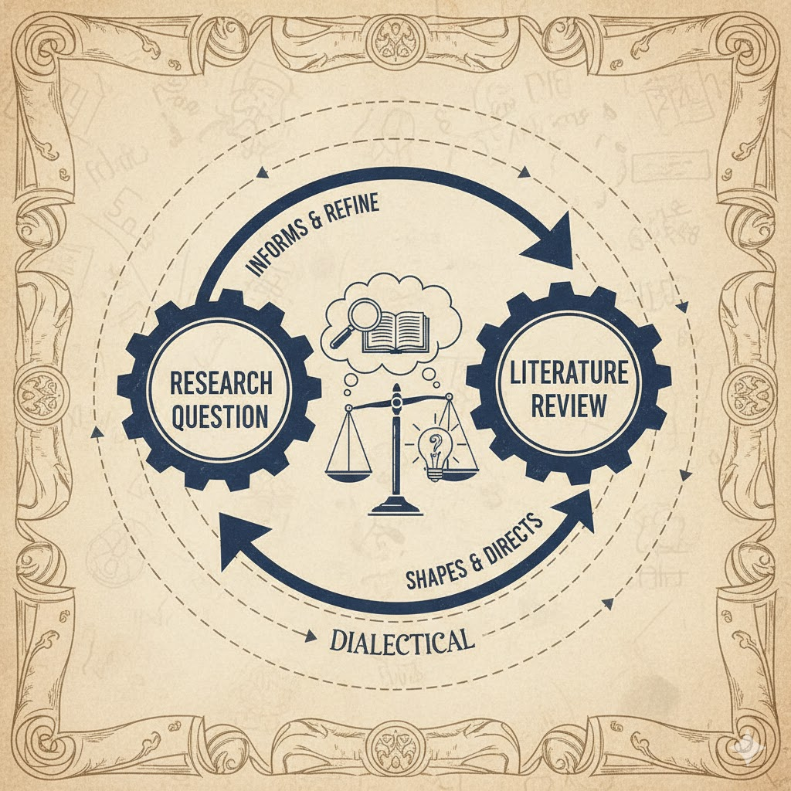

# ERAM 590 - AI and Academic Literature

---

## Lecture 1

---

### Welcome to AI and Academic Literature

- What is this course about? Do we need another course on academic literature?
- Foundational: How to Develop a Literature Review
- Future-Oriented: How AI is Impacting Academic Literature / Scholarship
- Mix of Theory and Practice

---

### Overview

How do you build a sense of your field and its gaps? This course aims to make sense of a term – academic literature – at once mundane and mystical. It starts with fundamentals: how to build, annotate, analyze, map and translate a literature database into a literature review. It progresses to think about how AI and other technology can help foster more critical, analytic and reflexive modes of interpretation and understandings of the field.

All required material (video lectures, readings etc.) will be provided to students.

---

### What we'll cover...

- Week 1 - Course Overview / What's a Good Research Question? / AI tools for literature
- Week 2 - Where's the Gap? Mapping a Field  / Anatomy of a Journal Article
- Week 3 - Does Artificial Intelligence mean  Artificial Knowledge? How AI is Impacting Academia / Vibe Scholarship (Is It as Bad as It Sounds?)
- Week 4 - Academic Audiences and Techniques of Persuasion / Finding Your Scholarly Voice: Peers / Audience / Venue / Field 
- Week 5 - "What Do I Know?" Towards A Sociology of Knowledge / Designing a Literature Review
- Week 6 - The Reflexive Researcher
- Week 7 - The Automatic Academy? The Future of Scholarship

---

### Assessments: Building a 'Mock' (or Real) Literature Review

The aim of the course is to build a *cumulative* literature review. It is a course in which to experiment with different approaches to engage with literature. Accordingly assessment will focus less on the "correctness" of the final output and more on week-to-week engagement with course materials and activities. 

That all said, the purpose of the course is to support a dissertation / journal article / other academic writing – to that extent, if the final output does serve other purposes, well and good!

---

### Assessments: Building a 'Mock' (or Real) Literature Review

 - Week 1: First Draft of Research Topic / Research Question (10%)
 - Week 2: Design, Method and Structure of the Literature Review  (10%)
 - Week 3: Concept Map of the Literature (10%)
 - Week 4: Literature Review Sample: In the Scientific Mode / In the Humanities Mode (10%)
 - Week 5: Literature Review: Signposting (10%) 
 - Week 6: Statement about the use of AI in your Literature Review / Reflection about the role of AI in academia (10%)
 - Week 7: Final Literature Review (40%) - **Due Friday Dec 12**

---

| **Week** | **Theory** | **Practice** | **Assessment** |
| --- | --- | --- | --- |
| **1** | Course Overview / Anatomy of a Journal Article / What Makes a Good Research Question?  | AI Tools for Literature | First Draft of Research Topic / Research Question |
| **2** | Academic Audiences and Techniques of Persuasion | Where's the Gap? Mapping a Field | Design, Method and Structure of the Literature Review |
| **3** | Does Artificial Intelligence Mean Artificial Knowledge? How AI is Impacting Academia  | Vibe Scholarship (Is It as Bad as It Sounds?) | Concept Map of the Literature |
| **4** | Finding Your Scholarly Voice: Peers / Audience / Venue / Field | Drafting a section of your review in a *scientific* and *humanities* mode | Literature Review Sample: In the Scientific Mode |
| **5** | "What Do I Know?" Towards A Sociology of Knowledge | Framing Language: "Carry" Your Reader | Frame up your Literature Review |
| **6** | The Reflexive Researcher and Interpreting Scholarship | Reflecting on your positionality vis-a-vis interpretation; drafting a statement about AI’s epistemic role | Statement on the Use of AI in Your Literature Review / Reflection on the Role of AI in Academia |
| **7** | The Automatic Academy? The Future of Scholarship | Compiling a complete literature review | Final Literature Review |

---

### Rubric / Criteria

 - **Develop** novel, significant and feasible research question
 - **Compile** relevant map of the field relating to the research question
 - **Choose** and **apply** appropriate citation practices (science / humanities / mix) for question & field
 - **Use** framing / signposting / metadiscursive language
 - **Show** reflexivity as a scholar
 - **Acknowledge** and **demonstrate** appropriate use of AI
 - Use all of the above to **highlight** a plausible gap in the literature 

---

### Approach

 - "Industry" orientation: move fast and break things! 
 - Quick sketches of a literature review - with AI (and caveats)
 - Why? The idea is to build intuitions about (a) how to review literature and (b) how to write-up those reviews quickly
 - Peer review: really more like turning an individual pursuit into something *social*.  
 - AI Orientation: 
   - Understanding that knowledge has always had a technical orientation (paper, printing press, media, computers, Internet)
   - But we need a critical lens; looking ahead to how technology should make us work harder intellectually (not easier)

---

### Format

 - We'll use the 3 hours flexibly
 - 2 x 10 minute breaks on the hour
 - The 3 hours will encompass (most of) the assessment
 - Mix of mini-lectures / discussion / group-work
   - With discussion - we'll aim to build a lightweight notebook on good literature search / reading / review practices
   - AI exercises
 - Mix of theory / practice

---

### Discussion and Introductions

 - What is Literature? What is a Literature Review?
 - What is Changing? How is AI Impacting Scholarship?

---

### Notes on Software Note-taking...

 - Encourage everyone to use some software (Obsidian etc)
 - Try to learn Markdown / Zettenkettel...
 - My own NightOwl - Why?
 

---

### Mechanisms for Collaborative Document Editing

 - What we need:
   - A "continuous document"
   - Ability to share with peers & annotate 
 - Box / Microsoft Office? HIPAA-compliant but cumbersome
 - Canvas options?
 - Google Docs? Not HIPAA-compliant
   - [ERAM 590 - Google Docs](https://docs.google.com/document/d/1wyWkvOju-FPXxWnpSlzrrgugqy0RdZGNL6S3Kh5wHd4/edit?usp=sharing)

---

### What Makes a Good Research Question? (and is *that* a "Good Research Question"?)

 - Partly a question of *feel* - experienced researchers know a good question when they see it
 - Sources:
   - Informed by *literature*: what key problems are unsolved?
   - Informed by *events*: what is happening and how do we explain it?
   - Informed by *circumstance*: it annoys me no-one can answer this question - perhaps I can?
   - Informed by *disposition*: I just love working on – or want to know more about – X.
   - Informed by *sociality* (FOMO): All the cool kids work on X - should I be working on it too? Or should I *not* be working on it?

---

### What Makes a Good Research Question? Relationship to literature

 - Should I dream up a research question from thin air? Should I wait until I've done a systematic literature review?
 - Think of the relationship between research question and literature review as *dialectical* (each directing the other):
   - Think of a draft topic / question
   - Search on the topic / question. Is it answered? Wholly or partly? Which parts remain?
    

---

### What Makes a Good Research Question? Practicalities

 - Does the research question *need an answer*? Is it *necessary*? Or does it provoke a "so what?" response?
 - Is it *doable* and *feasible*? Or would I need 100 years / 1 billion dollars / a vast research team to do it?
 - Will I be able to answer this question with *methods* that I know and *data* that I can access?

---

### What Makes a Good Research Question? Novelty

 - Has this question been answered before? 
   - Not always obvious... Many different literatures, disciplines, traditions work on related problems.
 - Is it *novel* for good reasons? No one needs an answer to it, or it is unanswerable through research (does God exist?)
 - Is it likely to remain novel throughout my research? Think of AI: "No one has studied the impact of Gemini 3 / ChatGPT 6 on student learning" (because these systems aren't released yet - but once they are, the studies will follow).

---

### What Makes a Good Research Question? Consequences

 - What happens when I know the results 
 - Is it *doable* and *feasible*? Or would I need 100 years / 1 billion dollars / a vast research team to do it?
 - Will I be able to answer this question with *methods* that I know and *data* that I can access?
 

---

### Class discussion

 - We'll all need a candidate research question / topic 
 - Doesn't need to be your dissertation!
 - Breakout groups: work on a pseudo-topic 
 - Document the topic!

---

### Readings

Weber, M. (1946). Science as a Vocation. In Science and the Quest for Reality (pp. 382-394). London: Palgrave Macmillan UK.

libguides.umn.edu. n.d. “Characteristics of a Good Research Question - Literature Searching - Research Guides at University of Minnesota Minneapolis.” Libguides.umn.edu. [https://libguides.umn.edu/c.php?g=1337354&p=9854773].

<!-- 

Aarseth, E. J. (1997). Cybertext: Perspectives on ergodic literature. JHU Press. [williamwolff.org](https://williamwolff.org/wp-content/uploads/2013/01/aarseth-ergodic-ch1-1997.pdf) 

---

## 584 Lecture 2

 - Pitfalls: the Annotated Bibliography and the Literature Review
 - Tone: Navigating The Two Cultures
 - Signposting / metadiscourse / discourse markers / rhetorical statements
 - Persuasive purpose

[sciencepolicy.colorado.edu](https://sciencepolicy.colorado.edu/students/envs_5110/snow_1959.pdf)

---

## 584 Lecture 3

---

## 584 Lecture 4

---

## 584 Lecture 5

---

## 584 Lecture 6

---

## 584 Lecture 7
-->