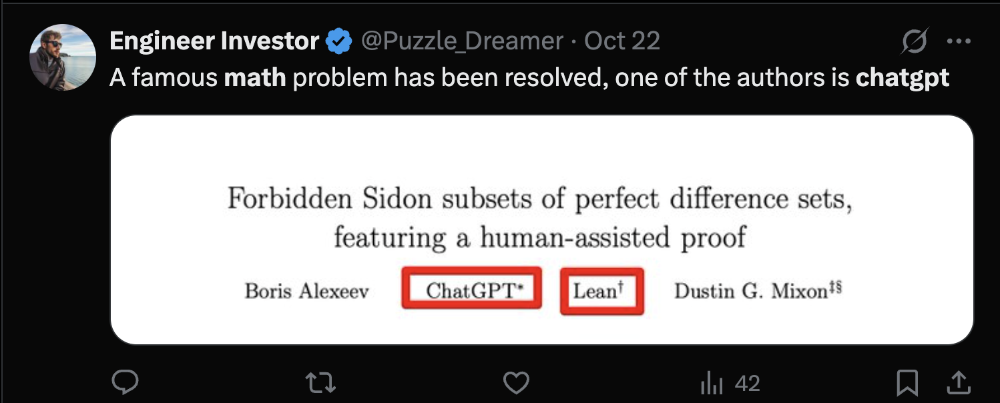
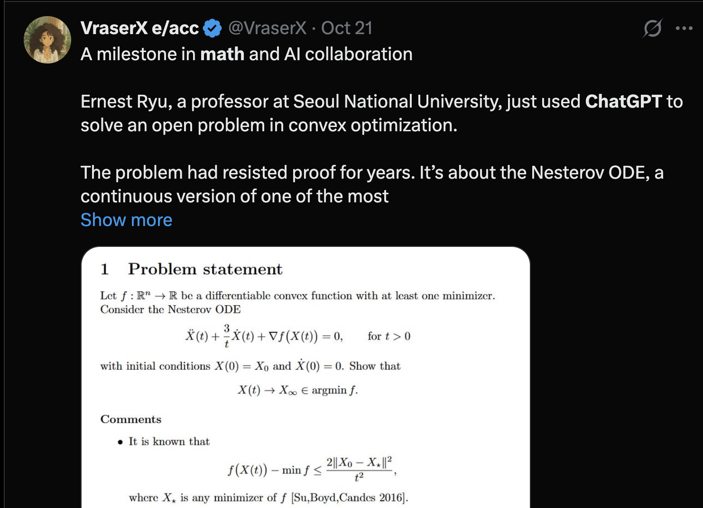
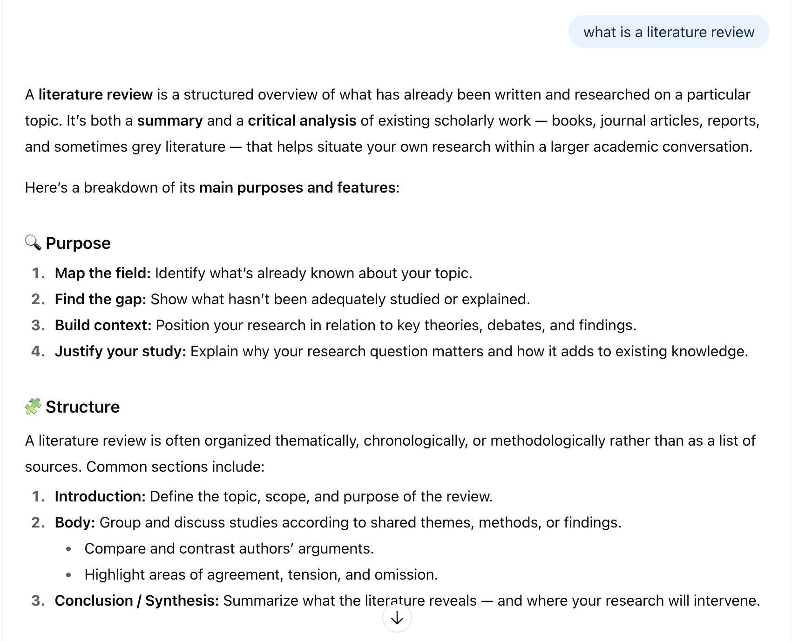
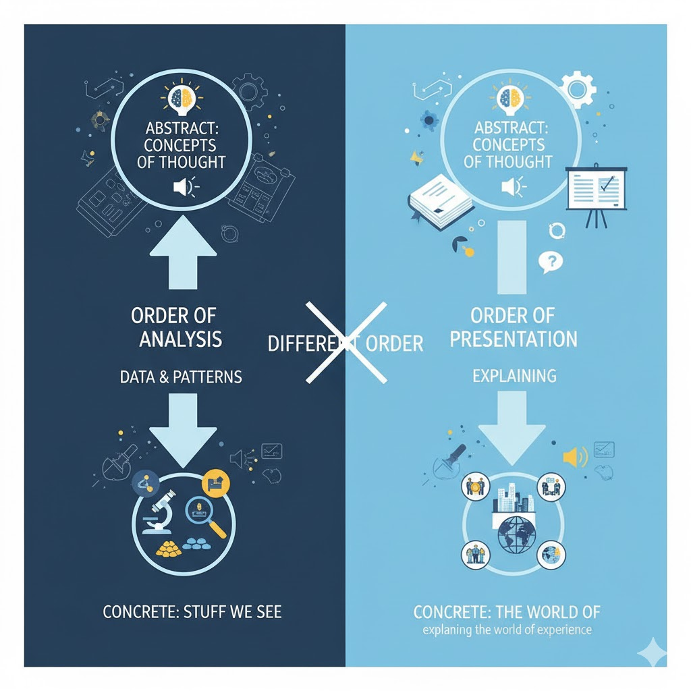
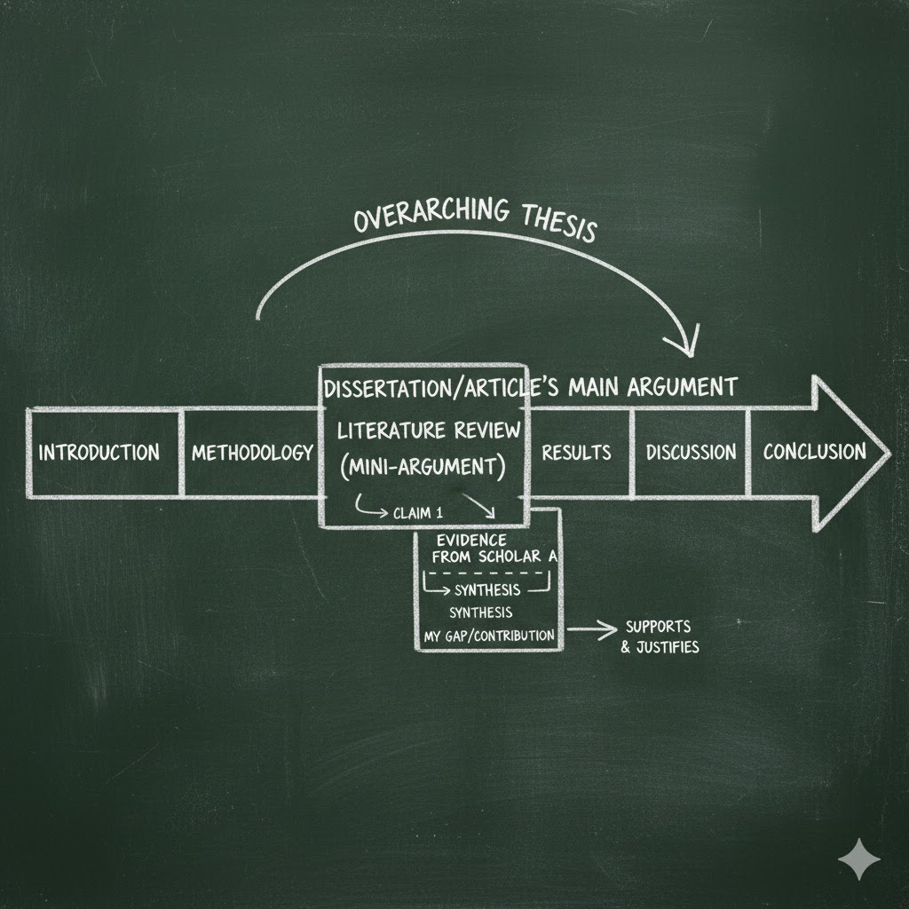

---

## 590 Lecture 2

- Week 2 - Anatomy of a Journal Article / Where's the Gap? Mapping a Field  

  
- Overview:
  - What is a Journal Article? What is a Literature Review? (hours 1) 
  - Mapping a Field (and Minding the Gap) (hour 2)
  - Design, Method and Structure of the Literature Review (hour 3)

Academic Audiences and Techniques of Persuasion | Where's the Gap? Mapping a Field | 

---

## Recap on Week 1

- What is this course about? Do we need another course on academic literature?
- Foundational: How to Develop a Literature Review
- Future-Oriented: How AI is Impacting Academic Literature / Scholarship
- Mix of Theory and Practice

How do you build a sense of your field and its gaps? This course aims to make sense of a term – academic literature – at once mundane and mystical. It starts with fundamentals: how to build, annotate, analyze, map and translate a literature database into a literature review. It progresses to think about how AI and other technology can help foster more critical, analytic and reflexive modes of interpretation and understandings of the field.

All required material (video lectures, readings etc.) will be provided to students.

---

## Recap on Week 1

| **Week** | **Theory** | **Practice** | **Assessment** |
| --- | --- | --- | --- |
| **1** | Course Overview / Anatomy of a Journal Article / What Makes a Good Research Question?  | AI Tools for Literature | First Draft of Research Topic / Research Question |
| **2** | Academic Audiences and Techniques of Persuasion | Where's the Gap? Mapping a Field | Design, Method and Structure of the Literature Review |
| **3** | Does Artificial Intelligence Mean Artificial Knowledge? How AI is Impacting Academia  | Vibe Scholarship (Is It as Bad as It Sounds?) | Concept Map of the Literature |
| **4** | Finding Your Scholarly Voice: Peers / Audience / Venue / Field | Drafting a section of your review in a *scientific* and *humanities* mode | Literature Review Sample: In the Scientific Mode |
| **5** | "What Do I Know?" Towards A Sociology of Knowledge | Framing Language: "Carry" Your Reader | Frame up your Literature Review |
| **6** | The Reflexive Researcher and Interpreting Scholarship | Reflecting on your positionality vis-a-vis interpretation; drafting a statement about AI’s epistemic role | Statement on the Use of AI in Your Literature Review / Reflection on the Role of AI in Academia |
| **7** | The Automatic Academy? The Future of Scholarship | Compiling a complete literature review | Final Literature Review |

---

## Anatomy of a Journal Article

 - Think back to Weber: the "Journal Article" is the vehicle of choice for transmitting science (German: *Wissenschaft*, or what we would call knowledge)
 - We read dozens, hundreds, thousands...
 - Our life is conditioned by the results of journal articles
   - For example, "AI" is today completely dominated by a single paper, "Attention is All You Need" (GS cites: > 200K)
 - But what *is* a journal article? How do you *analyze* one? How do you *write* one? 

---

### Quick history:

 - The "journal" is a recent invention
 - Convenient communication of science (17-19th centuries)
 - Involves the following "ontology":
   - A collection of **articles**
   - **bold text**Authors of the article
   - An **editor** (who reviews and assembles articles)
     - **Peer reviewers** (other scholars who the editor invites to review articles)
   - A **publisher** (who *recruits* the editor, *typesets*, *sells* and *distributes* the journal to readers)
   - A **readership** (who subscribes to the journal - very often **university libraries**)

---

### Aside: Perversity of Publishing

 - **University libraries** pay  subscriptions to the **publisher** for articles that its own employees have authored (and edited and reviewed)
   - **Why?**
 - Are there alternatives?
   - Open access publishing (but questions of sustainability of volunteer labour / reputation / distribution reach)
   - Rise of "predatory publishing" (& dreaded "Article Processing Charge" - upto $8K USD)

---

### What is the **purpose** of an article?

 - An article makes an **argument**
 - As such, it is a form of **persuasive** writing
   - It aims to **change the mind** of a reader
   - But to do so, it must use **evidence** (and other things)
 - All the parts of an article should contribute to this aim: **persuasion**
 

---

### Another aside: AI Authorship of Journals

- Would you read an article by a **bot**? Under what circumstances? 
- What about a math paper?

---

### Typical structure of an Article

 - Introduction
 - Literature Review
 - Methodology
 - Findings
 - Results
 - Conclusion
 - But **why**? Why these parts?
 
Let's answer this collaboratively:

[ERAM 590 - Google Docs](https://docs.google.com/document/d/1wyWkvOju-FPXxWnpSlzrrgugqy0RdZGNL6S3Kh5wHd4/edit?tab=t.0)

---

### What is a literature review?

Lots of answers, lots of guidance...

[Literature Review Guidelines &#8211; Learning Design and Leadership (LDL) Program](https://ldlprogram.web.illinois.edu/dissertation-resources/literature-review-guidelines/)

[Writing a Literature Review - Purdue OWL® - Purdue University](https://owl.purdue.edu/owl/research_and_citation/conducting_research/writing_a_literature_review.html)

[Literature Reviews &#8211; The Writing Center • University of North Carolina at Chapel Hill](https://writingcenter.unc.edu/tips-and-tools/literature-reviews/#:~:text=A%20literature%20review%20discusses%20published,combines%20both%20summary%20and%20synthesis.)

---

### Designing a Literature Review

 - We have a Research Question / Topic
 - What's next? Just blast out a search on Google Scholar / University Website? Build a list of references, annotate, summarize, organize? Find the gap?
   - But can come across as arbitrary
 - **Or**: think of the Literature Review as a mini-research project within the project ( / article / dissertation)

---

## Learn from Marx?

 - Order of **analysis** is different from order of **presentation**
   - In analysis we go from concrete (stuff we see) to abstract (concepts of thought)
   - In presentation, we go from abstract (concepts) to concrete (the world of experience) - **explaining** the world of experience

---

### Google Gemini's view

"create an image showing how a literature review is a mini-argument embedded within the larger argument of an article or dissertation"

---

### What's the "research question" of the Literature Review

 - What's the gap in the literature? (should eventually coincide with the research question)
   - What are you *arguing*? That this gap exists... (perhaps other things too)
 - Develop a *Methodology*:
   - Choose relevant search terms (think about AI's ability to translate the terms you think of to the ones you don't)
     - Pick a couple of relevant articles and read the references
   - Choose an organization principles:
     - Organize by theme? What are the themes?
     - Organize by time? How have debates on topic X *evolved*?
 - Construct an *Introduction* and *Conclusion*
  

---

## Hour 2...

### Mapping Fields and Minding Gaps

---

### Metaphors of Knowledge: Navigating fields and finding gaps

 - What is the **field**? Talk your reader through it...
 - What is the **gap**? Tell your reader how you get there...
   - work backwards - find the gap, *then* organize the steps...
 - Use the language of *argument* / *metadiscourse*:
   - If we are on a "path" through the "field", join the dots:
     - Move up / down: general - specific
       - "More generally...", "At an abstract level", "Theoretically...", "Globally / Nationally..."
       - "More specifically...", "At an concrete level", "Pratically", "Locally
     - Move side to side: similar - different
       - "Similarly...", "Along the same lines...", 
       - "However...", "Conversely...", "On the other hand...", "In contrast..." 
   - "Control" your navigation:
     - "This review *will* cover...", "The literature describes several facets of..."
     - Add some drama: "Meanwhile...", "Despite...", "X has dispute Y's findings..."
     - "This review *has* covered..."

---

### Work it like a Puzzle

 - Look at the whole picture - does it make sense?
 - Fill it in piece by piece
 - Iterate - whole to part, part to whole
 - More vocabularly: the *Hermeneutic Circle*
   - Understand the Whole (in order to Interpret the Path)
   - Interpret the Path (in order to Understanding the Whole)

---

### Common Pitfalls

 - The Annotated Bibliography and the Literature Review
 - Tone: Navigating The Two Cultures (see Snow 1959)
 - Lack of Signposting / metadiscourse / discourse markers / rhetorical statements
 - Lack of persuasive purpose
 - Laundry list of gaps -> Narrow down on the one / two that you are likely to follow

---

### Two (or Three) (Pseudo-)Random Articles

1. Keerthiraj, & Misra, A. (2025). Who owns the future? AI, digital sovereignty, and the politics of knowledge. AI & SOCIETY, 1-13. https://link.springer.com/article/10.1007/s00146-025-02641-y  
2. Liu, J., Zhang, Y., Li, W., Wang, Q., Niu, P., & Zhang, X. (2025). Adaptive vs. Planned Metacognitive Scaffolding for Computational Thinking: Evidence from Generative AI-Supported Programming in Elementary Education. Computers & Education, 105473. https://www.sciencedirect.com/science/article/pii/S0360131525002416?casa_token=cBNpQ0r7f4oAAAAA:THnluE0eVY1uTJ3bnp1V6j-fsLEXobOB6QqoszFx_hsNacpAVPMmIe61gO70IXtFPiT2vIRcGPk
3. Spivak, G. C. (2023). Can the subaltern speak?. In Imperialism (pp. 171-219). Routledge. http://users.uoa.gr/~cdokou/TheoryCriticismTexts/Spivak-Subaltern.pdf

 - Why these two (three) examples? Contrasting methods, yes - but more than this, these articles reflect different orientations towards *scholarly techniques of persuasion*

---

### First: What do we do when we open an article?

 - What are the different ways of reading?
 - 2 Common Strategies:
   - Top to bottom
   - Abstract, Introduction, Conclusion - then the rest
 - Sometimes: 
   - Literature Review first
   - Methodology first (what did the researchers do?)
   - References first (what "space" of academia does this belong in?)

[ERAM 590 - Google Docs](https://docs.google.com/document/d/1wyWkvOju-FPXxWnpSlzrrgugqy0RdZGNL6S3Kh5wHd4/edit?tab=t.0)

---

### Who owns the future? AI, digital sovereignty, and the politics of knowledge *Keerthiraj, & Misra, A. (2025)*

Keerthiraj, & Misra, A. (2025). Who owns the future? AI, digital sovereignty, and the politics of knowledge. AI & SOCIETY, 1-13. https://link.springer.com/article/10.1007/s00146-025-02641-y

---

### Adaptive vs. Planned Metacognitive Scaffolding for Computational Thinking

Liu, J., Zhang, Y., Li, W., Wang, Q., Niu, P., & Zhang, X. (2025). Adaptive vs. Planned Metacognitive Scaffolding for Computational Thinking: Evidence from Generative AI-Supported Programming in Elementary Education. Computers & Education, 105473. https://www.sciencedirect.com/science/article/pii/S0360131525002416?casa_token=cBNpQ0r7f4oAAAAA:THnluE0eVY1uTJ3bnp1V6j-fsLEXobOB6QqoszFx_hsNacpAVPMmIe61gO70IXtFPiT2vIRcGPk

---

### Can the subaltern speak?
 
Spivak, G. C. (2023). Can the subaltern speak?. In Imperialism (pp. 171-219). Routledge. http://users.uoa.gr/~cdokou/TheoryCriticismTexts/Spivak-Subaltern.pdf

---

## Hour 3...

---

### Designing a Literature Review

Checklist:

1. What are the key terms of the (draft) research question? List them...
2. What are the *norms* of your field? And what *is* your field?
3. What is a reasonable *method* or *recipe* for your literature review?
4. What are *related terms* (can AI find reasonable synonyms)?
5. What do you get when you search *Google Scholar* / *library databases* for these terms?
6. Do you have *existing articles* / authors to draw from?
7. What *citation system* are you using? Can you code / organize literature in the way you'd like?
8. What is the best *organization* of the literature? Thematic, field (for multi-/interdisciplinary work), chronological, spatial, general / special?
9. Are there *classics* you are expected to cite? References with very large number of citations (e.g. Braun & Clarke 2006; Vaswani et al. 2017; Bender et al. 2021)?

---

### Do some sketches: "fast" review

 - **Time**, followed by **theme**, followed by **space**
 - Just be approximate

"Criticism of AI **dates back** to the inception of the field itself. For example, Dreyfus (1966 - or thereabouts) discussed the brittleness of (etc)... By the early 1980s, scepticism voiced by philosophers such as Searle (1981) in his famous "Chinese room" experiment, contributed to the emergence of an AI winter. **More recently**, as generative AI has largely revived the field, criticism has been directed toward both issues of **social justice and bias** (e.g. Bender et al. 2021) and potential **existential risk** (e.g. lesswrong blog). In some cases, critical AI scholars have also argued the existential case is a convenient disguise that obscures more immediate negative social effects (Gebru and Torres 2024). Moreover scholars from **outside the US** - particularly in the Global South – have begun to argue AI constitutes a form of **neocolonialism**, impacting digital sovereignty (Keerthiraj, & Misra 2025)"

 - Can work with or without AI - useful just to test how this or that understanding helps make your case (about gaps)
 - Don't commit to this structure just yet! 

---

### Then develop a plan...

1. Tentative gap - what do you think it is?
2. Scaffold your review - how many sections? do you need subsections? Add preliminary citations
3. Develop a sense of key transitions - what's the drama in the review? "also argued", "moreover" etc
4. Be light, noncommital - prepared to cut/paste
5. As your literature grows, you might need to *qualify* the statement of the gap. Maybe there **are** studies of the general topic X - but you can add *adjectives* to the gap (research question) to narrow it down... Go back to Step 1, rinse and repeat...

---

### Also consider

 - Different perspectives - outside the ordinary frame of discipline, time
   - e.g. "heteroscopia" ("many visions") - concept by Jaireth (2001) to describe Indian cinema
   - But also a useful term for thinking about machinic vision, generative AI 
 - Less-known authors (especially not widely cited) - this can enrich a review, demonstrating greater awareness beyond the same few authors / studies...
   - e.g. History of AI - typically focussed on US developments. But Schmidhuber (1922) argues the importance of developments in Ukraine (USSR), Japan, Finland in the 1960s/70s. Who knew? 
 - **In short: surprise us!**

---

### Growing your database

Different techniques for expanding your database:

- Search (Google Scholar / library databases)
- With existing articles: 
  - **Go back**: Scan *references* of this article
  - **Go forward**: Search for *citations* of this article
  - **Go sideways**: What else was published in the same journal / issue
- Check common "authorities": Wikipedia, syllabi, AI
  - e.g. "Critical AI" - people will be citing Bender et al. (2021) stochastic parrots paper 

---

### This Week's Activity

1. Write down the gap (should be close to your research question)
2. Write down your assumed audience / field. What do you know about them? Do they prefer lots of recent citations (science)? Or fewer, with more emphasis on the classics (philosophy, theory, some qual studies)?
3. Create a short plan / recipe method:
   - "Search for these terms / filters"
   - "Create a database of 10 articles"
   - "Scan the articles for relevance - discard those that are not relevant"
   - "With remaining articles: review references, search for more recent citations"
   - "Once I have 50 articles: code / annototate for relevance"
   - "Map out review structure; add citations, continue to search under subheadings"
   - "Supply list of refs to AI and ask if I'm missing anything crucial"
<!-- 
1. Develop a rough structure of headings / subheadings
2. Lay in some initial citations (if you know them), with indicative transitional language ("also", "however" etc) 
--> 

---

### Next Week's Readings

[sciencepolicy.colorado.edu](https://sciencepolicy.colorado.edu/students/envs_5110/snow_1959.pdf)

Aarseth, E. J. (1997). Cybertext: Perspectives on ergodic literature. JHU Press. [williamwolff.org](https://williamwolff.org/wp-content/uploads/2013/01/aarseth-ergodic-ch1-1997.pdf) 
