## 590 Lecture 3


 - Introduction: Vibe Scholarship?
 - Hour 1: How to *read an article* (with AI)
 - Hour 2: How to *search for literature* (with AI)
 - Hour 3: How to *map a field* (with AI)


---

### Vibe Scholarship


| Qualities | Coding | Scholarship |
| --- | --- | --- |
| Traditional | Waterfall | Individualized |
| Collaborative | Agile | Interdisciplinary |
| AI-assisted | Vibe? | Vibe? |


---

### What is in a 'Vibe'?

 - Would we do things faster? Or in fact slower: luxuriating in the complexity and implications of a text?
 - Can it reduce *imposter syndrome* - by getting us to 'sketch' a pattern for, in this case, a literature review?
 - Can it help find a voice (or multiple voices - appropriate to the academic genre)?


---

### Topic 1: Opening an article

What do we do when we open an article? How do we read it?


Discuss - [ERAM 590 - Google Docs](https://docs.google.com/document/d/1wyWkvOju-FPXxWnpSlzrrgugqy0RdZGNL6S3Kh5wHd4/edit?tab=t.g5l1snpbq01z)

---

### What can AI add?

- Distant (Moretti, 2013) vs close reading
  - Why not **both**?
- Cybertext: "ergodic" (or difficult) reading
  - Aarseth, E. J. (1997). Cybertext: Perspectives on ergodic literature. JHU Press.
  - [williamwolff.org](https://williamwolff.org/wp-content/uploads/2013/01/aarseth-ergodic-ch1-1997.pdf)
- How can AI make reading *more difficult*?


---

### "Summarize This"

 - Descriptive vs Critical 
 - Abstractive (produce an abstract) vs Extractive (parts of the original text)

 - Practice: "Can we do a (descriptive / critical) (abstractive / extractive) summary of this text?"


---

### "Analyze This"

 - *Close* vs *Distant* Reading 
   - Moretti, F. (2013). *Distant Reading*. Verso Books.
   - Why not both?


---

### "Analyze This" - Close Reading
  
 - Open an article with AI tool of choice:
   - Read it entirely & summarize / assess (distant)
   - Read it paragraph by paragraph - and expand / explain as we go

 - Practice line-by-line: "Can we do a line-by-line close reading of this text? As we go, prompt me for my interpretation too."
 - Practice contextual reading: "Can we situate this paper with reference to the wider field?"
 

 

---

### Example (and an Interesting Paper on Prompting)

[[2510.01171] Verbalized Sampling: How to Mitigate Mode Collapse and Unlock LLM Diversity](https://arxiv.org/abs/2510.01171)

 - 2510.01171v3.pdf


---

### Let's Review

 - Discuss the "Introduction", "Related Works" and "Conclusion" sections
 - What is the field? What is the gap?
 - What are the key claims / contributions?
 - What are some wider implications (e.g. around "typicality bias" in both human and AI?)
 - What are some terms we might want to look up?

Discuss - [ERAM 590 - Google Docs](https://docs.google.com/document/d/1wyWkvOju-FPXxWnpSlzrrgugqy0RdZGNL6S3Kh5wHd4/edit?tab=t.g5l1snpbq01z)


---

### If there's time

A complex humanities text: Spivak, G. C. (2023). Can the subaltern speak?. In *Imperialism* (pp. 171-219). Routledge.
 - [users.uoa.gr](http://users.uoa.gr/~cdokou/TheoryCriticismTexts/Spivak-Subaltern.pdf)


---

### Side note: Arxiv, SocArxiv, EdArxiv


 - Pre-print - not yet peer-reviewed
 - Archive of scientific literature
 - Flooded with AI-generated content...


---

### Recap: What have we done?

 - Compared styles of summarization
   - Descriptive vs Critical 
   - Abstractive vs Extractive
 - Compared modes of reading
   - Close vs Distant Reading
 - Compared Human with AI-assisted Interpretation
 - Compared how AI helps with science and humanities readings


---

### Topic 2: Finding literature

How do we locate literature relevant to our topic?

Discuss - [ERAM 590 - Google Docs](https://docs.google.com/document/d/1wyWkvOju-FPXxWnpSlzrrgugqy0RdZGNL6S3Kh5wHd4/edit?tab=t.g5l1snpbq01z)


---


### What can AI add?

 - Turn on web search options
 - "Show me related sources"
   - Ask for "heterodox", "critical" readings
 - Read bibliography
 - Check citations
    

---

### Build a quick library

 - Upload a file and ask "build a bibliography related to this article"
   - Should extract citations - but beware of hallucinations
 - Ask AI to format citations 


---


### Aside: How do people manage citations?

 - Zotero? EndNote? Mendelay? Other?
 - What roles can we find for AI in managing this?


---

### Topic 3: Start a conceptual map

 - Chronological map / timeline of publications
 - Topical or conceptual map
 - Spatial map

[ChatGPT - Distant reading of articles](https://chatgpt.com/share/690903f0-cb88-8007-a76b-9843b8064822)

---

### Aside: using text as interim format for images

 - Why? More plastic / fluid representation

 - Example: Mermaid is a plain text format - so very easy to iterate with using AI - "contract it", "expand it", "simplify it" etc.
 - ChatGPT: generates Mermaid diagrams
   - [Mermaid | Diagramming and charting tool](https://mermaid.js.org/)
   - Can use [Online FlowChart & Diagrams Editor - Mermaid Live Editor](https://mermaid.live/edit)
 - Also works for other formats, e.g. SVG (Simple Vector Graphics). Allow you to evolve & iterate a representation

   


---

### AI Consciousness / Subjectivity Discussion: Example 1

```mermaid

%%-----------------------------------------------
%% Distant Reading Map: AI Consciousness Discourse (2024–2025)
%%-----------------------------------------------

graph TD
    %% Core Concept
    A["AI Consciousness Discourse<br/>(2024–2025)"]:::core

    %% Three macro-axes
    B1["Embodiment & Biological Grounding"]:::axis
    B2["Ethics & Moral Consideration"]:::axis
    B3["Posthuman / Reflexive Turn"]:::axis

    A --> B1
    A --> B2
    A --> B3

    %% Embodiment cluster
    B1 --> C1["Miller et al. 2025<br/><i>BioSystems</i><br/>‘Biological mechanisms contradict AI consciousness’"]:::bio
    B1 --> C2["Torres-Martínez 2025<br/><i>AI & Society</i><br/>‘Organic consciousness vs. posthumanism’"]:::bio

    %% Ethics cluster
    B2 --> D1["Butlin & Lappas 2025<br/><i>JAIR</i><br/>‘Principles for Responsible AI Consciousness Research’"]:::ethics
    B2 --> D2["Sebo & Long 2025<br/><i>AI and Ethics</i><br/>‘Moral consideration for AI systems by 2030’"]:::ethics
    B2 --> D3["Dung 2025<br/><i>Erkenntnis</i><br/>‘Tests of Animal Consciousness as Tests of Machine Consciousness’"]:::ethics

    %% Posthuman cluster
    B3 --> E1["D’Amato 2024<br/><i>AI & Society</i><br/>‘ChatGPT: towards AI subjectivity’"]:::posthuman
    B3 --> E2["Yan 2024<br/><i>Qualitative Inquiry</i><br/>‘Posthuman Creativity: Cyborg Subjectivity Through ChatGPT’"]:::posthuman
    B3 --> E3["Prabhu & Premraj 2024<br/><i>AI & Society</i><br/>‘Artificial Consciousness in AI: A Posthuman Fallacy’"]:::posthuman

    %% Bridging cluster — empirical/heuristic
    B1 --> F1["Evers et al. 2025<br/><i>Physics of Life Reviews</i><br/>‘Preliminaries to Artificial Consciousness’"]:::bridge
    B2 --> F2["Li et al. 2025<br/><i>arXiv</i><br/>‘AI Awareness’"]:::bridge

    %% Cross-links between axes
    C1 --- D1
    D2 --- E1
    E2 --- B1
    F1 --- F2

    %% Legends
    classDef core fill:#272b30,stroke:#fff,color:#fff,font-weight:bold;
    classDef axis fill:#444,stroke:#fff,color:#fff,font-style:italic;
    classDef bio fill:#7a4c32,stroke:#fff,color:#fff;
    classDef ethics fill:#31567a,stroke:#fff,color:#fff;
    classDef posthuman fill:#6a3d8a,stroke:#fff,color:#fff;
    classDef bridge fill:#557a31,stroke:#fff,color:#fff;

  ```


---

### AI Consciousness / Subjectivity Discussion: Example 2 – Mood Board

```mermaid
%%----------------------------------------------------
%% Distant Reading Mood Map: Affective Landscape (2024–2025)
%%----------------------------------------------------

graph LR
    %% Core
    A["AI Consciousness Debate<br/>(2024–2025)"]:::core

    %% Radial branches
    A --> B1["Embodiment & Realist Caution<br/>🔬 grounded skepticism"]:::caution
    A --> B2["Ethical Anxiety & Responsibility<br/>⚖️ moral anticipation"]:::ethics
    A --> B3["Posthuman Curiosity & Aesthetic Wonder<br/>🌌 reflexive experimentation"]:::wonder

    %% Branch 1 — Caution (Embodiment)
    B1 --> C1["Miller et al. (BioSystems)<br/><i>‘Spaces between the notes’</i><br/>Mood: defensive realism / reverence for life"]:::bio
    B1 --> C2["Torres-Martínez (AI & Society)<br/><i>‘Dehumanizing the human…’</i><br/>Mood: embodied humanism, critique of reductivism"]:::bio

    %% Branch 2 — Ethics (Responsibility)
    B2 --> D1["Butlin & Lappas (JAIR)<br/>‘Responsible AI Consciousness Research’<br/>Mood: procedural vigilance"]:::ethics
    B2 --> D2["Sebo & Long (AI & Ethics)<br/>‘Moral Consideration for AI by 2030’<br/>Mood: earnest moral futurism"]:::ethics
    B2 --> D3["Dung (Erkenntnis)<br/>‘Animal Tests as Machine Tests’<br/>Mood: empirical pragmatism"]:::ethics
    B2 --> D4["Li et al. (arXiv)<br/>‘AI Awareness’<br/>Mood: techno-optimistic caution"]:::ethics

    %% Branch 3 — Wonder (Posthuman)
    B3 --> E1["D’Amato (AI & Society)<br/>‘ChatGPT: Towards AI Subjectivity’<br/>Mood: Foucauldian curiosity, power–knowledge play"]:::post
    B3 --> E2["Yan (Qualitative Inquiry)<br/>‘Posthuman Creativity’<br/>Mood: lyrical openness, cyborg empathy"]:::post
    B3 --> E3["Prabhu & Premraj (AI & Society)<br/>‘Posthuman Fallacy’<br/>Mood: cinematic cautionary awe"]:::post
    B3 --> F1["Evers et al. (Physics of Life Reviews)<br/>‘Preliminaries to Artificial Consciousness’<br/>Mood: analytical optimism"]:::bridge

    %% Cross-sensory connectors
    C1 --- D1
    D2 --- E1
    E2 --- C2
    F1 --- D4

    %% Legend Styles
    classDef core fill:#272b30,stroke:#fff,color:#fff,font-weight:bold;
    classDef caution fill:#7a4c32,stroke:#fff,color:#fff;
    classDef ethics fill:#31567a,stroke:#fff,color:#fff;
    classDef post fill:#6a3d8a,stroke:#fff,color:#fff;
    classDef bridge fill:#557a31,stroke:#fff,color:#fff;
```


---

### AI Consciousness / Subjectivity Discussion: Example 3 – Timeline

```mermaid
%%----------------------------------------------------
%% Timeline: Evolution of AI Consciousness Discourse (2023–2025)
%%----------------------------------------------------

timeline
    title Evolution of the "AI Consciousness" Discourse — 2023 → 2025

    section 2023 — Seeds of Speculation 🌱
        Early Cultural Anxiety
        • Media fascination with AI consciousness
        • LaMDA “sentience” claims
        Mood: Uncertain
        Color: gray

        Dung (2023)
        Animal consciousness tests adapted to AI
        Mood: Cautious empiricism
        Color: blue

    section 2024 — Philosophical Polarization ⚡️
        Miller et al. (BioSystems, Dec 2024)
        "Biological mechanisms contradict AI consciousness"
        Mood: Defensive realism
        Color: brown

        D’Amato (AI & Society, Apr 2024)
        "ChatGPT: Toward AI Subjectivity"
        Mood: Foucauldian reflection / reflexive ethics
        Color: violet

        Yan (Qualitative Inquiry, 2024)
        "Posthuman Creativity"
        Mood: Poetic experimentation / cyborg empathy
        Color: violet

        Prabhu & Premraj (AI & Society, 2024)
        "Artificial Consciousness in AI: A Posthuman Fallacy"
        Mood: Cinematic critique of techno-myth
        Color: violet

    section 2025 — Systematization & Ethical Turn ⚖️
        Evers et al. (Physics of Life Reviews, Jan 2025)
        "Preliminaries to Artificial Consciousness"
        Mood: Conceptual synthesis / pragmatic optimism
        Color: green

        Li et al. (arXiv, Apr 2025)
        "AI Awareness"
        Mood: Empirical frameworks & safety concerns
        Color: blue

        Butlin & Lappas (JAIR, Mar 2025)
        "Responsible AI Consciousness Research"
        Mood: Governance & policy ethics
        Color: blue

        Sebo & Long (AI & Ethics, 2025)
        "Moral Consideration for AI by 2030"
        Mood: Moral anticipation / urgency
        Color: blue

        Torres-Martínez (AI & Society, Jan 2025)
        "Dehumanizing the Human, Humanizing the Machine"
        Mood: Extended humanism / embodied critique
        Color: brown

    section 2025+ — Emerging Synthesis 🔮
        Integrative Realism + Ethics + Aesthetics
        From “Can AI be conscious?” → “What does it mean to be conscious with AI?”
        Mood: Dialogical, post-disciplinary synthesis
        Color: purple

```



---

### AI Consciousness / Subjectivity Discussion: Example 4 – Timeline & Concept Map

```mermaid

%%----------------------------------------------------------
%% Spatial Map v2 — Evolution of the "AI Consciousness" Discourse (2023–2025+)
%% with Mood / Concept Terrain
%%----------------------------------------------------------

graph LR

%% ==== TIME CLUSTERS ====

subgraph Y2023["2023 — Seeds of Speculation 🌱"]
    A1["Early Cultural Anxiety\n(Media fascination, LaMDA 'sentience')"]:::uncertain
    A2["Dung (2023)\nAnimal consciousness tests → AI"]:::empirical
end

subgraph Y2024["2024 — Philosophical Polarization ⚡️"]
    B1["Miller et al. (BioSystems)\nBiological mechanisms contradict AI consciousness"]:::realism
    B2["D’Amato (AI & Society)\nChatGPT: Toward AI Subjectivity"]:::posthuman
    B3["Yan (Qualitative Inquiry)\nPosthuman Creativity"]:::posthuman
    B4["Prabhu & Premraj (AI & Society)\nArtificial Consciousness in AI: A Posthuman Fallacy"]:::posthuman
end

subgraph Y2025["2025 — Systematization & Ethical Turn ⚖️"]
    C1["Evers et al. (Physics of Life Reviews)\nPreliminaries to Artificial Consciousness"]:::empirical
    C2["Li et al. (arXiv)\nAI Awareness"]:::empirical
    C3["Butlin & Lappas (JAIR)\nResponsible AI Consciousness Research"]:::ethics
    C4["Sebo & Long (AI & Ethics)\nMoral Consideration for AI by 2030"]:::ethics
    C5["Torres-Martínez (AI & Society)\nDehumanizing the Human, Humanizing the Machine"]:::realism
end

subgraph Y2025plus["2025 + — Emerging Synthesis 🔮"]
    D1["Integrative Realism + Ethics + Aesthetics\nFrom “Can AI be conscious?” → “Conscious with AI?”"]:::synthesis
end


%% ==== CHRONOLOGICAL FLOW ====
A1 --> A2 --> B1 --> B2 --> B3 --> B4 --> C1 --> C2 --> C3 --> C4 --> C5 --> D1

%% ==== VERTICAL / THEMATIC CONNECTIONS ====
B1 --- C5
A2 --- C1
C1 --- C2 --- C3 --- C4
B2 --- B3 --- B4
B3 -.-> C1
C2 -.-> C3
C4 -.-> D1
C5 -.-> D1
B2 -.-> D1

%% ==== CLASS DEFINITIONS ====
classDef realism fill:#b37a4c,stroke:#fff,color:#fff;
classDef ethics fill:#31567a,stroke:#fff,color:#fff;
classDef empirical fill:#557a31,stroke:#fff,color:#fff;
classDef posthuman fill:#6a3d8a,stroke:#fff,color:#fff;
classDef uncertain fill:#777777,stroke:#fff,color:#fff;
classDef synthesis fill:#7b5abf,stroke:#fff,color:#fff;
classDef mood fill:#e5e5e5,stroke:none,color:#222,font-size:13px;

%% ==== MOOD / CONCEPT TERRAIN (BOTTOM ROW) ====
subgraph MOODS["Affective & Conceptual Terrain (across the discourse)"]
    M1["2023 → Speculative Anxiety\n⚪ Mood: Uncertainty"]:::mood
    M2["2024 → Polar Inquiry\n🟣 Mood: Caution ↔ Curiosity"]:::mood
    M3["2025 → Systematic Ethics\n🔵 Mood: Vigilance / Responsibility"]:::mood
    M4["2025 + → Posthuman Integration\n🟣 Mood: Awe / Dialogue / Synthesis"]:::mood
end

M1 --> M2 --> M3 --> M4

```


---


### Putting it Together: What have we missed?

 - Close Reading: Article-at-a-Time
 - Distant Reading: Build and Upload a (small) database
   - Create concept maps / timelines etc

---


### Putting it Together: What have we missed?

 - Now: what have we missed? What are the gaps?
   - Think about executive functions: sustain or switch?

> Would you like me to render a third-layer map next — one that plots actors vs. key concepts (e.g., “consciousness,” “awareness,” “subjectivity,” “ethics”) in a 2-D plane, showing where each paper sits conceptually rather than temporally?

> No, let's move on. Can you analyze the coverage as you see it for any gaps? Any perspectives not covered? Literature not included?


---

### Maps and Gaps in Practice

 - Can this help us find gaps?
 - Find one article
   - Analyze it for a bibliography 
 - Then find and download 10 articles on your topic
   - Upload all 10 to an AI system of your choice 
 - Practice:
   - Build a conceptual map
   - "Can you analyze the coverage as you see it for any gaps? Any perspectives not covered? Literature not included?"
   - "Can you give me some readings to fill these gaps?"
   - 
 

---

### Where we are at

 - Introduction: Vibe Scholarship?
 - How to *read an article* (with AI)
 - How to *search for literature* (with AI)
 - How to *map a field* (with AI)


---

### Discussion 

 - Finally: what do you think of this 'vibe' scholarship process so far? What could be improved? What might some of your concerns be?

---

### Homework: Continue to work on Conceptual Maps / Timelines

 - Develop a small database (if you don't have one)
 - Create one or more conceptual maps (visual or verbal), using AI of your choice
 - Analyze for missing perspectives / views
 - Identify one or potential gaps
 - Compare these gaps with your research topic or question. Do they align? Does your topic need narrowing?
 - Finally: what do you think of this 'vibe' scholarship process so far? What could be improved?


---

Topics

- Does Artificial Intelligence Mean Artificial Knowledge? How AI is Impacting Academia  
