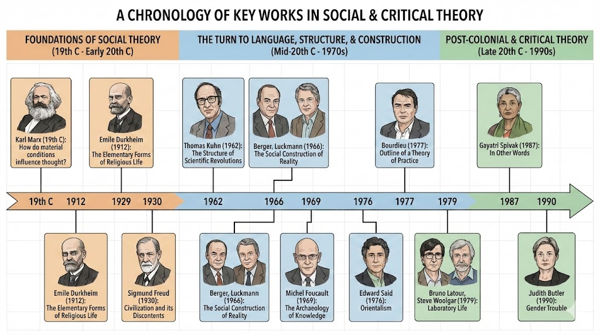
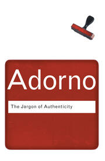
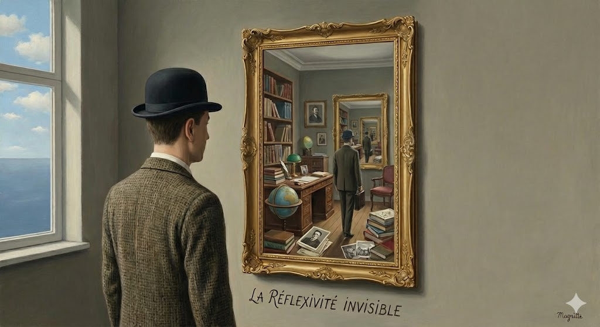

# 590 Lecture 6

---

### What We've Covered

 - Week 1: Research Topic & Question
 - Week 2: Method & Recipe for the Literature Review
 - Week 3: Vibe Scholarship - Applying AI to Close & Distant Reading
 - Week 4: Reading Spivak with AI & Writing for Humanities and the Sciences
 - Week 5: Structuring the Literature Review

---

### This Week

 - Hour 1: 
   - Sociology of Knowledge and Applications to your Literature Review
   - Reflexivity and Positionality: how do we interpret other scholarship?
 - Hour 2: Group work - write a literature review summary
 - Hour 3: How Do You Acknowledge AI in Literature Review?
   - And What is AI doing to Academia and the state of Knowledge?

---

### Next Week

 - Synthesizing the course into a draft review

---

### Sociology of Knowledge

 - Study of academic / scholarly societies
 - Navel gazing? Perhaps. But relevant for all academia because it helps us calibrate our writing (tone / citations )
 - We've already touched on this
   - Two Cultures (Snow (1959) – Humanities and the Sciences)
 - But also: what are **financial** / **political** drivers of research? What are the conceptual or ideological **frames**? What are the standards for **evidence** or **truth**? Compare Spivak (1988) to Zhang et al. (2025)
 

---

### Sociology of Knowledge: Key figures & developments

- Karl Marx (19th century): How do *material conditions* influence *thought*?
- Emile Durkheim (1912): *The Elementary Forms of Religious Life*
- Max Weber (1917): *Science as a Vocation* 
- Karl Mannheim (1929): *Ideology and Utopia* 
- Sigmund Freud (1930): *Civilization and its Discontents*
- Thomas Kuhn (1962): *The Structure of Scientific Revolutions* 
- Berger, Luckmann (1966): *The Social Construction of Reality*
- Michel Foucault (1966): *The Order of Things*
- Michel Foucault (1966, 1969): *The Archaeology of Knowledge*
- David Bloor (1976), *Knowledge and social imagery*
- Bourdieu (1977): *Outline of a Theory of Practice*
- Bruno Latour, Steve Woolgar (1979), *Laboratory Life* 
- Edward Said (1976), *Orientalism*
- Gayatri Spivak (1987), *In Other Words*
- Judith Butler (1990), *Gender Trouble*
 

---

### Sociology of Knowledge: Key figures & developments

Courtesy of Google's Nano Banana Pro. Not quite right, but thanks anyway!

---

### Sociology of Knowledge: Common Points?

- Thinking is not independent of **conditions** of life
- What are "conditions"?
  - Class (Marx), race, gender (Said, Butler, Spivak)
  - Social facts - fads & fashions (Durkheim)
  - Ideology - what fundamental beliefs structure or make possible our thinking (Mannheim)
  - Paradigms (Kuhn), epistemes (Foucault), habitus (Bourdieu): background forms of knowing and being
- Related to unconscious bias (Freud) 

---

### Why does this matter?

- Often asked to account for your **positionality**
- Hard to do! What is your *unconscious bias*? What are you *conscious of being unconscious of*?
  - If you knew, it wouldn't be unconscious!
- Critique of critique - mobilized in the problem of "irregular verbs":
  - "**I think** critically and independently"
  - "**You think** according to the influences of your economic class and upbringing"
  - "**She / He / They think** as unaware and naive victims of ideology" 

---

### Questions about an academic community:

 - What is its **jargon**? Do you want to reproduce, challenge or modify this jargon? 
   - "Jargon" itself can be used as a piece of dismissive or pejorative jargon. All disciplines have and need their vocabulary...
 - What are its **standards of evidence**? What does it **find persuasive**? What are the **key questions** it is asking? 
 - How stringent are its expectations about **method**, **citation**, **formatting**?
 - What are its markers of **distinction** and **discernment** – "tickets to the game"?
 - Conversely: what seem to be the things **not to say**?

---

### How can you develop this tacit sense? Possibilities:

 - Treat it like a research project - *study academics* like an community
   - Read journals
   - Attend conferences
   - Observe faculty
   - Join committees
   - Read or scan 'campus' novels & drama
   - Maintain a reflective journal
   - Share your own research, ask for feedback
   - Ask AI to play the role of an academic in a field
 - All of this can be input into a *discourse analysis* or *thematic analysis* of a field
 - Is it over-thinking? 
   

---

### Relationship to Literature Review

 - Write with your audience in mind 
 - But - very important! – not as though you are already "in the club"
 - Take a reference to Spivak. You might know your audience is likely familiar with Spivak's work. But of course you don't say:
   - "*As we all know*, Spivak argued that"
   - Instead it is as though your audience forgot Spivak's point and you gently remind them: "Spivak argued that..."
   - But then you might twist this familiarity: "In the age of AI, it might seem Spivak's arguments regarding grammatization have dated. However,..."
 - So a literature review can translate your own sociological research into some careful phrasing that both *reassures* and *surprises* your community

---

### Reflexivity and Positionality

 - Most people are familiar with ideas of reflexivity and positionality
   - As we have seen, can be difficult to describe in relation to our own position
 - Discussed in a lot of literature and traditions

---

### Reflexivity and Positionality: Example of Bourdieu

 - What reflexive positionality is **not**: 
   - autobiography or identity ("as an Australian white male...")
   - radical self-doubt ("given my positionality, all truth claims I make are necessarily flawed...")
 - instead it aims to understand the academic self who speaks...
   - part of a liberal settler/colonial academic tradition
   - informed by history, syllabus, academic canons, experience of teacher influence (inner critical voice) - Bourdieusian concept of *habitus* 
   - these *influence* (not necessarily determine) what it is that I say, how I interpret 

---

### Reflexivity and Positionality: Example of Bourdieu

 - Strangely a Bourdieusian sene of positionality is everything that is **not me** - but rather the structural conditions under which 
   - I find such-and-such to be problem (e.g. why do I perceive it to be unethical - where does my sense of ethics come from?)
   - I find this or that theory appealing
   - I prefer scientific / humanities writing prerrable
 - For Bourdieu, reflexivity is like the holding up a mirror - but then paying attention to everything in the *background of the self*

---

### Reflexivity and Positionality (2)

 - Generally discussed in relation to methods and data analysis 
 - How does it affect the literature review? What is it that we bring to the table when we read academic writing?
   - Discuss!

---

### Breaking the rules: From gap to structure

 - Sometimes you *know* what the gap is. The structure of a review feels like *fraudulent* - as though you are pretending to explain to the reader this and that about the literature review, only to arrive at some kind of magical *gap*.
 - Remember Marx: order of **presentation** not always the order of **analysis** (not a statement about Marx' politics!)
 - Can we learn from this? Can we work *backwards*? From example, from gap to special field to general field?

---

### Detective Novel: Start with 'whodunnit', work backwards

 - Start with a statement of the gap (solution to the crime)
 - Surround the gap with the narrative - the key actors, the setting, the clues...

---

### Collaborating with Others (including AI) on the Literature Review

1. Review Week 5 - Structuring the Literature Review
   - Discuss: what worked? what didn't?
2. Now *imagine* you have discovered the gap in the literature
   - Develop it as a statement, and write it down under "Week 6"
3. Write a *non-existent summary* of your literature review
   - Purpose: introduce a reader to your topic
   - 4-5 sentences 
   - Use signposting / metadiscourse heavily
   - If you have a preferred structure from week 5, use that
   - Sample: "In this review, I start by discussing A... I then examine research on B... I further consider C... Finally I show how none of A, B or C address the issue of D."
4. Review each other's statement of a gap
   - Write a single sentence about each other person's summary. Assess what you found (a) clear (or unclear); and (b) whether - just from the summary – you thought the claim about the gap could be *persuasive*
   - Take notes on your own tab of what others say
5. Then ask an AI of your choice to review your summary paragraph on the same criteria: clarity, likelihood of a gap
6. Finally refine the summary paragraph yourself and add *that* to week 6. 

---

### Homework: AI in Scholarship

 - What do you say? 
 - Let's take the group exercise, and write one or two sentences about how you thought AI contributed
 