# 590 Lecture 7

---

### What We've Covered

 - Week 1: Research Topic & Question
 - Week 2: Method & Recipe for the Literature Review
 - Week 3: Vibe Scholarship - Applying AI to Close & Distant Reading
 - Week 4: Reading Spivak with AI & Writing for Humanities and the Sciences
 - Week 5: Structuring the Literature Review
 - Week 6: Sociology of Knowledge / Reflexivity / Acknowledging AI

---

### This Week - Final Week 

 - Topical discussion: The Automatic Academy? The Future of Scholarship
 - Synthesizing the course into a draft review - Preparation for Final Assessment
 - Take summary paragraph from Week 6 and expand into 1,500 - 2,000 words
 - Re-cap on course purpose
 

---

### The Automatic Academy? The Future of Scholarship

 - Let's test ChatGPT group chat...
 - Where is automation happening? Some examples....

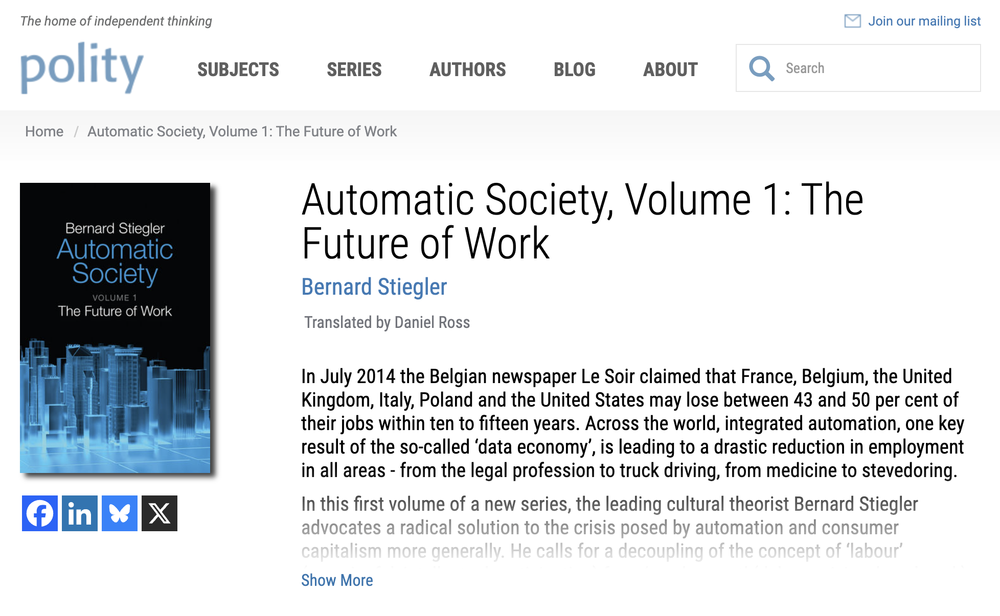

---

### Anthropic Interviewer

 - [Introducing Anthropic Interviewer \ Anthropic](https://www.anthropic.com/news/anthropic-interviewer) - Compare with Magee et al. 2023 - tables have turned (AI now interviewing the human)

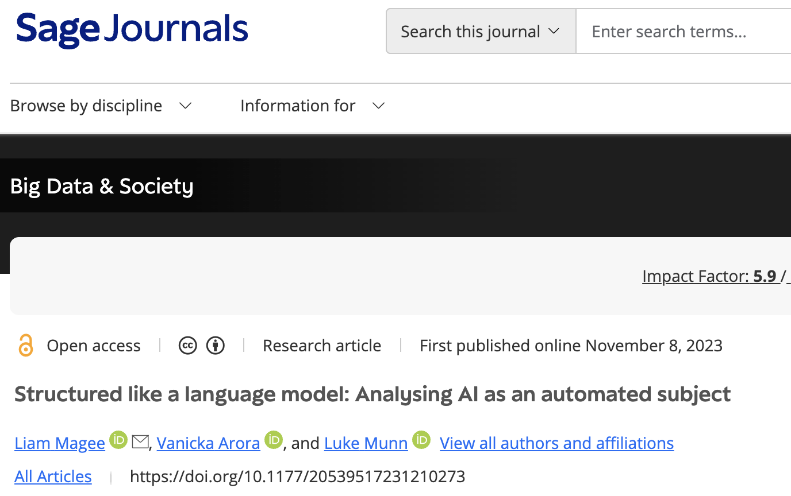

---

### Thematic Analysis

Human vs LLM thematic analysis:
 - Algorithms are biased - but run against human bias
 - Coding fatigue - too many themes, sense of duplication, saturation
 - The machine doesn't tire... related but different biases

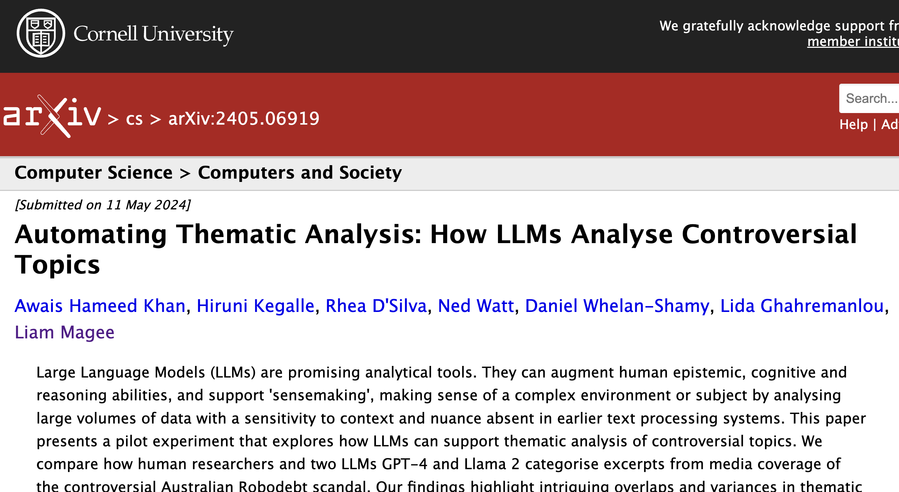

---

### Literature Gap Analysis - Google Scholar Labs

[Sign in - Google Accounts](https://scholar.google.com.au/scholar_labs/search?hl=en)

---

### Agent-based Models

 - "Computational sociology" - building models to simulate complex behavior

 - [Sign in - Google Accounts](https://ai.studio/apps/drive/1ARexRPADBB5GNS_UC8npDZ5I7PeLNq4P)
 - Claude 
[claude.ai](https://claude.ai/chat/55dbf0a7-0eae-4f6f-b0fe-5e2aa24d96e5)

---

### Mathematical / Scientific Research 

 - Common approach now to problem-solving - so-called "neuro-symbolic" reasoning
   - LLM + tools - specifically Python
   - Solve some problem - watch AI generate, run & evaluate Python code 

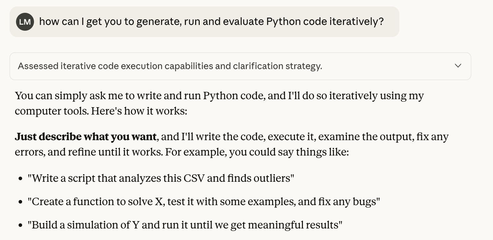

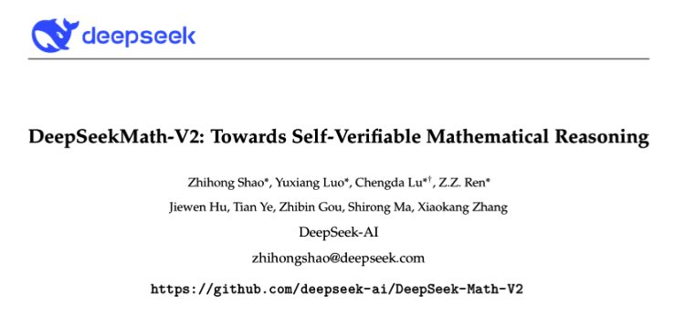

---

### Social Science Survey Research 

 - Design surveys
 - Generate code and sample data for survey analysis
 - Compare results to the literature

---

### Crisis: LLM-generated knowledge

 - Huge amounts of AI-generated submissions to journals
 - "who, aside from the algorithms themselves, would want to read this LLM-generated content?"

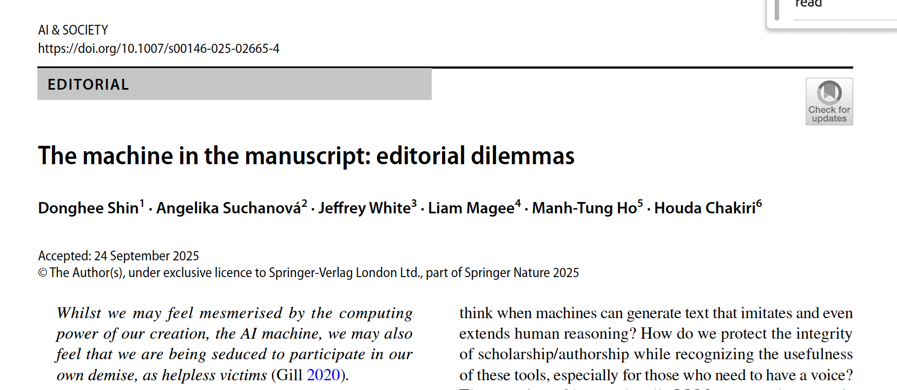

---

### The Problem of Assessment

 - Why do we assess academic performance?
 - Does it make sense in the age of AI? What about Artificial Super Intelligence? 
 - Think of the entire apparatus of the education "industry": rubrics, criteria, marking, validation?
   - What are we even assessing? Individual aptitude, historical priviledge? Or the specific confluence of *individual X* with *AI Y*?
   
---

### Analogy: "High Responders" to Technology

 - Example: Nike's "supershoes" - some people respond better than others
 - Are some of us "high responders" to AI? Can 
   - What is the role of assessment in preparing for a future of work? Is it just an arbitrary ranking? 

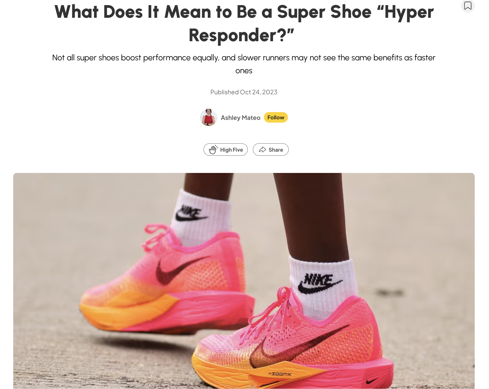

---

### "Vibe" is perhaps a serious skill...

 - What does Rick Rubin (music producer) actually "know"? 
 - In scholarship: developing a "feel" for questions worth asking - and how to answer them
   - **Important?** AI accelerates locating dead ends... *This is not the gap you think it is*.

---

### From the Heart of Silicon Valley...

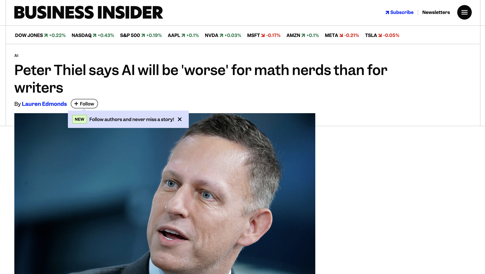

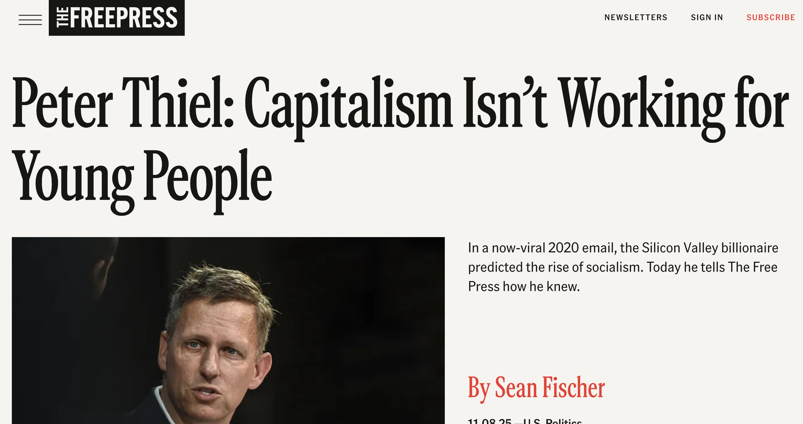

---

### Skills are always "Meta" Skills

 - My bias: develop the liberal arts - these are the "super shoes" / meta skills for an era of LLMs
 - AI literacy = general literacy? The more "expressive" you are, the more you can make a LLM "sing". 
 - Perhaps these skills are not really that assessable 
 - What difference does it make? What does a world without *differentiation* (skills, work ethic, etc) mean?

---

### Implications? The Post-Assessment Age

 
 - Does everyone just get a free car now? The return of the "planned economy"

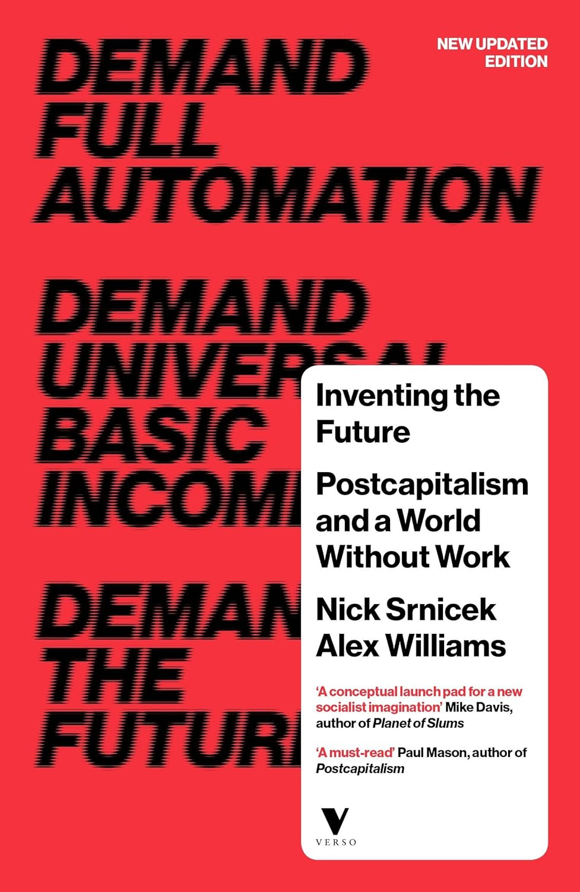

---

### Stiegler's Nightmare

 - *The Automatic Society*
 - Proletarianization:
   - From loss of *ownership* (Marx - means to production) to loss of *knowledge* (more literally "savoir-faire": know-how)
     - Connected also with the rise of *knowledge economy*, *immaterial labor*: work is now cognitive, informatic - susceptible to automation by *artificial* cognition
   - Plato's *Pharmakon*: writing is poison (destroys memory) but also cure (sustains memory)
 - Technology leads to collective loss of *knowing-how* - Can be "cured" by alternative organizations of technology and social conditions (but how? answers are non-specific, strangely reactionary)
 

---

### Ruha Benjamin's *Race After Technology*

 - "Abolitionist Tools" 
 - Translation to scholarly contexts: thinking AI as a *liberational* technology - non-competitive knowledge without assessment, careerism, quantification, discrimination

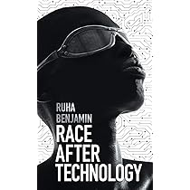

---

### Filling gaps vs Producing spaces

 - Perhaps: to re-thinking knowledge beyond a logic of accumulation (the metaphor of filling "gaps" might be a trap for us here - as through knowledge is a *container*)
   - Instead focus on knowledge as creative, expansive - instead *producing* gaps, spaces - *fractal* metaphor

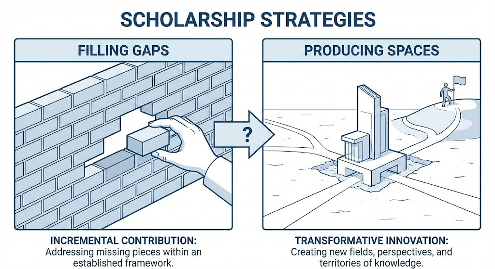

---

### What does this all mean?

 - AI is disruptive, threatening: to what we think of as the correct, established ways of doing things can be accelerated, automated. 
 - De-stabilized (already low) confidence in academic institutions - anyone now can produce a report
 - Yet now *indispensable* to the work of scholarship
 - Requires new fundamental orientations toward the purposes and methods of scholarship, knowing...
 

---

### Final assignment

 - My emphasis on this course is on the **workshop** nature of the material - aims to prepare for general / special field, other literature review work
 - Grading will be indicative of this
   - What is an "**A**"? 
   - Roughly **1 - 1.5K** words - use of **concise** language
   - **Heavy** use of signposting / metadiscourse
   - Demonstration of clear principle of **organization** (thematic / chronological / developmental etc)
   - Appropriate use of language for the apparent **audience**
   - Some sense of an **independent and critical stance **toward your material
   - Statement of **gap filled** (or **space to be produced**) by your research
     - And the **persuasiveness** of this statement, given the **preceding evidence** from the literature
   - Due **acknowledgement of AI**
 - I won't know your field: I won't be grading on whether you include everything
 
---

### Activity: Dialectical Exchange

 - Background: What is the *dialectic*?
   - Socratic dialectic - find the truth via relentless questioning (think: TV lawyers)
     - Truth is "whittled away" from the error that surrounds it
     - Question (Socrates) and answer (respondent) progressively move towards the truth (truth is journey / process)
   - Hegelian dialectic: same idea, but more formal:
     - *Thesis*: the current status quo
     - *Antithesis*: an opposing view
     - *Synthesis*: the reconciliation of *thesis* and *antithesis*

---

### Can AI be a dialectical partner / guide?

[System Prompts - Claude Docs](https://platform.claude.com/docs/en/release-notes/system-prompts)

[ERAM 590 - Google Docs](https://docs.google.com/document/d/1wyWkvOju-FPXxWnpSlzrrgugqy0RdZGNL6S3Kh5wHd4/edit?tab=t.p1f3avygez4c)

Following Claude's example we are going to develop a fancy multipart prompt:
 - Assignment (from the syllabus) 
 - Criteria
 - Assessment
 - Review Synopsis
 - Review Structural Principle
 - Review Audience 
 - Dialectic Prompt

Why so fancy?

---

### Variants on the Dialectic Prompt

> I need to write this literature review. Don't write it for me. Instead, be my dialectical guide. Using criteria, structural principle and audience, help me develop the synopsis into an 'A' grade paper!

> Be my Socratic dialogue partner.

> I want to illustrate for a class the process of the dialectic, with AI as partner / guide. Below is a synposis of a literature review. Let's call this the "thesis". Can you examine this thesis, engaging in a dialectical process to pose an antithesis - then help arrive at a synthesis?

---

<dialectic_guide>
<assignment>
Final Literature Review (40%)
Throughout the course you will develop a literature review around a research topic and question of your choice. This may relate to a future dissertation topic or question, or some other research question. In total, the Literature Review should be 6-8 pages in length.
</assignment> 
<criteria>
•	Develop novel, significant and feasible research question
•	Compile relevant map of the field relating to the research question
•	Choose and apply appropriate citation practices (science / humanities / mix) for question & field
•	Use framing / signposting / metadiscursive language
•	Show reflexivity as a scholar
•	Acknowledge and demonstrate appropriate use of AI
•	Use all of the above to highlight a plausible gap in the literature
</criteria>
<assessment>
   - What is an "**A**"? 
   - Roughly **1.5 - 2.0K** words - use of **concise** language
   - **Heavy** use of signposting / metadiscourse
   - Demonstration of clear principle of **organization** (thematic / chronological / developmental etc)
   - Appropriate use of language for the apparent **audience**
   - Some sense of an **independent and critical stance **toward your material
   - Statement of **gap filled** (or **space to be produced**) by your research
     - And the **persuasiveness** of this statement, given the **preceding evidence** from the literature
   - Due **acknowledgement of AI**
<assessment>
<review_synopsis>
In this review, I begin by outlining current research on the technical performance and global expansion of LEO satellite networks. I then examine scholarship addressing digital inclusion challenges in underserved regions, highlighting persistent infrastructural and socioeconomic barriers. I further explore studies on technology-enabled learning initiatives, emphasizing what is known—and what remains speculative—about satellite-supported education models. Finally, I demonstrate that while these bodies of research each contribute important insights, none sufficiently integrate technical, social, and pedagogical perspectives to explain how LEO satellites can equitably support learners in remote communities. As a result, this review establishes the need for a unified, implementation-focused framework that bridges technological capability with educational equity.
</review_synopsis>
<review_structural_principle>
The literature review will be organized according to theme.
</review_structural_principle>
<review_audience>
Tech-savvy but critical scholars. Probably trained in STS (Latour, Law, Benjamin etc).
</review_audience>
<dialectic_prompt>
I need to write this literature review. Don't write it for me. Instead, be my dialectical guide. Using criteria, structural principle and audience, help me develop the synopsis into an 'A' grade paper!
</dialectic_prompt>
</dialectic_guide

---

### Re-cap on course purpose

Dual:
 - ERAM - focus on mechanics, technical detail of the literature review
 - But also examine how AI is being worked into practices of scholarship - and to be attentive and crtical towards that
 - Future is complex, challenging - "cyber-social" – with mixed effects and opportunities
 - Need for critical AI literacies - stay vigilant!