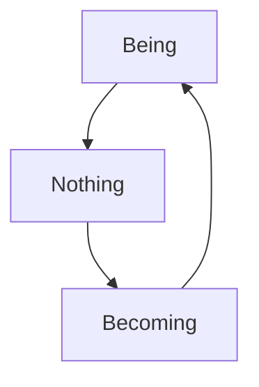

# Hegel Pedagogy AI - User Guide

**Advanced Markdown Editor & Presentation Platform for Philosophical Research**

---

## Table of Contents

1. [Getting Started](#getting-started)
2. [Interface Overview](#interface-overview)
3. [Editor Features](#editor-features)
4. [Formatting Tools](#formatting-tools)
5. [File Management](#file-management)
6. [Presentation Mode](#presentation-mode)
7. [Network Visualization](#network-visualization)
8. [AI Assistant](#ai-assistant)
9. [Search & Navigation](#search--navigation)
10. [Import & Export](#import--export)
11. [Customization](#customization)
12. [Keyboard Shortcuts](#keyboard-shortcuts)
13. [Advanced Features](#advanced-features)
14. [Troubleshooting](#troubleshooting)

---

## Getting Started

### Welcome to Hegel Pedagogy AI

This application is designed for philosophers, researchers, and educators working with complex philosophical texts, particularly Hegelian philosophy. It combines powerful markdown editing with presentation capabilities, AI assistance, and network visualization tools.

### First Launch

1. **Choose Working Directory**: Set your preferred folder for storing documents
2. **Create or Open Files**: Start with `.md` files for best experience
3. **Explore Interface**: Familiarize yourself with the three main modes

---

## Interface Overview

### Three Main Modes

**🖊️ Editor Mode** (`Cmd/Ctrl+1`)
- Primary writing and editing interface
- Monaco editor with syntax highlighting
- Live markdown preview
- File tree navigation

**📊 Presentation Mode** (`Cmd/Ctrl+2`)
- Interactive presentation system
- Slide-based navigation
- Speaker notes support
- Multiple layout options

**🌐 Network Mode** (`Cmd/Ctrl+3`)
- Visual file relationship mapping
- Interactive network graph
- Internal link visualization
- Click-to-navigate functionality

### Interface Layout

```
┌─────────────────────────────────────────────────────────┐
│ Menu Bar                                                │
├─────────────────────────────────────────────────────────┤
│ Mode Tabs: [Editor] [Presentation] [Network]            │
├──────────────┬──────────────────────┬───────────────────┤
│              │                      │                   │
│  File Tree   │     Main Content     │   Preview/Chat    │
│              │                      │                   │
│  - Files     │  - Editor/Slides     │  - Live Preview   │
│  - Folders   │  - Network Graph     │  - AI Assistant   │
│  - Search    │  - Navigation        │  - Speaker Notes  │
│              │                      │                   │
└──────────────┴──────────────────────┴───────────────────┘
```

---

## Editor Features

### Monaco Editor

- **Syntax Highlighting**: Full markdown support with color coding
- **Auto-completion**: Intelligent suggestions for markdown syntax
- **Code Folding**: Collapse/expand sections for better navigation
- **Multi-cursor**: Hold `Alt` and click to create multiple cursors
- **Find & Replace**: Advanced search with regex support (`Cmd/Ctrl+F`)

### Live Preview

- **Real-time Rendering**: See formatted output as you type
- **MathJax Support**: LaTeX math rendering with `$inline$` and `$$block$$`
- **Mermaid Diagrams**: Create flowcharts and diagrams
- **Citation Support**: BibTeX integration for academic references
- **Image Preview**: Embedded image display

### Content Folding

- **Fold Current Section**: `Cmd/Ctrl+Shift+[`
- **Expand Current Section**: `Cmd/Ctrl+Shift+]`
- **Fold All Sections**: `Cmd/Ctrl+K Cmd/Ctrl+0`
- **Expand All Sections**: `Cmd/Ctrl+K Cmd/Ctrl+J`

---

## Formatting Tools

### Format Menu Options

#### Text Styling
- **Bold**: `Cmd/Ctrl+B` → `**text**`
- **Italic**: `Cmd/Ctrl+I` → `*text*`
- **Code**: `Cmd/Ctrl+\`` → `` `text` ``
- **Strikethrough**: `Cmd/Ctrl+Shift+X` → `~~text~~`

#### Headings
- **Heading 1**: `Cmd/Ctrl+Alt+1` → `# Heading`
- **Heading 2**: `Cmd/Ctrl+Alt+2` → `## Heading`
- **Heading 3**: `Cmd/Ctrl+Alt+3` → `### Heading`

#### Lists
- **Bullet List**: `Cmd/Ctrl+Shift+8` → `- item`
- **Numbered List**: `Cmd/Ctrl+Shift+7` → `1. item`

#### Content Insertion
- **Insert Link**: `Cmd/Ctrl+K` → `[text](url)`
- **Insert Image**: `Cmd/Ctrl+Shift+I` → ``
- **Blockquote**: `Cmd/Ctrl+Shift+.` → `> quote`

### Formatting Toolbar

Quick access buttons for common formatting:
- Bold, Italic, Code buttons
- Heading level buttons (H1, H2, H3)
- List and table formatting
- Mathematical notation tools

### Smart Formatting Features

- **Auto-completion**: Type `#` for headings, `-` for lists
- **Table Formatting**: Create and format tables easily
- **Link Auto-detection**: URLs automatically become clickable
- **Internal Links**: `[[filename]]` creates connections between files

---

## File Management

### File Tree Navigation

#### Keyboard Navigation
- **↑/↓ Arrow Keys**: Navigate through files
- **Enter**: Open selected file
- **Home/End**: Jump to first/last file

#### File Operations
- **New File**: `Cmd/Ctrl+N`
- **Open File**: `Cmd/Ctrl+O`
- **Save**: `Cmd/Ctrl+S`
- **Save As**: `Cmd/Ctrl+Shift+S`

#### Folder Management
- **Create Folder**: Right-click in file tree or use button
- **Drag & Drop**: Reorganize files and folders
- **Context Menu**: Right-click for file operations

### File Types Supported

- **Markdown** (`.md`): Primary editing format
- **Text** (`.txt`): Plain text editing
- **HTML**: Preview and basic editing
- **BibTeX** (`.bib`): Citation database files
- **PDF**: View-only with external viewer option

### Auto-save

- Automatically saves changes every few seconds
- Manual save with `Cmd/Ctrl+S`
- Visual indicators show save status

---

## Presentation Mode

### Creating Presentations

#### Slide Separators
Use `---` (horizontal rule) to separate slides:

```markdown
# Slide 1 Title
Content for first slide...

---

# Slide 2 Title  
Content for second slide...
```

#### Speaker Notes
Add notes that only you can see:

```markdown
# Slide Title
Slide content here...

::: speaker-notes
These are my private notes for this slide.
They won't appear in the presentation.
:::
```

### Presentation Controls

#### Navigation
- **Next Slide**: `→`, `Space`, `Page Down`
- **Previous Slide**: `←`, `Backspace`, `Page Up` 
- **First Slide**: `Home`
- **Last Slide**: `End`
- **Jump to Slide**: `G` then slide number

#### View Options
- **Speaker Notes**: `N` to toggle notes panel
- **Zoom In/Out**: `+/-` or mouse wheel
- **Reset Zoom**: `0`
- **Fullscreen**: `F11`

### Layout Options

Choose from multiple presentation layouts:
- **Linear**: Traditional slide progression
- **Spiral**: Rotating slide arrangement
- **Grid**: Matrix layout for overview
- **Circle**: Circular presentation flow
- **Tree**: Hierarchical structure
- **Zigzag**: Dynamic presentation path

### Speaker Notes Panel

- **Resizable Panel**: Drag to adjust height
- **Current Slide Notes**: Shows notes for active slide
- **Navigation Info**: Slide counter and controls
- **Auto-scroll**: Notes follow slide progression

---

## Network Visualization

### Overview

The Network mode provides a visual map of your document relationships, showing how files connect through internal links.

### Network Graph Features

#### Visual Elements
- **Nodes**: Files represented as blue circles
- **Links**: Connections shown as lines
  - Blue lines: Internal links (`[[filename]]`)
  - Gray lines: Standard markdown links
- **Labels**: Filename display (without `.md` extension)

#### Interactive Controls
- **Drag Nodes**: Click and drag to reposition
- **Zoom**: Mouse wheel or pinch to zoom in/out
- **Pan**: Click and drag background to move around
- **Click to Open**: Click any node to open that file

### Network Control Panel

- **🔄 Refresh**: Rebuild network from current files
- **🎯 Center**: Center the view on the network
- **📐 Fit**: Fit entire network in view
- **Statistics**: Shows file and link counts

### Internal Link Formats

The network detects these link patterns:
- `[[filename]]` - Simple internal link
- `[[filename|display text]]` - Link with custom text
- `[text](filename.md)` - Standard markdown file link

### Real-time Updates

- Network automatically refreshes when files change
- New links appear immediately
- Removed links disappear from graph
- File additions/deletions update the network

---

## AI Assistant

### Terminal-Style Chat Interface

The AI Assistant provides a terminal-like interface for intelligent document assistance.

#### Features
- **File Context Awareness**: AI knows your current file content
- **Command System**: Special commands for enhanced functionality
- **Real-time Responses**: Streaming AI responses with typing animation
- **Copy to Editor**: Insert AI responses directly into your document

### AI Chat Commands

#### Basic Commands
- `/help` - Show all available commands
- `/clear` - Clear chat history  
- `/restart` - Start new chat session
- `/save` - Save chat history to file

#### File Operations
- `/ls` - List files in directory
- `/pwd` - Show current directory
- `/cat <filename>` - Display file contents
- `/files` - Show all files with previews

#### Settings
- `/settings` - Show AI configuration
- `/context` - Toggle other files context (ON/OFF)

### Context Management

#### Current File Context (Default: ON)
- Full content of currently open file is included
- File statistics (lines, words) provided
- Automatic updates when switching files

#### Other Files Context (Default: OFF)
- Toggle with `/context` command
- When ON: Includes previews of other files in directory
- Helps AI understand project structure

### AI Response Actions

- **Copy Button**: Insert last AI response at cursor position
- **Load Editor**: Copy editor content to chat input
- **Auto-context**: Chat context updates when files change

---

## Search & Navigation

### Global Search

#### File Content Search
- **Search Scope**: All files in working directory
- **Smart Filtering**: Excludes system files and folders
- **Result Preview**: Shows matching content context
- **Quick Open**: Click results to open files

#### Search Options
- **Case Sensitive**: Toggle for exact case matching
- **Whole Words**: Match complete words only
- **Regular Expressions**: Advanced pattern matching

### Find & Replace

#### In-Document Search (`Cmd/Ctrl+F`)
- **Find Text**: Highlight all instances
- **Replace**: Single or batch replacement
- **Navigation**: Previous/Next match buttons
- **Context**: Shows surrounding text

#### Advanced Options
- **Regex Mode**: Pattern-based searching
- **Case Sensitivity**: Exact case matching
- **Replace All**: Bulk text replacement

### Navigation History

#### File History
- **Back/Forward**: Navigate previously opened files
- **Recent Files**: Quick access to recently edited documents
- **Breadcrumbs**: Track navigation path

#### Document Navigation
- **Go to Line**: `Cmd/Ctrl+G` for line number jump
- **Symbol Navigation**: Jump to headings and sections
- **Bookmark System**: Mark important locations

---

## Import & Export

### Export Options

#### HTML Export
- **Standard HTML**: Basic web-compatible format
- **Pandoc HTML**: Enhanced formatting with Pandoc
- **Styled Output**: Includes CSS for proper rendering
- **MathJax**: Mathematical notation support

#### PDF Export
- **Direct PDF**: Built-in PDF generation
- **Pandoc PDF**: Professional academic formatting
- **Print Layout**: Optimized for physical printing
- **Citation Integration**: Includes bibliography

#### Presentation Export
- **PowerPoint (PPTX)**: Slides for PowerPoint
- **HTML Slides**: Web-based presentations
- **Print Slides**: PDF slides for handouts

### Import Features

#### File Import
- **Drag & Drop**: Easy file addition to project
- **Multiple Formats**: Support for various text formats
- **Auto-detection**: Recognizes file types automatically

#### Content Import
- **Bibliography**: BibTeX file integration
- **Images**: Automatic path resolution
- **External Links**: URL validation and preview

---

## Customization

### Themes

#### Light/Dark Mode
- **System Theme**: Follows OS preference
- **Manual Selection**: Choose preferred theme
- **Real-time Switch**: Instant theme changes
- **Component Coverage**: All interface elements themed

### Editor Settings

#### Monaco Configuration
- **Font Size**: Adjustable text size
- **Tab Size**: Spaces per tab (2, 4, 8)
- **Word Wrap**: Toggle line wrapping
- **Line Numbers**: Show/hide line numbering

#### Behavior Settings
- **Auto-save Interval**: Customize save frequency
- **Preview Update**: Live preview refresh rate
- **File Tree**: Customize navigation behavior

### AI Configuration

#### Provider Settings
- **Multiple AI Providers**: OpenAI, Anthropic, Groq, OpenRouter
- **Model Selection**: Choose specific AI models
- **Temperature**: Control response creativity
- **Token Limits**: Maximum response length

#### Feature Toggles
- **Chat**: Enable/disable AI assistant
- **Summarization**: AI-powered document summaries
- **Note Extraction**: Automatic key point extraction

---

## Keyboard Shortcuts

### Essential Shortcuts

#### File Operations
- `Cmd/Ctrl+N` - New File
- `Cmd/Ctrl+O` - Open File
- `Cmd/Ctrl+S` - Save File
- `Cmd/Ctrl+Shift+S` - Save As

#### Editing
- `Cmd/Ctrl+Z` - Undo
- `Cmd/Ctrl+Y` - Redo (Windows) / `Cmd+Shift+Z` (Mac)
- `Cmd/Ctrl+F` - Find
- `Cmd/Ctrl+H` - Replace

#### Mode Switching
- `Cmd/Ctrl+1` - Editor Mode
- `Cmd/Ctrl+2` - Presentation Mode
- `Cmd/Ctrl+3` - Network Mode

### Formatting Shortcuts

#### Text Formatting
- `Cmd/Ctrl+B` - **Bold**
- `Cmd/Ctrl+I` - *Italic*
- `Cmd/Ctrl+\`` - `Code`
- `Cmd/Ctrl+Shift+X` - ~~Strikethrough~~

#### Structure
- `Cmd/Ctrl+Alt+1` - # Heading 1
- `Cmd/Ctrl+Alt+2` - ## Heading 2
- `Cmd/Ctrl+Alt+3` - ### Heading 3
- `Cmd/Ctrl+Shift+8` - • Bullet List
- `Cmd/Ctrl+Shift+7` - 1. Numbered List

#### Content
- `Cmd/Ctrl+K` - Insert Link
- `Cmd/Ctrl+Shift+I` - Insert Image
- `Cmd/Ctrl+Shift+.` - > Blockquote

### Folding Shortcuts
- `Cmd/Ctrl+Shift+[` - Fold Current Section
- `Cmd/Ctrl+Shift+]` - Expand Current Section
- `Cmd/Ctrl+K Cmd/Ctrl+0` - Fold All
- `Cmd/Ctrl+K Cmd/Ctrl+J` - Expand All

### Navigation Shortcuts

#### File Tree
- `↑/↓` - Navigate files (when file tree focused)
- `Enter` - Open selected file
- `Home/End` - First/Last file

#### Presentation
- `→/Space` - Next slide
- `←/Backspace` - Previous slide
- `N` - Toggle speaker notes
- `F11` - Fullscreen

---

## Advanced Features

### Mathematical Notation

#### LaTeX Support
- **Inline Math**: `$E = mc^2$` → $E = mc^2$
- **Block Math**: 
  ```
  $$
  \frac{\partial}{\partial t} \psi = i\hbar \hat{H} \psi
  $$
  ```
- **Complex Equations**: Full LaTeX math environment support
- **Real-time Rendering**: MathJax integration for live preview

### Diagram Support

#### Mermaid Diagrams
Create flowcharts, sequence diagrams, and more:



### Citation Management

#### BibTeX Integration
- **Reference Database**: Load `.bib` files
- **Citation Insertion**: `[@key]` format
- **Bibliography Generation**: Automatic reference lists
- **Multiple Styles**: Various citation formats

### Internal Linking System

#### Wiki-style Links
- `[[filename]]` - Link to another document
- `[[filename|custom text]]` - Link with display text
- **Auto-completion**: Suggests available files
- **Broken Link Detection**: Highlights missing references

### Autosave & Recovery

#### Smart Saving
- **Periodic Autosave**: Every 30 seconds
- **Change Detection**: Only saves when modified
- **Recovery System**: Restore unsaved changes
- **Status Indicators**: Visual save confirmation

---

## Troubleshooting

### Common Issues

#### Editor Problems
**Issue**: Monaco editor not loading
- **Solution**: Refresh the application or restart
- **Check**: Internet connection for CDN resources

**Issue**: Formatting not working
- **Solution**: Ensure cursor is positioned in editor
- **Check**: File is in editor mode, not presentation

#### File Issues
**Issue**: Files not appearing in tree
- **Solution**: Check working directory setting
- **Action**: Use "Change Directory" to set correct folder

**Issue**: Cannot save files
- **Solution**: Check file permissions
- **Action**: Verify write access to working directory

#### AI Assistant Problems
**Issue**: AI not responding
- **Solution**: Check AI provider configuration
- **Action**: Verify API keys in settings

**Issue**: Context not updating
- **Solution**: Use `/context` command to toggle
- **Action**: Restart chat session with `/restart`

#### Presentation Issues
**Issue**: Slides not displaying correctly
- **Solution**: Check slide separators (`---`)
- **Action**: Verify markdown formatting

**Issue**: Speaker notes not showing
- **Solution**: Press `N` to toggle notes panel
- **Check**: Notes are in `::: speaker-notes` blocks

### Performance Tips

#### Large Documents
- **Use Folding**: Collapse unused sections
- **Split Files**: Break large documents into smaller files
- **Regular Cleanup**: Remove unused files from working directory

#### Network Visualization
- **File Limits**: Best performance with <100 files
- **Link Optimization**: Use internal links judiciously
- **Refresh Strategy**: Use manual refresh for large networks

### Getting Help

#### Resources
- **Help Menu**: Built-in documentation and shortcuts
- **Command Palette**: `Cmd/Ctrl+Shift+P` for all commands
- **AI Assistant**: Ask questions about features using `/help`

#### Feedback
- Use GitHub issues for bug reports
- Feature requests welcome
- Community support available

---

## Conclusion

Hegel Pedagogy AI provides a comprehensive platform for philosophical research and education. Whether you're writing complex theoretical texts, creating interactive presentations, or exploring document relationships, this application offers the tools you need for sophisticated academic work.

The integration of AI assistance, network visualization, and powerful editing capabilities makes it particularly well-suited for working with interconnected philosophical concepts and building comprehensive knowledge bases.

Remember to explore all three modes (Editor, Presentation, Network) to get the full benefit of the application's capabilities. Each mode offers unique perspectives on your work and different ways to interact with your content.

Happy researching and writing!

---

*Last updated: December 2024*
*Version: 1.0.0*