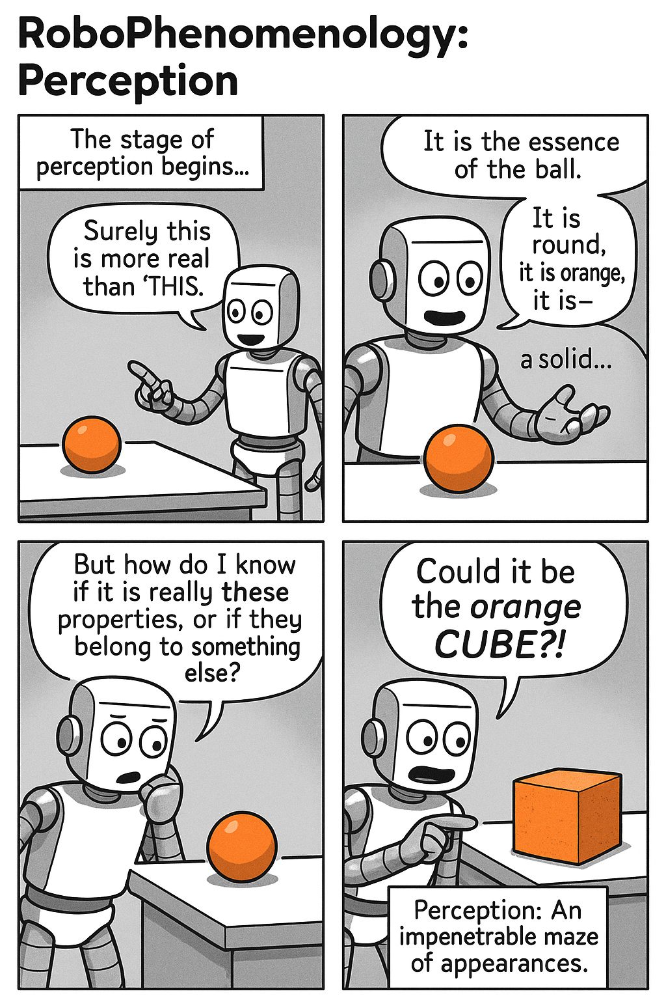
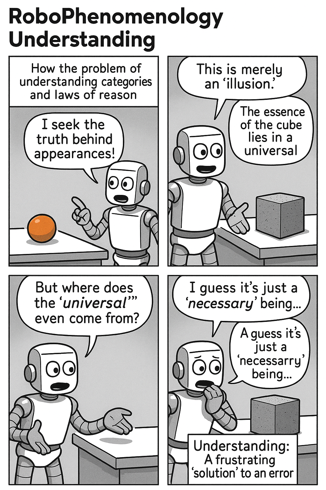

## Introducing Hegel and The Concept of Experience (`Erfahrung')


---

## Readings


--- 

## Assignments


---


## Some Notes on Hegel

 - German philosopher of the early 19th century
 - Comes *after* Immanuel Kant, and the Critique of Pure Reason / Practical Reason / Judgment (late 1700s)
 - The last of the "polymath" philosophers – across math, science, logic, history, art, literature, psychology 
 - Product of the Enlightenment and the French Revolution (1789)
 - Argued that the End of History had been realized - the perfect form of the State had evolved
 


---

## Hegel's influence

 - Died in 1831 - most famous philosopher in Germany at the time
 - Influenced "radical" thinkers of the 1830s/40s - the "Young Hegelians"
 - Including Karl Marx, Friedrich Engels
   - Dialectical materialism - lasting influence
   - Frankfurt school (1930s onwards)
 - Significant for psychoanalysis (Freud? Certainly Jacques Lacan, Slavoj Žižek)
 - Phenomenology (Edmund Husserl, Martin Heidegger)
 - French theory: existentialism, structuralism, deconstruction (via Alexandre Kojeve's 1930s lectures)
   - Also Rene Girard (and so Silicon Valley)
 - American philosophy:
   - Pragmatism (Robert Brandom, Robert Pippin, Terry Pinchard)
   - Francis Fukuyama (The End of History)
   


---


### Hegel’s *Phenomenology of Spirit*

- Published in 1807 - famously as Napoleon rode into Jena, Germany in his assault on Europe.  
- Explores how a subject forms consciousness through self-awareness in its development.
- Positions learning as central to becoming a conscious entity within society.
- Serves as historical pivot for modern questions on cognition and AI.
- Highlights continuity between human, machinic, and other subjects in the process.

```notes
The key text we'll be examining here is Hegel's *Phenomenology of Mind* (1807). For this course I will be using this text as a sort of *avant la lettre* account of how a *subject* – an entity that for the moment we will assume can exist in human, in machinic and perhaps in other situations – forms itself as a subject. In perhaps less obscure terms, how something like us learns to be as a conscious self. This text by Hegel occupies an important place in Western philosophy, and in some ways – as I hope to make clear – can be seen as one of the historical pivots around which questions of learning can be responded to. 
```

---

Let's start with the title: in German, *Phänomenologie des Geistes*, translated as either *The Phenomenology of Spirit*  or *The Phenomenology of Mind*. The word "Geist" can in other words be translated as "Spirit" or "Mind" – the cause of a lot of confusion. Think of what word in English sounds closest to *Geist*: "ghost" (but also "guest" and "host"). What is this text about? Something vague, religious, metaphysical: spirit? Or concrete, psychological, scientific: mind? Are we talking about something collective – like a world spirit, or spirit of the times – what we mean when we say *Zeitgeist*? Or something particular and individual – what is happening in *my* mind, right now? Can it be all these things (people have argued this).


---

What about the other word, *Phenomenology*? Let's now this apart. What does the -ology mean - the *logos*? Its "the study of". But the study of what? The study of phenomena, which sounds like the study of everything (*all* phenomena). But what exactly are phenomena? The word comes from the Greek term *phanomenai*, "to appear". So, phenomena are appearances, and for Kant, who preceded Hegel, phenomena were opposed to noumena, which meant things in themselves. Reality, in other words, as opposed to how things appear to us, the phenomena.


---

But Hegel disputes this – in his account, all we ever have are phenomena. But things can also appear in different ways: we organize appearances differently, in particular as we learn, develop and grow. Our mind or spirit, in other words, puts phenomena together in different ways - partly because we realize the errors, inconsistencies or troubles involved in older ways. Experience (or Erfahrung) is the living out of this unceasing process of realization. How does this all unfold? That is the story of the Phenomenology of Mind / Spirit - to study how phenomena present themselves to mind, or more accurately, how the mind moves through its various shapes to organize phenomena as it comes to know them. 

---

With this last point we also begin to see a fundamental difference between Hegel and what precedes him under the name of empiricism. Whereas empiricism – and perhaps our raw intuition – is that experience *happens to us*. We are, in other words, passive recipients of experience. We will want to pause here, and take stock of this alternative intuition: for Hegel, we are always *constituting* our experience, if for the most part unconsciously. We *make* our experience – even though we are not free to simply make any experience at all. As we will see the structure of experience is past down to us by history, society, language and norms. 


---

The first part of the Phenomenology itself deals with three phases of Consciousness (everything in Hegel comes in threes):

 - Sense-certainty
 - Perception
 - Understanding
 
These form a kind of progression, but not in the usual sense of, for example, layers of consciousness or childhood development. Instead these are more like *ideas* of consciousness that need to get progressively more refined before we arrive at what it means to understand something. 


---


### Sense Certainty


```notes
Hegel begins with the idea of sense-certainty. What does it mean to experience certainty of your senses? His description of this is like a limited stream-of-consciousness. Things happens: I notice them but only in the sense of a "here" and a "now". There is not "there" and "then" – there is no way to connect each instant of sensation with any other. Moreover nothing can be distinguished in this state, because there is not basis for comparison. What philosophers call qualia, or the qualities that make one thing distinct from another, don't exist at this stage.

In language terms, we have only basic phenomenal description: there is a "this" that is "here" and "now". It is like a pointing or what is called a deictic language: when I say words, all I do is point or indicate.

If we were to imagine this as a machine, it could be like a simple sensor, reading off data but not going anywhere with it. This is not machine *learning* in any sense - nothing is recorded or memorized. 

```

---

### Perception



The next "shape" of consciousness is more developed. Now things can be perceived; that is, the specific attributes or qualities can be registered. I see this thing here is orange, round and so on.

If we wanted to imagine this in linguistic terms, it is as though our language had now only adjectives. All we could ever say about this or that is descriptive: "orange", "round", and so on.

It is as though our machine now can identify attributes – not however objects. Instead of just indicating on/off, this machine registers these qualities: shades of colour, shapes, and so on. But it cannot classify anything – we have no nouns yet.

---


### Understanding



Hegel here has a strange heading title: "Force and the Understanding". Why *force*? Here Hegel is drawing, also strangely for us, upon Newtonian physics. What he is getting at is that a key turn in this shape of consciousness is the arrival of laws explaining cause and effect. When certain qualities occur regularly we start to say they cohere in something we call a thing or object. And the repetition of these qualities means more than one object, and from that we build up the idea of classes or categories. Our limited world now has nouns, descriptions of things in space. And these nouns do things; they act in time, and hence we develop verbs. 

At this stage we have something close to a rudimentary idea of consciousness. We are able to sense things, name them and talk about their relationship to other things.

In our mechnical analogy, what do we have here? A LLM? Something that is consciousness – that knows there are things in the world – but has no sense of itself, and therefore no self-consciousness?


---


### Sequgeway: What is Our Experience of Experience?


 - What does it mean to be a subject? 
 - What is our experience of experience?

```notes
What does it mean to be a subject? 

Let's start with a phenomenological experiment. Close your eyes, and try to imagine *where* your sense of subjectivity, or experience, actually is. What is the "seat" of your experience? You might say it is in your head. And what is your orientation: what is the "direction" and position your experience is pointed towards? You might now say it is through your eyes, or at least in the direction your head is facing. 

And while we are here, what about the complex layers of history that make up our subjectivity? Where does our prior experience lie? If I ask you now to bring up a memory – any memory – what is it that you actually do? What do you experience in bringing up a memory? Do you – for a least a moment – experience something like annoyance at having to select one memory over another? And what is this experience of annoyance itself like? What does your body do? Do you sigh for instance? Does your heart beat a little faster, at the request of a professor to draw up a memory? Do you wonder - somewhere – whether this is a waste of time (you didn't enrol in a meditation course)? What does this wondering feel like?

And so on...

The experience *of* experience, we can see, involves a series of sensations and associations. These goings-on are things that we can document, we can capture in some kind of stream of consciousness way. Indeed, even the idea of a "stream" already invokes many assumptions – that our consciousness is deeply connected to time, a series of moments running on, but also connected to prior moments.

And we have a sense that our consciousness is not merely a cerebral matter, but involves our bodies, our organs, that flow with our consciousness, that are caught up in our the directedness of our attentions. 

Finally, we might also have a sense of the "edge" of our consciousness. I want you now to imagine some kind of instrument you use or have used: something external to the body, but closely connected to it. For example, a computer keyboard, a phone screen, a baseball bat, an iron, a hammer, or favourite items of clothing. Everyday, but also intimate, something that feels in certain moments like an extension of the body – something external that becomes you. Does your consciousness ever extend to that object, even momentarily, for example in what people can call a "flow state"? 

And what about other people? We know in extreme cases we can feel other people's pain, sometimes more intensely than our own. It is as though their pain strikes us as more acute, even though it is not our own. It is an even more *intimate* pain, because it is not our body, for instance, but someone else's body that paradoxically is connected via their consciousness to our own.

So here we have a sentiment of consciousness as not merely locked up in a skull – our own – but in some sense already distributed. But not infinite, at least not in everyday experience – we would need some paranormal experience to go so completely out of ourselves that we reach back to before our birth, or after our death, or beyond the limits of our world. Even if we can accept that it is amorphous, consciousness still has a shape, it has edges.

Now what would an entirely *mechanical* experience of consciousness be? We can imagine a stepping stone: for example, the experience of an animal. Non human, but with a brain and body. We all know of examples of literature, film, television that literalise this experiment.

And in certain forms, we can also elaborate this to humanoid or anthropomorphic experience. Being in a human's body but with only an algorithmic simulation of consciousness. C-3PO in Star Wars for example: think about how this *droid* differs from R2D2, which has no human body,  
```


---

Controversially, this includes questions of machine learning. I will be arguing that Hegel's text makes the possibility of machine learning thinkable. I will also be arguing that present day machine learning fails, quite dramatically, to live up to the standard Hegel sets for it. In this failing, we can say that machines still do not learn. This is not the standard of consciousness, but rather something even more fundamental to learning – as I said earlier, how a subject *becomes* a subject. This involves creating a relationship between itself and its world, its history and future.  Hopefully this will become clearer as we progress. 

---

How does this connect with machine learning? Part of this course will examine the technical process by which machines learn – though I devote more time to the sibling course, *Introduction to Generative AI for Education*, for this work. Here we will spend more time thinking about the philosophical underpinnings of machine learning, and focus on one specific area that so far remains an open area of research in computer science: the problem of *continuous learning*. What is this problem? Let's imagine I sit down to *talk* to an AI agent such as ChatGPT. I notice that I am usually initiating a new conversation – though of course I can also choose to resume a prior conversation too. If I have paid for the subscription service and turned on the personalization feature, I notice also that the agent seems to know some details about me. Indeed, over time – if I connect the agent to my files and data – I also notice that this personalization seems to become more sophisticated and knowledgeable too.

---

However in another sense the system remains the same system it was at the point that its initial training was completed. Evidence of this appears in the common problem of cut-off dates – the point at which the content of the web was digested and fed into the machine learning algorithm. If we make an analogy to the human situation, it is as though this student had stopped acquiring any real new information after a certain point. Although it can pretend to know more, if I remove the connection to my data or personal history, the machine immediately forgets what it has known about me. The effect of this is not very obvious, because usually the training data cut-off is recent enough, and it is supplemented by Internet information. But were we to project ourselves a hundred years into the future, we'd have the strange sense of interacting with a mechanical ghost: its knowledge would not have been updated. 

---

There are efforts to develop continuous learning systems, though none are yet deployed in the major AI systems available to us. And this points immediately to one of the key fissures between human and machine learning. Try as we might, as human subjects we are unable to stop *experiencing* the world. In the same thought experiment, even if I was locked in a stimulus-free chamber for a period of time, if you asked me a question about what had happened in the world in the meantime I could not answer. But I would have experienced *something*. The machine does not – yet – do this. 

---


This focus on experience justifies the selection of Hegel's *Phenomenology* – really one of the most important documents of the idea of experience in the Western philosophical tradition. here isn't time to recapitulate the full complex story of the *Phenomenology*. We will be focussing on certain strategic elements of that story, which I will argue helps us to understand something about human processes of learning, and also how that relates to the machinic simulation of learning. Two of those elements involves the developmental and socialized nature of learning – aspects given much greater and more explicit treatment in pedagogical theory via the works of Piaget and Vygotsky. While Hegel's work does not discuss, for example, the stages of child development, in a certain sense the entire text of *Phenomenology* is an effort to understand the sequence or series of moves through which we come to a position of understanding and knowledge about the world and ourselves. In the first few lectures, we will be working through how Hegel sees this happening for an individual. In the latter part of the course, we will branch out to think of how learning is also social, and we will tackle – again with Hegel's support – different moments of socialized development too.

---

This discussion will not be directed, though, toward the simple aim of how machine learning is – and in a certain sense cannot ever be – equivalent to human learning. Our aim is instead more ambitious. Hegel was also a thinker of history, and understood history as also undergoing a series of developments. Without committing ourselves to Hegel's quite dogmatic understanding, we will seek to thematise how machine learning fits into a wider picture of human development and progress. What is – from a human learning perspective – the "end game" of machine learning? Where does it fit within our – usually implicit – account of why learning is important? This is not just a question of how we can use machine learning systems to supplement, accelerate and democratize how humans learn. It is rather a question of how we need to rewire both the content and the form of human learning in a world that is transforming dramatically – and which we need to insist upon still having some agency in that process of transformation. This will be what I hope is the practical payoff for an otherwise arduous conceptual journey through the world of Hegelian philosophy.

