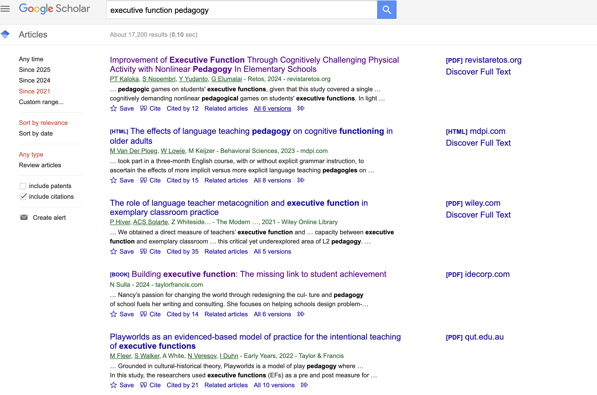

## Attention

As we've noted in the week's online guide, this week we are moving both back and forward - back to the earlier moments of consciousness, perception in particular, but also forward to the much more recent developments in both neuro and computer science.

What I propose this week is that we examine three key papers that all treat the concept of attention in a specific way. I won't be doing too much here to relate this concept to Hegel's unfolding architecture in *Phenomenology of Spirit* - we'll instead turn to that in the weeks ahead. But you may want to think how different meanings of attention might be situated with respect to both concepts of experience and recognition we've covered to date.

I'll start by looking at the Petersen & Posner [-@stevene.petersen2012theattention] paper, *The Attention System of the Human Brain: 20 Years After*, then the Vaswani et al's [-@ashishvaswani2017attentionis] *Attention is All You Need* paper, and then finally Terranova's [-@tizianaterranova2012attentioneconomy] critique of the Attention Economy. In each case we'll provide a short summary, and connect the argument to the wider lecture and course content - then provide time for discussion.

### Human Attention

This paper is an updated version of an earlier one in 1990, also by Posner and Petersen, at the beginning of "neuroimaging": using tomography, fMRI and EEG machines to monitor brain activity. They argue human attention involves three distinct but related cognitive processes: alterting, orienting and executive (or executive control). We might think of these as involving become aware of something; turning our attention towards that thing; and then making some decision about that thing: is it dangerous, attractive, and so on.

Alerting involves the initial registration of an external stimulus. They further distinguish two modes of alerting:  phasic, or short-term reactions, and tonic, os sustained vigilance. Both their initial and this updated paper located alerting function to the right hemisphere of the brain.

Orienting involves some kind of fast directing of attention in response to the stimulus or goal. This might be the instant turning of the head toward a large sound; or the fixation of the head and eyes on the road ahead while driving in difficult conditions. This happens in the frontal and posterior parts of the brain.

Finally, the executive function involves making decisions: to stay fixed upon an object that has gained attention, or to move on. Executive control is apparently located in several regions of the brain: the prefrontal cortex, the frontal midline region and lateral frontal cortex. In their revised article Petersen and Posner identify two distinct executive processes: one involving sustained focus or attention, another enabling a switching of tasks within the same overall attention frame or goal.

Within the context of learning, we can see how this new attention-oriented work helps to make sense of, in particular, learning *difficulties*. Impairments on different brain regions can result in complex but still localizable – and potentially addressable – limitations in how attention is alerted, directed, sustained and purposefully redirected, as conditions require. 

Now while this is not a course diving into neuroscientific research, we can note in passing that this kind of neurological or neuroscientific research has impacted upon the theory and practice of pedagogy. A quick Google Scholar search shows for example how many results have integrated "executive function" into pedagogy research:

These recent studies show, for example, that the hierarchy of attention mechanisms - from 

And of course GPT can help us 

And to keep concordance with Hegel, we might also note his own strong distrust with the neuroscience of his day – a now outdated field called "phrenology", which involved measuring skulls to determinine cognitive aptitudess.

### Machine Attention

Vaswani et al.'s 2017 paper is a landmark in machine learning. Perhaps the most cited paper this century, this work by Google scholars was first actually implemented, not by Google, but by a young start-up company

### Synthesizing Human and Machine Attention?

When we return to the topic of consciousness next week, we'll see how some scholars, like Nancy Katherine-Hayles, have sought to combine neuroscience research into attention mechanisms with more traditional philosophical concerns about the nature of consciousness.  

---

### Thought Experiment

Let's start with the following thought experiment. We will imagine we have the following unfinished sentence:

> The Cat sat on the...

