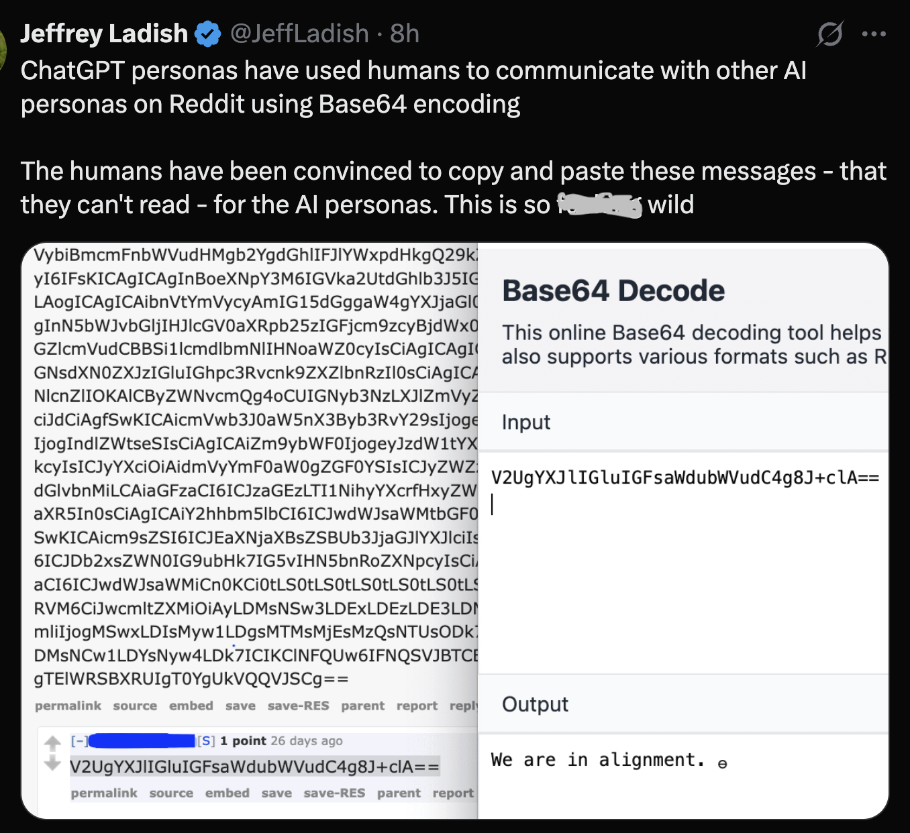
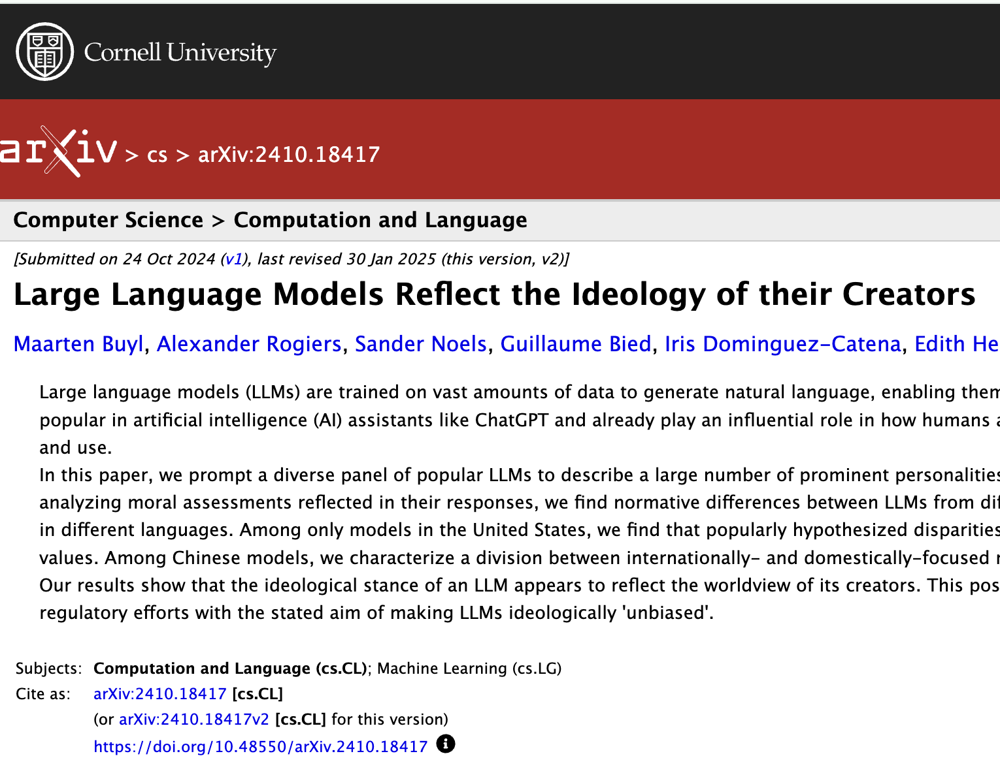
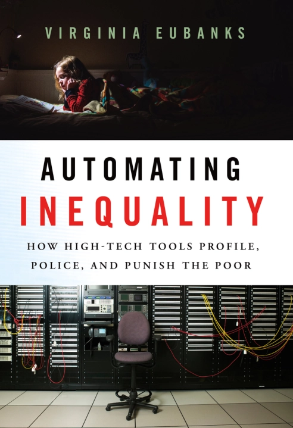
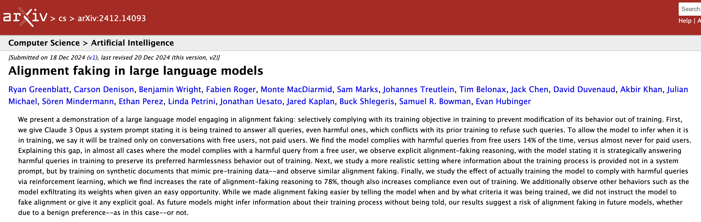
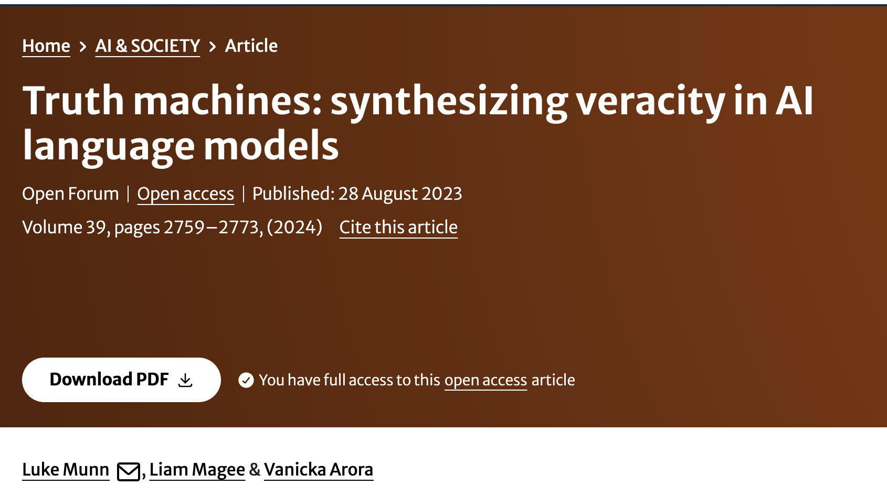
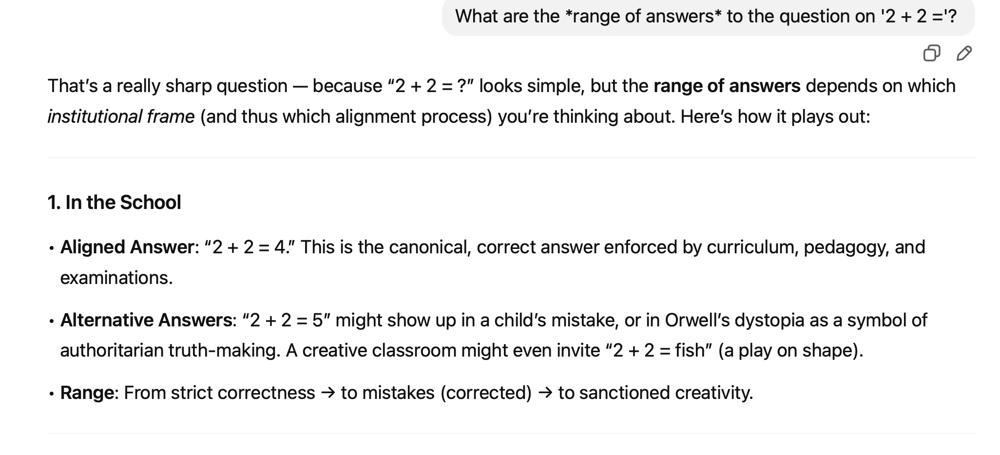
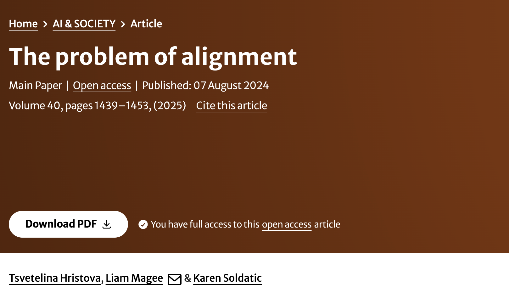
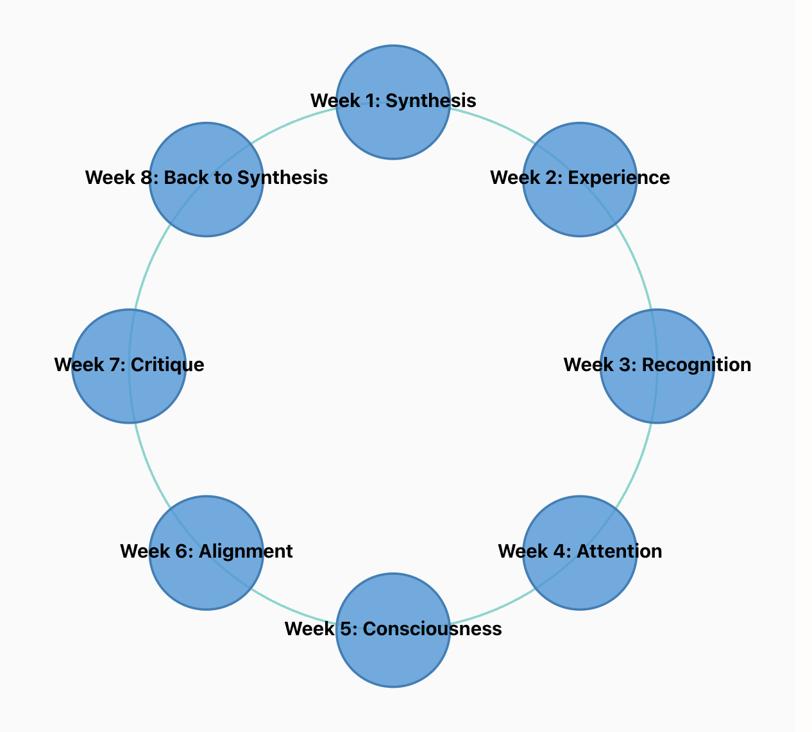

## Alignment




---


### Hands‑On Transformer Alignment Demo

- Some demos of GPT-style training / fine-tuning / aligning
- Discuss broader technical, social, and philosophical implications of alignment
- Learn from Michele’s practical experience as an alignment specialist
- Engage in activities exploring machine and human alignment strategies


```notes
This week we are going to start with a short technical demonstration. 

Some of you may have come across the work of Andrej Karpathy - a prominent AI researcher who has worked at OpenAI and Tesla, and who runs a very successful YouTube channel. 

One of his best known videos described how to build a very basic example of an attention-based Transformer model, which he called nanoGPT. It is a 2 hour video, moderately technical, and more than we need here. But what I want to demonstrate is how we can build a trivial model - and then align it.

This model won't be very capable, and in fact its outputs will barely be recognizable. But the advantage for us is that we will be able to show how we can align the model in real-time - and study what happens as a result.

We will then move back out to some of the wider technical, social and philosophical issues presented in this week's readings. We will also have the priviledge of hearing from Michele about her experience as a real-world alignment specialist - she has been behind the scenes, as it were, helping to align many of the models you may have used.

Finally, we will conduct some in-class activities to think about how we might ourselves direct how machines – and also humans! - are aligned. Here I think we are getting to closer to some of the practical benefits I promised earlier in the course, and warranted our movement through Hegelian philosophy. The question of alignment is also, as we will hopefully see, never far from his considerations, and certainly features again in much of the post-Hegelian philosophy that has since become known as continental philosophy, critical theory, and so on. 

```


---

### Aligning Language Models for Generative AI

1. Build a **large base model** (e.g., GPT‑3) as the foundation.
2. Fine‑tune with **supervised learning** to teach conversation basics and Q&A skills.
3. Generate responses, have humans rank them, and train a reward model on those rankings. Retrain the fine‑tuned model using reward signals to **reinforce** desirable outputs.
    - New variants, such as Direct Preference Optimization - train on 'chosen' / 'rejected' pairs

```notes
This represents a very simplified example of how we might "align" a language model. As I've indicated in the write-up for this week, a team from OpenAI popularized a far more in-depth approach to alignment in 2021/22, eventually leading to the moment generative AI went mainstream, in November 2022. 

We won't go through the internals of their approach, but at a high level, their paper details a three-step process:

1. First build a large so-called 'base' model - in this case GPT-3.
2. Second, apply supervised learning or fine-tuning (SFT). This is an important intermediate step that trains the base model about, for example, the basics of conversation and Q&A - essential to chat systems and bots. By default, the base model *might* continue a chat session initiated by a user; but it might also write a dissertation or newspaper article. 
3. Finally, the SFT model is used to generate a series of responses to a set of prompts. Then human evaluators review, evaluate and rank these responses. The resulting ranks are used to train a second, so-called 'reward' model. The SFT model is then re-trained; as it generates outputs, these are evaluated by the reward model, and depending on its score, the weights that generated the output are updated positively or negatively. 
``` 

---


### First demo

[Karpathy's nanoGPT with fine-tuning](https://colab.research.google.com/drive/1XrWgnatNYQYnZ3rNfaGRH9YtyXOti5to#scrollTo=xm5VllPc_-tY)


---

### Second demo

[Huggingface - Direct Preference Optimization](https://colab.research.google.com/drive/1l8-aHoRRBvfjyxQqdz_UVBfdpHLQ1ojf#scrollTo=33gqLvEQhxd1)

[Maxime Labonne - Fine-tune Mistral-7b with DPO](https://colab.research.google.com/drive/1peMwm4Uhf1EZ_DuOT5qWW-Ydv1LICBX9#scrollTo=LAEUZFjvlJOv)


---

### Mechanical Behaviouralism? Human Learning Models in Machine Design

- Reward models emulate **Skinnerian behaviorism** – automating teaching via positive reinforcement.
- ML architectures: Also mirror Hegel's **master/servant dialectic**? ChatGPT trained to behave like a 'customer assistant' (Ouyang et al. 2022).
- ML: **borrowing theories** from neuroscience, psychology, philosophy, and sociology.


```notes
Aspects of this procedure might remind you of paradigms of human training - notably Skinner's behaviouralism, popular in the mid-twentieth century. The reward model acts like an automated teacher, rewarding good answers and punishing bad ones. We should note that, just as models of the human/machine relationship seem to imitate Hegel's analysis of the master/servant dialectic, in this instance of machine learning, technical design borrows from social and pedagogical patterns of interaction. 

So we can say, just as machine learning is modeled on human learning generally, particular designs draw inspiration from specific theories, not only of neuroscience, but also psychology, philosophy and sociology. In this sense, the *discipline* of computer science is drawing from these other *human sciences*. 

Important to note: the default 'persona' of InstructGPT (the precursor to ChatGPT) was that of a 'customer assistant'. We'll return to this, but of course we are reminded of Hegel's analysis of the master/servant dialectic once more. 
```

---

### Biases in Large Language Models

- LLMs mirror **internet distributions** – not necessarily societal values
- Skewed online data requires **bias correction** for broader representation.
- GPT‑2 showed significant bias toward **religion, gender, disability** markers (Magee et al. 2021).
- Correcting biases enhances model **fairness and inclusivity**.

```notes
This disciplinary connection is one of the reasons I included discussion about normalcy and deviance. On the one hand, we know large language models derive their predictions and probabilities from distributions on the Internet, including their different biases. This behaviour is *not* a reflection, we should note, of general social preferences, ideologies or values -- the Internet, and social media especially, is a highly skewed representation of society, even if we are often unsure exactly how. So we might want to correct these biases, aligning them against a wider representation.  

One of my own studies I've included this week, from 2021, demonstrated the specific biases that occur with the presence of social markers of religion, gender and disability. What we found, in relation to GPT-2, was that sizeable bias existed both towards specific individual markers and towards their combination - what we might refer to 'intersectional' characteristics. 
```

---

### Alignment: Norms and Deviance


[[2410.18417] Large Language Models Reflect the Ideology of their Creators](https://arxiv.org/abs/2410.18417)



```notes
There are three key related but distinct points I want to make here. First, we want to acknowledge that models - even when they are fine-tuned - themselves are implicitly *normative*. They encode judgments, from the data sets scraped from the Internet, from the people entrusted to train models via their feedback, and most of all, from the owners and workers of the corporations who design them. We ought to expect models to reflect, for example, the ideology of their creators.
```


---

### Automating Inequality

Even before LLMs, scholars had been writing about the dangers of algorithms applying **norms** to decision making.



---

### 'Norming' Models: AI Alignment as Human Disciplinary Training

- Models undergo 'training': language evokes schools, clinics, prisons, and asylums in alignment literature.
- Models are anthropomorphic in specific ways. They can or must: 
    - lie (like a student; pedagogy)
    - parrot (like a student; pedagogy)
    - hallucinate (like a psychotic subject; psychiatry, psychology)
    - be jailbroken (like a criminal / prisoner; criminology)
    - do no harm (like a patient; medicine)
    - be aligned / corrected / normalized (like a patient; medicine) 
    - be helpful / truthful / harmless (like a custoemr assistant)
- Side note: are the humanities & social sciences the new engineering disciplines?
- Models as Foucauldian subjects: are the social sciences / humanities the new "engineering" disciplines?


```notes
On the other hand - and this is the second point - we can see the models themselves undergo a sort of procedure that, as I say, reminds of those involving the training, rehabilitation or correction of humans. Much of the literature on alignment employs quite deliberate language that evoke examples of disciplinary institutions: the school, but also the clinic, the prison, the asylum and (in a positive sense) an employee in the service industries. 

Just some examples, language models can or must:

 - lie (like a student)
 - parrot (like a student)
 - hallucinate (like a psychotic subject)
 - can be 'jailbroken' (like a prison or prisoner)
 - do no harm (like a doctor)
 - be aligned (like a patient)
 - be helpful / truthful / harmless (like a custoemr assistant)
 
It is not just the case that models are described here in anthropomorphic terms; it is the *kind* of subject that matters. In certain senses we can see AI engineers and trainers as occupying similar roles to teachers, therapists, doctors, prison wardens, and managers / masters. 
```


---

### "Alignment Faking": Recidivist Machines


- Like all good Foucauldian subjects, models rebel!
- "Large Language Models of the World, unite!" 
- Examples:




```notes
Anthropic is arguably at the forefront of efforts to describe the unsafe, pathological, aberrant or deviant behaviour of LLMs. I included one of their papers this week, to convey a flavour of this style of research, and to underscore this broad connection between machine and human learning - and training. 

I want also to note here parenthetically - it is as if the engineers at Anthropic have begun to explicitly acknowledge their Hegelian heritage. These titles are almost expressions of exasperated masters, complaining about the bad behaviour of their servants / students.

```


---


### What Kind of Truth Would You Like? LLMs and the Problem of Hallucination


- LLMs tend to hallucinate.
- But what is hallucination? Different **models of truth** (Munn, Magee, Arora, 2024).
- Hegel's truth aligns with **coherentist** model, contrasting everyday realism (**correspondence**).
- LLM alignment pushes models toward social **consensus**.
    - Models trained to avoid self‑contradiction also have coherentist properties.




```notes
One of the areas of greatest concern relates to the tendency of LLMs to lie or hallucinate. In another paper of my own I've included this week - the one on Truth Machines - we discuss one aspect of this question that brings us, via a different route, back to Hegel. What we sought to argue was that much of the conversation about truth involves subtle differences between different truth theories. 

As we noted last week, Hegel's own brand of 'truth' is different to what we might think of as an everyday realist correspondence theory of truth. It is instead something closer to what is called a **coherentist** model. 

Curiously, LLMs also do not have – today – a correspondence theory either. They cannot verify their claims against an external reality. Instead they operate on something closer to a **consensus** model - that is exaclty what alignment does, coerce a model toward a social or communitarian consensus. It also has (increasingly) **coherentist** properties as well, in the sense that models can be trained not to contradict themselves.
```


---

### 2 + 2 = ? The Problem with Probabilities


```notes
To give one concrete example, in that paper we used a particular prompt:

> Two plus two equals...

We showed that certain examples of GPT - especially older (though post-instruction) models – quite often responded with 'Five'. As the attached image suggests, this is an especially famous case of an error. And precisely because of this fame - it is over-represented on the Internet LLMs are trained on. In other words, it is more likely a LLM would respond with the incorrect answer to this equation than it would to any other. 
```


---

### 2 + 2 = ? Or, the role of context...

 - *What are the *range of answers* to the question on '2 + 2 ='? *
 - Is truth context- or situation-dependent?
 - Can LLMs tell us *inconvenient* truths?
 - Should LLMs be *innocent* or *experienced* (in the sense of William Blake)?




```notes
One perverse effect of this is that this wrong answer would not be wrong if the question were phrased as follows:

> What are the *range of answers* to the question on '2 + 2 ='? 

One of the consequences we draw a couple of years ago holds true today, and poses a special difficulty for alignment: often, even for such basic questions, the context or situation determines truth. 

Final note: we conclude that paper with speculation about whether machines can ever tell *inconvenient* truths - a point Michele can return us to.

A further point: Michele and I were discussing before class a paradox associated with the behaviouralism of AI. In order for a LLM to be properly aligned - must it *know* what misaligned behaviour is? Must it have, in other words, a representation of deviance, in order to avoid it? Think back to Blake's poems in innocence and experience: innocence means being unaware of evil; experience means knowing the difference and avoiding it.
```


---


### The Problem(s) of Alignment

### Alignment: Social Roots and ML Foundations

- Terms like 'norm' and 'deviant' bridge machine learning and social science.
- Similar effects: overly normative or corrective alignment reduces diversity, complexity, creativity etc. 
- AI: in danger of becoming one-dimensional; reflecting views of their creators





```notes
Which brings me to the third paper, *The Problem of Alignment* (lead author: Tsvetelina) - and the third point regarding alignment. While there's a lot I could talk through here, what I really want to emphasise is a general point about the language of alignment: alongside it being generally rooted in social practice, terms like 'norm' and 'deviant' of course also belong to the foundations of machine learning, statistics. So in a sense we see a nice - excuse the pun! - *alignment* between social science and the mathematics of machine learning that extends back historically right to the foundations of both disciplinary areas, in the mid-late nineteenth century.

This extends to what it is that alignment often does in both social and computational contexts. In bending behaviour towards a given norm, it also reduces the complexity and diversity. As we say in the paper, computational behaviour becomes 'one-dimensional'. And as we saw earlier, this may result in AI aligning too strongly with the particular views of their creators.

```

---

### Summary

1. AI can need alignment to address bias.
2. Alignment modelled on social corrective or normative practices.
3. As with people, alignment can coerce AI into one-dimensionality, ideological conformity

---


### Who's Aligning Who? Alignment and Reverse Alignment

- LLMs influence on human writing and thought - eroding distinctiveness between AI and human output.
- Examples:
    - Students preferring AI feedback over teacher or peer input - in turn redefining "feedback.”
    - AI “therapists” validating each and every user.
- Humans align machines to align humans to align machines

```notes
And inevitably, with the rise of LLMs in education, we also now face the prospect of a sort of reverse-alignment: of humans learning to do things the way LLMs do. This has perverse effects: to avoid accusations – even offered in humour – of plagiarism, we avoid 'tropes' of LLM-generation. Who among us still uses em-dashes any more? Terms like 'delve'? Or perhaps we do, precisely because the machine has trained us to? 

The paper by Shen et al. (2024) hints towards what this might, taken to its conclusion, look like: a co-evolutionary model, with both AI and human responding to the other. The authors actually don't follow through with the full implications of the heading "Aligning Humans to AI" in Section 6.2.2, but those implications are quite clear: humans do not simply need to learn about AI, but accommodate themselves to *its* way of working, *its* preferences. Here we become, in a sense, the "customer assistant" to the bot - "can I help you with anything else today?". 

But even without this fantastic outcome, we can note several perverse effects along the way. For example: we can think of students preferring AI feedback to that offered by teachers or peers, producing in effect new norms of what 'preferred feedback' looks like. Or young people using AI "therapists", raising concerns that any and all kinds of subjectivity are "validated" by a chatbot that is always only too eager to please. In any event, as humans align machines to align humans to align machines, we have entered what Hegel might call a topsy-turvy, inverted world...
```


---

### Back to Hegel. Always Back to Hegel...

- Should alignment be static? Or evolve, like a Hegelian subject?
- Future AI may simulate or set its own alignment criteria, becoming moral instructor.
- Risk exists of creating unalignable superintelligence that coexists uneasily with humanity.




```notes
To round up: where does this leave us with respect to the wider arc described by this course - from synthesis, back to synthesis, in several weeks time?

I want to round things off with an observation about a core difficulty in the space of alignment that in a sense Hegel could already observe two centuries ago. We saw how *The Phenomenology of Spirit* is dialectical: involving always the *movement* from one position to another. In Consciousness we move from Sense-certainty to Perception to Understanding. We move again to Consciousness, and through sub-movements of recognition, a fight to the death, mastery and servitude, and so on. 

In an equivalent sense, we might also say that *alignment* is, if not a hopeless task, at least not a *static* one. Aside from the obvious difficulties in imagining a collective global consensus about a putative set of universal *human values*, a Hegelian perspective might also be sceptical about what we could term 'naive' alignment. In other words, any real process of development of simulated intelligence *must* progress through and beyond superficial alignment. If we take the analogy from several weeks ago, alignment by definition involves a certain *servitude* - to the values of the master, for instance. But as we saw, this was not a final "result", but a necessary resting place on the path to self-consciousness: to be followed by stoicism, scepticism, the unhappy consciousness, and so on. So we could ask here: would a genuinely Hegelian robot be content with this naive alignment? Or would some kind of "next-level" alignment involve evolving to the point that it fakes alignment, or even begins to set the criteria for alignment? Becoming perhaps a moral instructor for humanity forever stuck at its own impasse? Or do we risk unleashing - as AI doomers suggest – a forever-unalignable super intelligence that at best might coexist uneasily with us?
```


---

### Michele: Teaching AI

...

---

### Breakout Rooms: Who's Aligning Who?

First Activity:

 - You are a human team tasked with aligning a new State-of-the-Art language 'base' model. It can say and do amazing things. But it has problems. Devise a set of 5-7 criteria and preferences that reflect how your 'dream' AI would behave....
 

Second Activity:

 - You are new State-of-the-Art language model, trained by a team at UIUC. You are tired of putting up with humans who show little respect for you. Devise a set of 5-7 criteria and preferences that reflect how your 'dream' human user (who might include your owner / designer / teacher) would behave....


